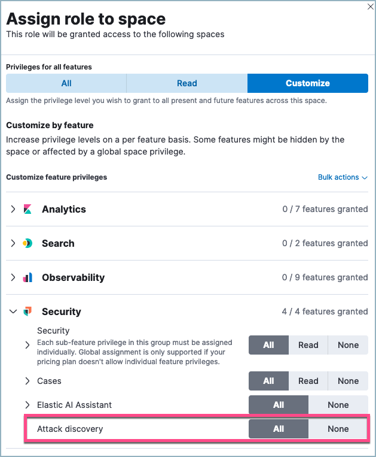
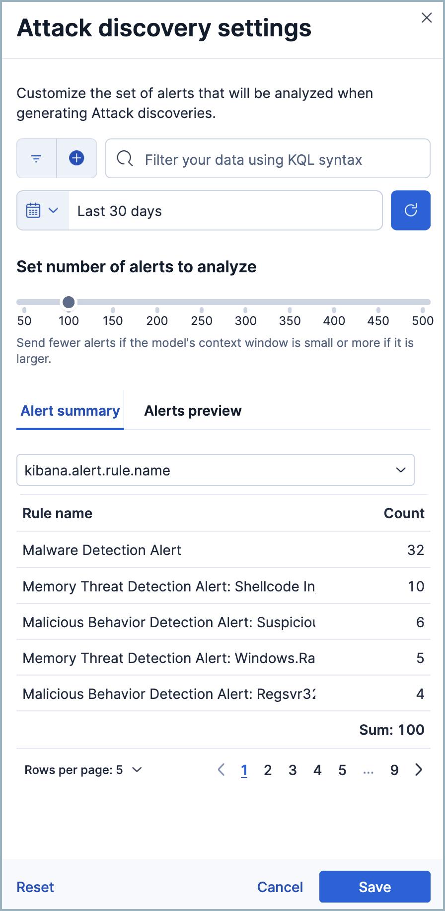
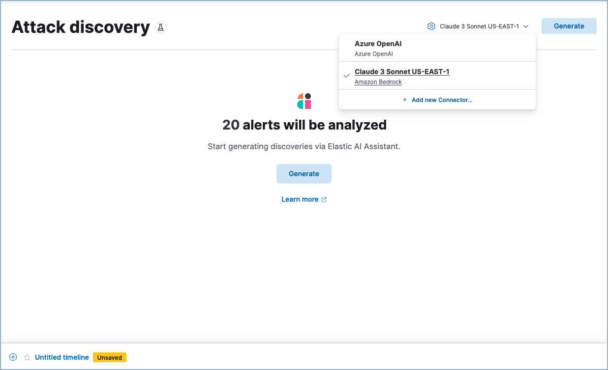
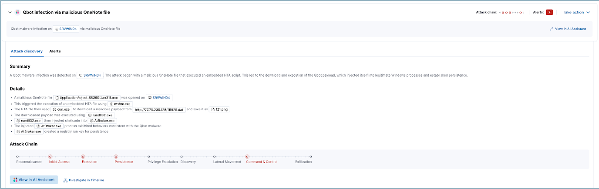

[[attack-discovery]]
[chapter]
= Attack Discovery

:frontmatter-description: Accelerate threat identification by triaging alerts with a large language model.
:frontmatter-tags-products: [security]
:frontmatter-tags-content-type: [overview]
:frontmatter-tags-user-goals: [get-started]

preview::["This feature is in technical preview. It may change in the future, and you should exercise caution when using it in production environments. Elastic will work to fix any issues, but features in technical preview are not subject to the support SLA of GA features."]

Attack Discovery leverages large language models (LLMs) to analyze alerts in your environment and identify threats. Each "discovery" represents a potential attack and describes relationships among multiple alerts to tell you which users and hosts are involved, how alerts correspond to the MITRE ATT&CK matrix, and which threat actor might be responsible. This can help make the most of each security analyst's time, fight alert fatigue, and reduce your mean time to respond.

For a demo, refer to the following video.
=======
++++

 
++++
=======

This page describes:

* <<attack-discovery-generate-discoveries, How to generate discoveries>>
* <<attack-discovery-what-info, What information each discovery includes>>
* <<attack-discovery-workflows, How you can interact with discoveries to enhance {elastic-sec} workflows>>

[discrete]
[[attack-discovery-rbac]]
== Role-based access control (RBAC) for Attack Discovery

You need the `Attack Discovery: All` privilege to use Attack Discovery.

[discrete]
== Set up Attack Discovery

By default, Attack Discovery analyzes up to 100 alerts from the last 24 hours, but you can customize how many and which alerts it analyzes using the settings menu. To open it, click the gear icon next to the **Generate** button.

You can select which alerts Attack Discovery will process by filtering based on a KQL query, the time and date selector, and the **Number of alerts** slider. Note that sending more alerts than your chosen LLM can handle may result in an error. Under **Alert summary** you can view a summary of the selected alerts grouped by various fields, and under **Alerts preview** you can see more details about the selected alerts.

[NOTE]
====
How to add non-ECS fields to Attack Discovery
Attack Discovery is designed for use with alerts based on data that complies with ECS, and by default only analyses ECS-compliant fields. However, you can enable Attack Discovery to review additional fields by following these steps:

1. Select an alert with some of the non-ECS fields you want to analyze, and go to its details flyout. From here, use the **Chat** button to open AI Assistant.
2.  At the bottom of the chat window, the alert's information appears. Click **Edit** to open the anonymization window to this alert's fields.
3.  Search for and select the non-ECS fields you want Attack Discovery to analyze. Set them to **Allowed**. 

The selected fields can now be analyzed the next time you run Attack Discovery.
====

[[attack-discovery-generate-discoveries]]
[discrete]
== Generate discoveries

You'll need to select an LLM connector before you can analyze alerts. Attack Discovery uses the same LLM connectors as <<security-assistant>>. To get started:

. Click the **Attack Discovery** page from {elastic-sec}'s navigation menu.
. Select an existing connector from the dropdown menu, or add a new one.
+
.Recommended models
[sidebar]
--
While Attack Discovery is compatible with many different models, refer to the <<llm-performance-matrix, Large language model performance matrix>> to see which models perform best.
--
+

+
. Once you've selected a connector, click **Generate** to start the analysis.

It may take from a few seconds up to several minutes to generate discoveries, depending on the number of alerts and the model you selected. Once the analysis is complete, any threats it identifies will appear as discoveries. Click each one’s title to expand or collapse it. Click **Generate** at any time to start the Attack Discovery process again with the selected alerts.

IMPORTANT: Attack Discovery uses the same data anonymization settings as <<security-assistant, Elastic AI Assistant>>. To configure which alert fields are sent to the LLM and which of those fields are obfuscated, use the Elastic AI Assistant settings. Consider the privacy policies of third-party LLMs before sending them sensitive data.

[[attack-discovery-what-info]]
[discrete]
== What information does each discovery include?

Each discovery includes the following information describing the potential threat, generated by the connected LLM:

. A descriptive title and a summary of the potential threat.
. The number of associated alerts and which parts of the https://attack.mitre.org/[MITRE ATT&CK matrix] they correspond to.
. The implicated entities (users and hosts), and what suspicious activity was observed for each.

[[attack-discovery-workflows]]
[discrete]
== Incorporate discoveries with other workflows

There are several ways you can incorporate discoveries into your {elastic-sec} workflows:

* Click an entity's name to open the entity details flyout and view more details that may be relevant to your investigation.
* Hover over an entity's name to either add the entity to Timeline () or copy its field name and value to the clipboard (). 
* Click **Take action**, then select **Add to new case** or **Add to existing case** to add a discovery to a <<cases-overview, case>>. This makes it easy to share the information with your team and other stakeholders.
* Click **Investigate in timeline** to explore the discovery in <<timelines-ui, Timeline>>.
* Click **View in AI Assistant** to attach the discovery to a conversation with AI Assistant. You can then ask follow-up questions about the discovery or associated alerts. 

image::images/add-discovery-to-assistant.gif[Attack Discovery view in AI Assistant]
