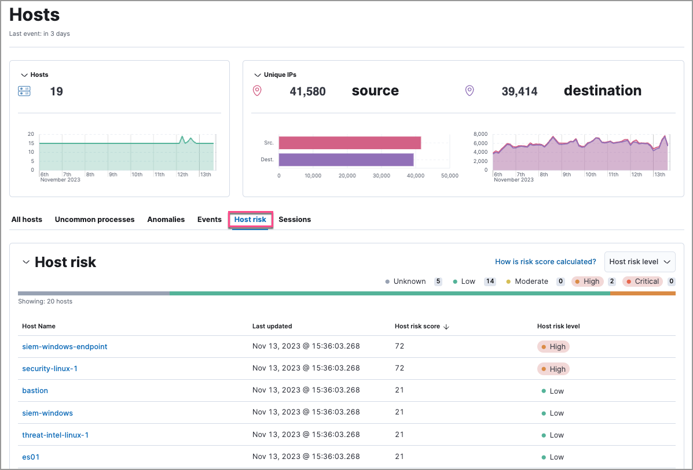
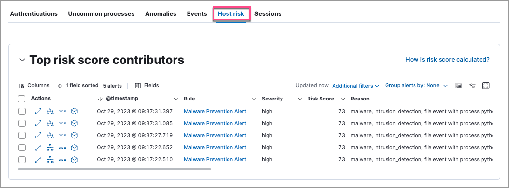

<DocBadge template="technical preview" />

The ((security-app)) provides several options to monitor the change in the risk posture of hosts and users from your environment. Use the following places in the ((security-app)) to view and analyze risk score data:

* <DocLink id="serverlessSecurityAnalyzeRiskScoreData" section="entity-analytics-dashboard">Entity Analytics dashboard</DocLink>
* <DocLink id="serverlessSecurityAnalyzeRiskScoreData" section="alerts-page">Alerts page</DocLink>
* <DocLink id="serverlessSecurityAnalyzeRiskScoreData" section="alert-details-flyout">Alert details flyout</DocLink>
* <DocLink id="serverlessSecurityAnalyzeRiskScoreData" section="hosts-and-users-pages">Hosts and Users pages</DocLink>
* <DocLink id="serverlessSecurityAnalyzeRiskScoreData" section="host-and-user-details-pages">Host and user details pages</DocLink>
* <DocLink id="serverlessSecurityAnalyzeRiskScoreData" section="host-and-user-details-flyouts">Host and user details flyouts</DocLink>

<DocCallOut title="Tip">
We recommend that you prioritize <DocLink id="serverlessSecurityAnalyzeRiskScoreData" section="alert-triaging">alert triaging</DocLink> to identify anomalies or abnormal behavior patterns.
</DocCallOut>

## Entity Analytics dashboard

From the Entity Analytics dashboard, you can access entity key performance indicators (KPIs), risk scores, and levels. You can also click the number link in the **Alerts** column to investigate and analyze the alerts on the Alerts page.

 

## Alert triaging 
You can prioritize alert triaging to analyze alerts associated with risky or business-critical entities using the following features in the ((security-app)). 

### Alerts page

Use the Alerts table to investigate and analyze:

* Host and user risk levels
* Host and user risk scores
* Asset criticality

To display entity risk score and asset criticality data in the Alerts table, select **Fields**, and add the following:

* `user.risk.calculated_level` or `host.risk.calculated_level`
* `user.risk.calculated_score_norm` or `host.risk.calculated_score_norm`
* `user.asset.criticality` or `host.asset.criticality`

Learn more about <DocLink id="serverlessSecurityAlertsUiManage" section="customize-the-alerts-table">customizing the Alerts table</DocLink>.

#### Triage alerts associated with high-risk or business-critical entities

To analyze alerts associated with high-risk or business-critical entities, you can filter or group them by entity risk level or asset criticality level.

<DocCallOut title="Note">
If you change the entity's criticality level after an alert is generated, that alert document will include the original criticality level and will not reflect the new criticality level.
</DocCallOut>

* Use the drop-down filter controls to filter alerts by entity risk level or asset criticality level. To do this, <DocLink id="serverlessSecurityAlertsUiManage" section="edit-drop-down-filter-controls">edit the default controls</DocLink> to filter by:

  * `user.risk.calculated_level` or `host.risk.calculated_level` for entity risk level:

    

  * `user.asset.criticality` or `host.asset.criticality` for asset criticality level:

    

* To group alerts by entity risk level or asset criticality level, select **Group alerts by**, then select **Custom field** and search for:

  * `host.risk.calculated_level` or `user.risk.calculated_level` for entity risk level:

    

  * `host.asset.criticality` or `user.asset.criticality` for asset criticality level:

    

  * You can further sort the grouped alerts by highest entity risk score:

    1. Expand a risk level group (for example, **High**) or an asset criticality group (for example, **high_impact**).
    1. Select **Sort fields** → **Pick fields to sort by**.
    1. Select fields in the following order:
        1. `host.risk.calculated_score_norm`or `user.risk.calculated_score_norm`: **High-Low**
        1. `Risk score`: **High-Low**
        1. `@timestamp`: **New-Old**

    

### Alert details flyout

To access risk score data in the alert details flyout, select **Insights** → **Entities** on the **Overview** tab:

### Hosts and Users pages

On the Hosts and Users pages, you can access the risk score data:

* In the **Host risk level** or **User risk level** column on the **All hosts** or **All users** tab:

   

* On the **Host risk** or **User risk** tab:

  

### Host and user details pages

On the host details and user details pages, you can access the risk score data:

* In the Overview section:

  

* On the **Host risk** or **User risk** tab:

  

### Host and user details flyouts

In the host details and user details flyouts, you can access the risk score data in the risk summary section:

  

