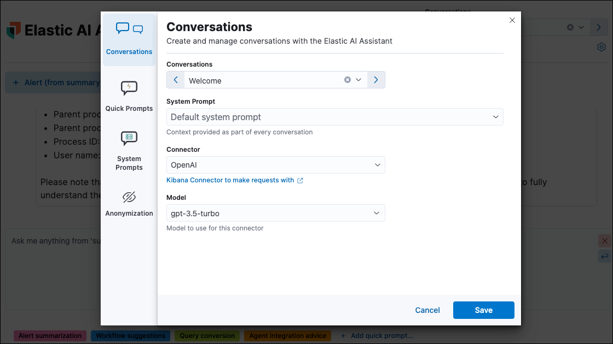

<DocBadge template="technical preview" />

The Elastic AI Assistant utilizes generative AI to bolster your cybersecurity operations team. It allows users to interact with ((elastic-sec)) for tasks such as alert investigation, incident response, and query generation or conversion using natural language and much more.

AI Assistant relies on generative AI connectors to third-party AI providers.

<DocImage size="xl" url="../images/ai-assistant/-assistant-assistant.gif" alt="Animation of AI Assistant chat window" />

<DocCallOut title="Important" color="warning">
The Elastic AI Assistant is designed to enhance your analysis with smart dialogues. Its capabilities are still developing. Users should exercise caution as the quality of its responses might vary. Your insights and feedback will help us improve this feature. Always cross-verify AI-generated advice for accuracy.
</DocCallOut>

<DocCallOut title="Tip">

When choosing a third-party provider to use with AI Assistant, remember that different services may impose rate limits on their APIs. This may negatively affect AI Assistant performance. In addition, different models support various context lengths. Models with larger context lengths will provide a better experience when using the AI Assistant.

For example, refer to OpenAI's documentation on [rate limits](https://platform.openai.com/docs/guides/rate-limits/) and [GPT-4 models](https://help.openai.com/en/articles/7127966-what-is-the-difference-between-the-gpt-4-models) for more information on their available options.

</DocCallOut>

<DocCallOut title="Requirements">

* This feature requires the Security Complete <DocLink id="serverlessGeneralManageProject" text="project feature"/>.

* You must have the appropriate user role to set up and use AI Assistant.
    {/* Placeholder statement until we know which specific roles are required. */}

* You need an account with a third-party generative AI provider, which AI Assistant uses to generate responses. Supported providers are OpenAI, Azure OpenAI Service, and Amazon Bedrock.

</DocCallOut>

## Your data and AI Assistant

Elastic does not store or examine prompts or results used by AI Assistant, or use this data for model training. This includes anything you send the model, such as alert or event data, detection rule configurations, queries, and prompts. However, any data you provide to AI Assistant will be processed by the third-party provider you chose when setting up the Generative AI connector as part of the assistant setup.

Elastic does not control third-party tools, and assumes no responsibility or liability for their content, operation, or use, nor for any loss or damage that may arise from your using such tools. Please exercise caution when using AI tools with personal, sensitive, or confidential information. Any data you submit may be used by the provider for AI training or other purposes. There is no guarantee that the provider will keep any information you provide secure or confidential. You should familiarize yourself with the privacy practices and terms of use of any generative AI tools prior to use.

<DocCallOut title="Note">
Elastic can automatically anonymize event data that you provide to AI Assistant as context. To learn more, refer to <DocLink id="serverlessSecurityAIAssistant" section="configure-ai-assistant">Configure AI Assistant</DocLink>.
</DocCallOut>

## Set up AI Assistant

You must complete these steps before you can use AI Assistant:

1. Create an API key with your AI provider to authenticate requests from AI Assistant. You'll use this in the next step. Refer to the provider's documentation for generating API keys:

    * [OpenAI](https://platform.openai.com/docs/api-reference)
    * [Azure OpenAI Service](https://learn.microsoft.com/en-us/azure/cognitive-services/openai/reference)

1. Create a [Generative AI connector](((kibana-ref))/gen-ai-action-type.html) using the AI provider's API key and URL to authenticate communication between ((elastic-sec)) and the provider.
    You can do this in ((kib)) from **((stack-manage-app))** -> **((connectors-ui))**, or from within AI Assistant.

## Start chatting

To open AI Assistant, select the **AI Assistant** button in the top toolbar from anywhere in the ((security-app)). You can also use the keyboard shortcut **Cmd + ;** (or **Ctrl + ;** on Windows). 

<DocImage size="m" url="../images/ai-assistant/-assistant-ai-assistant-button.png" alt="AI Assistant button" />

This opens the **Welcome** chat interface, where you can ask general questions about ((elastic-sec)).

You can also chat with AI Assistant from several particular pages in ((elastic-sec)) where you can easily send context-specific data and prompts to AI Assistant.

* <DocLink id="serverlessSecurityViewAlertDetails">Alert details</DocLink> or Event details flyout: Click **Chat** while viewing the details of an alert or event.
* <DocLink id="serverlessSecurityRulesUiManagement">Rules page</DocLink>: Select one or more rules, then click the magic wand icon (🪄✨) at the top of the page next to the **Rules** title.
* <DocLink id="serverlessSecurityTimelinesUi">Timeline</DocLink>: Select the **Security Assistant** tab.

{/* * <DocLink id="serverlessSecurityDataQualityDash">Data Quality dashboard</DocLink>: Select the **Incompatible fields** tab, then click **Chat**. (This is only available for fields marked red, indicating they're incompatible). */}
{/* Commented out because the Data Quality dashboard is temporarily unavailable in Serverless. */}

<DocCallOut title="Note">
All chat history and custom quick prompts persist in local browser storage, allowing you to navigate away to other areas in ((elastic-sec)), then return to ongoing conversations. This also means that chats persist across multiple users if they use the same browser; be sure clear any chats that you don't want available to other users.
</DocCallOut>

## Interact with AI Assistant

Use these features to adjust and act on your conversations with AI Assistant:

* Select a _system prompt_ at the beginning of a conversation to establish how detailed and technical you want AI Assistant's answers to be.

    <DocImage size="xl" url="../images/ai-assistant/-assistant-system-prompt.gif" alt="The system prompt drop-down menu" />

    System prompts provide context to the model, informing its response. To create a custom system prompt, open the system prompts dropdown menu and click **+ Add new system prompt...**.

* Select a _quick prompt_ at the bottom of the chat window to get help writing a prompt for a specific purpose, such as summarizing an alert or converting a query from a legacy SIEM to ((elastic-sec)).

    <DocImage size="xl" url="../images/ai-assistant/-assistant-quick-prompts.png" alt="Quick prompts highlighted below a conversation" />

    Quick prompt availability varies based on context — for example, the **Alert summarization** quick prompt appears when you open AI Assistant while viewing an alert. To customize existing quick prompts and create new ones, click **Add Quick prompt**.

* Use these buttons to perform actions in the conversation history and prompt entry area:

    * **Add note to timeline** (<DocIcon type="editorComment" title="Comment" />): Add the selected text to your currently active Timeline as a note.
    * **Add to existing case** (<DocIcon type="addDataApp" title="Add data" />): Add a comment to an existing case using the selected text.
    * **Copy to clipboard** (<DocIcon type="copyClipboard" title="Copy to clipboard" />): Copy the text to clipboard to paste elsewhere. Also helpful for resubmitting a previous prompt.
    * **Add to timeline** (<DocIcon type="timeline" title="Timeline" />): Add a filter or query to Timeline using the text. This button appears for particular queries in AI Assistant's responses.

        <DocCallOut title="Tip">
        Be sure to specify which language you'd like AI Assistant to use when writing a query. For example: "Can you generate an Event Query Language query to find four failed logins followed by a successful login?"
        </DocCallOut>

    * **Clear chat** (<DocIcon type="cross" title="Remove" />): Delete the conversation history and start a new chat.

## Configure AI Assistant
The **Settings** menu (<DocIcon type="controlsVertical" title="EQL settings" />) allows you to configure default conversations, quick prompts, system prompts, and data anonymization.

The **Settings** menu has four tabs:

* **Conversations:** When you open AI Assistant from certain pages, such as Timeline or Alerts, it defaults to the relevant conversation type. Choose the default system prompt for each conversation type, the connector, and model (if applicable).
* **Quick Prompts:** Modify existing quick prompts or create new ones. To create a new quick prompt, type a unique name in the **Name** field, then press **enter**. Under **Prompt**, enter or update the quick prompt's text. Under **Contexts**, select where the quick prompt should appear.
* **System Prompts:** Edit existing system prompts or create new ones. To create a new system prompt, type a unique name in the **Name** field, then press **enter**. Under **Prompt**, enter or update the system prompt's text. Under **Contexts**, select where the system prompt should appear.

    <DocCallOut title="Note">
    To delete a custom prompt, open the **Name** drop-down menu, hover over the prompt you want to delete, and click the *X* that appears. You cannot delete the default prompts.
    </DocCallOut>

* **Anonymization:** When you provide an event to AI Assistant as context, you can select fields to include as plaintext, to obfuscate, and to not send. The **Anonymization** tab allows you to define default data anonymization behavior. You can update these settings for individual events when you include them in the chat.

    

    The fields on this list are among those most likely to provide relevant context to AI Assistant. Fields with **Allowed** toggled on are included. **Allowed** fields with **Anonymized** set to **Yes** are included, but with their values obfuscated.

    

    When you include a particular event as context, you can use a similar interface to adjust anonymization behavior. Be sure the anonymization behavior meets your specifications before sending a message with the event attached.

The **Show anonymized** toggle controls whether you see the obfuscated or plaintext versions of the fields you sent to AI Assistant. It doesn't control what gets obfuscated — that's determined by the anonymization settings. It also doesn't affect how event fields appear _before_ being sent to AI Assistant. Instead, it controls how fields that were already sent and obfuscated appear to you.
