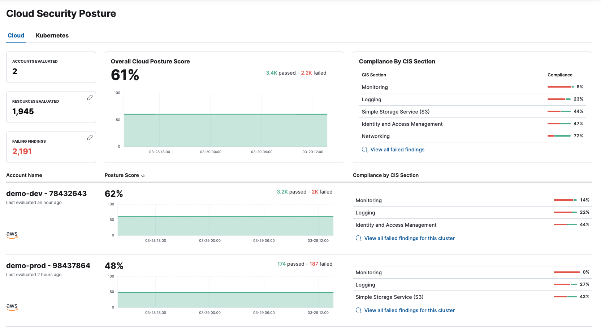

{/* Note: This page is intentionally duplicated by docs/dashboards/cloud-posture.asciidoc. When you update this page, update that page to match. And careful with the anchor links because they should not match. */}

The Cloud Posture dashboard summarizes your cloud infrastructure's overall performance against <DocLink id="enSecurityBenchmarkRules">security guidelines</DocLink> defined by the Center for Internet Security (CIS). To get started monitoring your security posture, refer to <DocLink id="enSecurityCspmGetStarted">Get started with Cloud Security Posture Management</DocLink> or <DocLink id="enSecurityGetStartedWithKspm">Get started with Kubernetes Security Posture Management</DocLink>.

The Cloud Posture dashboard shows:

* Configuration risk metrics for all monitored cloud accounts and Kubernetes clusters
* Configuration risk metrics for individual cloud accounts and Kubernetes clusters
* Configuration risks grouped by CIS Section (security guideline category)

<DocCallOut title="Requirements">

* The Cloud Posture dashboard is available to all Elastic Cloud users. For on-prem deployments, it requires an [Enterprise subscription](https://www.elastic.co/pricing).

</DocCallOut>

## Cloud Posture dashboard UI

At the top of the dashboard, you can switch between the Cloud accounts and Kubernetes cluster views.

The top section of either view summarizes your overall cloud security posture (CSP) by aggregating data from all monitored resources. Three summary cards on the left show Cloud Accounts or Clusters evaluated, Resources evaluated, and Failed Findings. You can click **Resources Evaluated** or **Failed Findings** to open the <DocLink id="enSecurityFindingsPage">Findings page</DocLink>, grouped by resources or filtered for failed findings, respectively.

The remaining summary cards show your overall posture score, and total failed findings grouped by CIS section. Click any CIS section name to view failed findings from that section on the <DocLink id="enSecurityFindingsPage">Findings page</DocLink>.

Below the summary section, each row shows the CSP of a single Cloud account or Kubernetes cluster, including its name, when its posture was last evaluated, its compliance score, and failed findings grouped by CIS section. When you begin to monitor a new account or cluster, a new row appears.

## FAQ (Frequently Asked Questions)

<DocAccordion buttonContent="When do newly-enrolled assets appear on the dashboard?">

It can take up to 10 minutes for deployment, resource fetching, evaluation, and data processing before a newly-enrolled AWS account or Kubernetes cluster appears on the dashboard.

</DocAccordion>

<DocAccordion buttonContent="When do unenrolled accounts disappear from the dashboard?">

An account will disappear as soon as your integration fetches data while that account is not enrolled. The fetch process repeats every four hours, which means a newly unenrolled account can take a maximum of four hours to disappear from the dashboard.

</DocAccordion>
