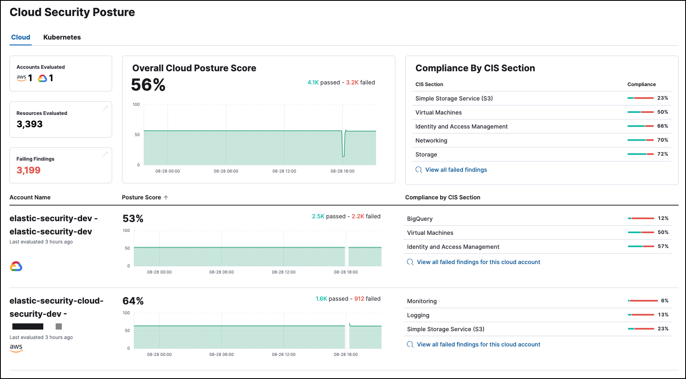
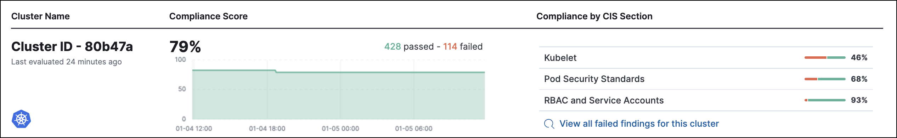

import InReview from '../partials/in-review-notice.mdx'

<InReview />

{/* Note: This page is intentionally duplicated by docs/cloud-native-security/cloud-nat-sec-posture.asciidoc. When you update this page, update that page to match. And careful with the anchor links because they should not match. */}

The Cloud Security Posture dashboard summarizes your cloud infrastructure's overall performance against <DocLink id="serverlessSecurityBenchmarkRules">security guidelines</DocLink> defined by the Center for Internet Security (CIS). To start collecting this data, refer to <DocLink id="serverlessSecurityCspmGetStarted">Get started with Cloud Security Posture Management</DocLink> or <DocLink id="serverlessSecurityGetStartedWithKspm">Get started with Kubernetes Security Posture Management</DocLink>.

The Cloud Security Posture dashboard shows:

* Configuration risk metrics for all monitored cloud accounts and Kubernetes clusters
* Configuration risk metrics for individual cloud accounts and Kubernetes clusters
* Configuration risks grouped by CIS Section (security guideline category)

## Cloud Security Posture dashboard UI

At the top of the dashboard, you can switch between the Cloud accounts and Kubernetes cluster views.

The top section of either view summarizes your overall cloud security posture (CSP) by aggregating data from all monitored resources. Three summary cards on the left of this section show Cloud Accounts or Clusters evaluated, Resources evaluated, and Failed Findings. You can click **Resources Evaluated** or **Failed Findings** to open the <DocLink id="serverlessSecurityCspmFindingsPage">Findings page</DocLink> grouped by resources or filtered for failed findings, respectively.

The remaining summary cards show your overall posture score, and total failed findings grouped by CIS section. Click any CIS section name to view failed findings from that section on the <DocLink id="serverlessSecurityCspmFindingsPage">Findings page</DocLink>.

Below the summary section, each row shows the CSP of a single Cloud account or Kubernetes cluster, including its name, when its posture was last evaluated, its compliance score, and failed findings grouped by CIS section. When you begin to monitor a new account or cluster, a new row appears.

## FAQ (Frequently Asked Questions)

<DocAccordion buttonContent="When do newly-enrolled clusters appear on the dashboard?">

It can take up to 10 minutes for deployment, resource fetching, evaluation, and data processing before a newly-enrolled cluster appears on the dashboard.

</DocAccordion>

<DocAccordion buttonContent="When do unenrolled clusters disappear from the dashboard?">

A cluster will disappear as soon as the KSPM integration fetches data while that cluster is not enrolled. The fetch process repeats every four hours, which means a newly unenrolled cluster can take a maximum of four hours to disappear from the dashboard.

</DocAccordion>
