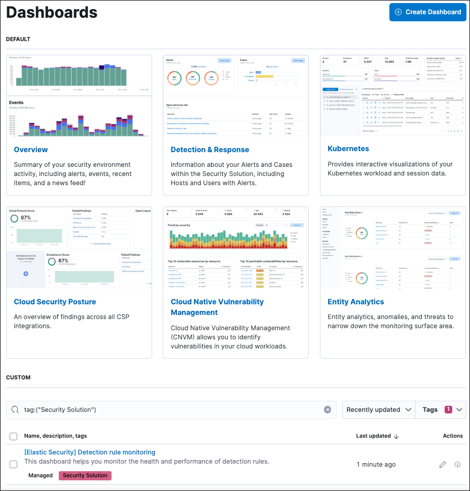

The following sections describe the ((security-app))'s prebuilt dashboards, which provide visualizations of your security environment.

You can also create and access custom security dashboards from the Dashboards landing page. To create one, click **Create Dashboard**. Custom dashboards must have the tag `Security Solution` to appear on the Dashboards page.

{/* The include that was here is another page */}

{/* The include that was here is another page */}

{/* The include that was here is another page */}

{/* The include that was here is another page */}

{/* The include that was here is another page */}

{/* The include that was here is another page */}

{/* The include that was here is another page */}

{/* The include that was here is another page */}
