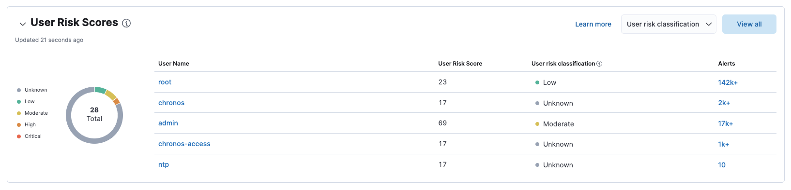

The Entity Analytics dashboard provides a centralized view of emerging insider threats - including host risk, user risk, and anomalies from within your network. Use it to triage, investigate, and respond to these emerging threats.

<DocCallOut title="Requirements">

* A [Platinum subscription](https://www.elastic.co/pricing/) or higher is required.
* To display host and user risk scores, the host risk score and user risk score features must be enabled. You can do this directly from the dashboard by clicking the **Enable** button. For more information, refer to the <DocLink id="serverlessSecurityHostRiskScore" section="enable-host-risk-score">Enable host risk score</DocLink> and <DocLink id="serverlessSecurityUserRiskScore" section="enable-user-risk-score">Enable user risk score</DocLink> instructions.
* To display anomalies, you must [install and run](((ml-docs))/ml-ad-run-jobs.html) the following machine learning jobs: 
    * Unusual Source IP for a User to Logon from (`auth_rare_source_ip_for_a_user`)
    * Unusual Login Activity (`suspicious_login_activity`)
    * DNS Tunneling (`packetbeat_dns_tunneling`)
    * Unusual Network Destination Domain Name (`packetbeat_rare_server_domain`)
    * Unusual DNS Activity (`packetbeat_rare_dns_question`)
    * Suspicious Powershell Script (`v3_windows_anomalous_script`)

</DocCallOut>

The dashboard includes the following sections:

* <DocLink id="serverlessSecurityDetectionEntityDashboard" section="entity-kpis-key-performance-indicators">Entity KPIs (key performance indicators)</DocLink>
* <DocLink id="serverlessSecurityDetectionEntityDashboard" section="host-risk-scores">Host Risk Scores</DocLink>
* <DocLink id="serverlessSecurityDetectionEntityDashboard" section="user-risk-scores">User Risk Scores</DocLink>
* <DocLink id="serverlessSecurityDetectionEntityDashboard" section="anomalies">Anomalies</DocLink> 

## Entity KPIs (key performance indicators)

Displays the total number of critical hosts, critical users, and anomalies. Select a link to jump to the Host risk table, User risk table, or Anomalies table. 

## Host Risk Scores

Displays host risk score data for your environment, including the total number of hosts, and the five most recently recorded host risk scores, with their associated host names, risk classifications, and number of detection alerts. Host risk scores are calculated using a weighted sum on a scale of 0 (lowest) to 100 (highest). 

Interact with the table to filter data, view more details, and take action: 

* Select the **Host risk classification** menu to filter the chart by the selected classification. 
* Click a host name link to go to the Host details page.
* Hover over a host name link to display inline actions: **Add to timeline**, which adds the selected value to Timeline, and **Copy to Clipboard**, which copies the host name value for you to paste later. 
* Click **View all** in the upper-right to display all host risk information on the Hosts page. 
* Click the number link in the **Alerts** column to view the alerts on the Alerts page. Hover over the number and select **Investigate in timeline** (<DocIcon type="timeline" title="Timeline" />) to launch Timeline with a query that includes the associated host name value.

For more information about host risk scores, click the **Learn more** link in the table, or refer to <DocLink id="serverlessSecurityHostRiskScore">Host risk score</DocLink>. 

## User Risk Scores

Displays user risk score data for your environment, including the total number of users, and the five most recently recorded user risk scores, with their associated user names, risk classifications, and number of detection alerts. Like host risk scores, user risk scores are calculated using a weighted sum on a scale of 0 (lowest) to 100 (highest). 

Interact with the table to filter data, view more details, and take action:

* Select the **User risk classification** menu to filter the chart by the selected classification. 
* Click a user name link to go to the User details page. 
* Hover over a user name link to display inline actions: **Add to timeline**, which adds the selected value to Timeline, and **Copy to Clipboard**, which copies the user name value for you to paste later. 
* Click **View all** in the upper-right to display all user risk information on the Users page. 
* Click the number link in the **Alerts** column to view the alerts on the Alerts page. Hover over the number and select **Investigate in timeline** (<DocIcon type="timeline" title="Timeline" />) to launch Timeline with a query that includes the associated user name value.

For more information about user risk scores, click the **Learn more** link in the table, or refer to <DocLink id="serverlessSecurityUserRiskScore">User risk score</DocLink>. 

<DocCallOut title="Note">
The host risk and user risk score tables are not affected by the date and time range. 
</DocCallOut>

## Anomalies

Anomalies identify suspicious or irregular behavior patterns. The Anomalies table displays the total number of host and user anomalies identified by six predefined ((ml)) jobs (named in the Anomaly name column). These jobs must be installed and running to provide anomaly data.   

If data is missing, click the **Run job** link next to a ((ml)) job to install and start the job. 

Interact with the table to view more details:

* Click **View all host anomalies** to go to the Anomalies table on the Hosts page.
* Click **View all user anomalies** to go to the Anomalies table on the Users page.
* Click **View all** to display and manage all machine learning jobs on the Anomaly Detection Jobs page. 

<DocCallOut title="Tip">
To learn more about ((ml)), refer to [What is Elastic machine learning?](((ml-docs))/machine-learning-intro.html) 
</DocCallOut>

