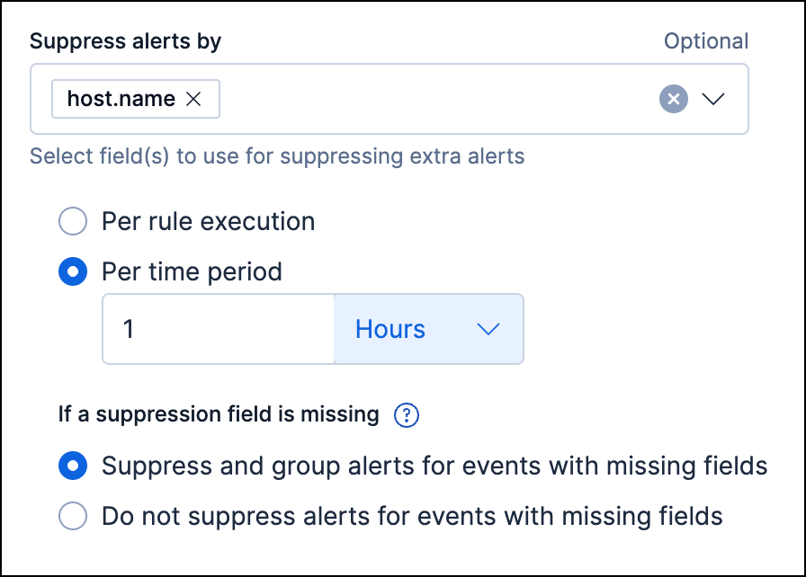
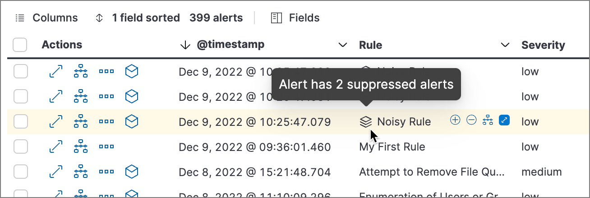
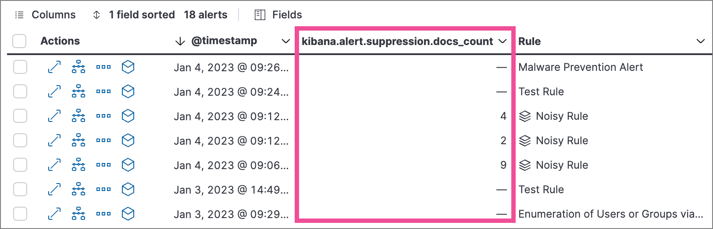
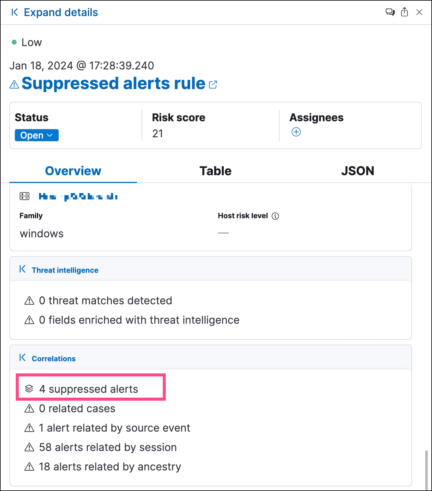
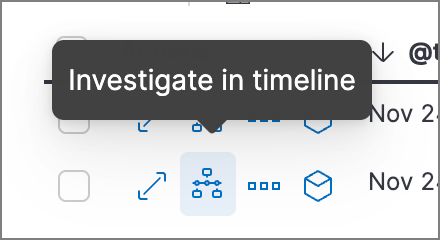

[[alert-suppression]]
== Suppress detection alerts

Alert suppression allows you to reduce the number of repeated or duplicate detection alerts created by <<about-rules,detection rules>>. Normally, when a rule meets its criteria repeatedly, it creates multiple alerts, one for each time the rule's criteria are met. When alert suppression is configured, alerts for duplicate events are not created. Instead, the qualifying events are grouped, and only one alert is created for each group. 

Depending on the rule type, you can configure alert suppression to create alerts each time the rule runs, or once within a specified time window. You can also specify multiple fields to group events by unique combinations of values.

The {security-app} displays several indicators in the Alerts table and the alert details flyout when a detection alert is created with alert suppression enabled. You can view the original events associated with suppressed alerts by investigating the alert in Timeline.

=== Configure alert suppression 

.Requirements and notices
[sidebar]
--
* Alert suppression requires a https://www.elastic.co/pricing[Platinum or higher subscription].

* {ml-cap} rules have <<ml-requirements,additional requirements>> for alert suppression.
--

You can configure alert suppression when <<rules-ui-create,creating>> or editing a rule.  

. When configuring the rule (the **Define rule** step for a new rule, or the **Definition** tab for an existing rule), specify how you want to group alerts for alert suppression:
+
--
** **All rule types except the threshold rule**: In *Suppress alerts by*, enter 1-3 field names to group events by the fields' values. 
** **Threshold rule only:** In **Group by**, enter up to 3 field names to group events by the fields' values, or leave the setting empty to group all qualifying events together. 

--
+
TIP: Refer to <<suppression-fields-with-multiple-values,Suppression for fields with an array of values>> to learn how fields with multiple values are handled.
+
. If available, choose how often to create alerts for duplicate events:
** *Per rule execution*: Create an alert each time the rule runs and meets its criteria.
** *Per time period*: Create one alert for all qualifying events that occur within a specified time window, beginning from when an event first meets the rule criteria and creates the alert. This is the only option available when configuring alert suppression for threshold rules.
+
For example, if a rule runs every 5 minutes but you don't need alerts that frequently, you can set the suppression time period to a longer time, such as 1 hour. If the rule meets its criteria, it creates an alert at that time, and for the next hour, it'll suppress any subsequent qualifying events.
+

+
. Under *If a suppression field is missing*, choose how to handle events with missing suppression fields (events in which one or more of the *Suppress alerts by* fields don't exist):
+
NOTE: These options are available for all rule types except threshold rules. 

* *Suppress and group alerts for events with missing fields*: Create one alert for each group of events with missing fields. Missing fields get a `null` value, which is used to group and suppress alerts. 
* *Do not suppress alerts for events with missing fields*: Create a separate alert for each matching event. This basically falls back to normal alert creation for events with missing suppression fields.

. Configure other rule settings, then save and enable the rule.

[TIP]
==== 

* Use the *Rule preview* before saving the rule to visualize how alert suppression will affect the alerts created, based on historical data.
* If a rule times out while suppression is turned on, try shortening the rule's <<rule-schedule,look-back>> time or turn off suppression to improve the rule's performance.

====

[discrete]
[[suppression-fields-with-multiple-values]]
=== Suppression for fields with an array of values

When specifying fields to suppress alerts by, you can select fields that have multiple values. When alerts for those fields are generated, they're handled as follows:

* **Custom query or threshold rules:** Alerts are grouped by each unique value and an alert is created for each group. For example, if you suppress alerts by `destination.ip` of `[127.0.0.1, 127.0.0.2, 127.0.0.3]`, alerts are grouped separately for each value of `127.0.0.1`, `127.0.0.2`, and `127.0.0.3` and an alert is created for each group.

* **Indicator match, event correlation (non-sequence queries only), new terms, {esql}, or {ml} rules:** Alerts with identical array values are grouped together. For example, if you suppress alerts by `destination.ip` of `[127.0.0.1, 127.0.0.2, 127.0.0.3]`, alerts with the entire array are grouped and only one alert is created for the group.
           
* **Event correlation (sequence queries only) rules:** Alerts that are an exact match are grouped. To be an exact match, array values must be identical and in the same order. For example, if you specify the field `myips` and one sequence alert has `[1.1.1.1, 0.0.0.0]` and another sequence alert has `[1.1.1.1, 192.168.0.1]`, neither of those alerts is suppressed, despite sharing an array element.

=== Confirm suppressed alerts

The {security-app} displays several indicators of whether a detection alert was created with alert suppression enabled, and how many duplicate alerts were suppressed.

IMPORTANT: After an alert is moved to the `Closed` status, it will no longer suppress new alerts. To prevent interruptions or unexpected changes in suppression, avoid closing alerts before the suppression interval ends.

* *Alerts* table — Icon in the *Rule* column. Hover to display the number of suppressed alerts:
+
[role="screenshot"]

* *Alerts* table — Column for suppressed alerts count. Select *Fields* to open the fields browser, then add `kibana.alert.suppression.docs_count` to the table.
+
[role="screenshot"]

* Alert details flyout — *Insights* -> *Correlations* section:
+
[role="screenshot"]

=== Investigate events for suppressed alerts

With alert suppression, detection alerts aren't created for the grouped source events, but you can still retrieve the events for further analysis or investigation. Do one of the following to open Timeline with the original events associated with both the created alert and the suppressed alerts:

* *Alerts* table — Select *Investigate in timeline* in the *Actions* column.
+
[role="screenshot"]

* Alert details flyout — Select *Take action* -> *Investigate in timeline*.

=== Alert suppression limit by rule type

Some rule types have a maximum number of alerts that can be suppressed (custom query rules don't have a suppression limit):

* **Threshold, event correlation, {esql}, and {ml}:** The maximum number of alerts is the value you choose for the rule's **Max alerts per run** <<rule-ui-advanced-params,advanced setting>>, which is `100` by default.
* **Indicator match and new terms:** The maximum number is five times the value you choose for the rule's **Max alerts per run** <<rule-ui-advanced-params,advanced setting>>. The default value is `100`, which means the default maximum limit for indicator match rules and new term rules is `500`.