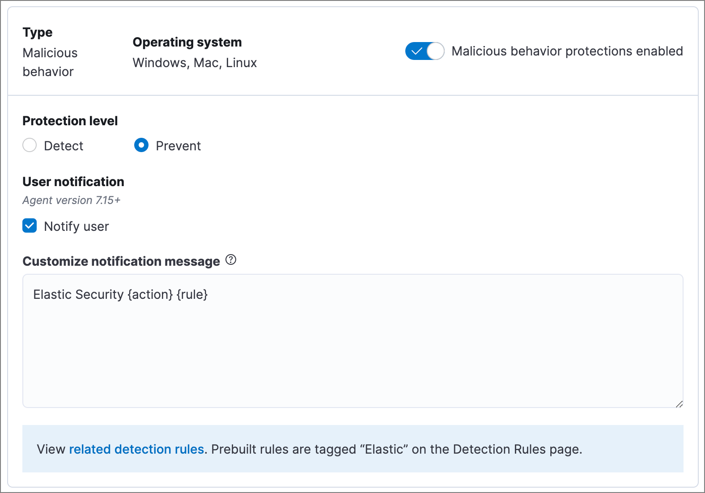
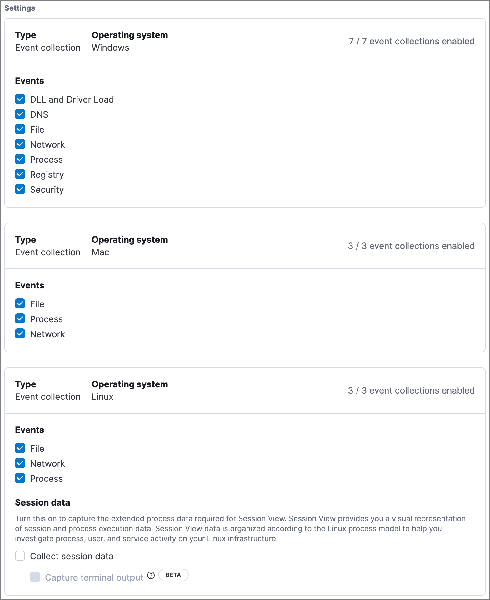

After the ((agent)) is installed with the ((elastic-defend)) integration, several protections features — including
preventions against malware, ransomware, memory threats, and malicious behavior — are automatically enabled
on protected hosts (some features require a Platinum or Enterprise license). If needed, you can update the
integration policy to configure protection settings, event collection, antivirus settings, trusted applications,
event filters, host isolation exceptions, and blocked applications to meet your organization's security needs.

You can also create multiple ((elastic-defend)) integration policies to maintain unique configuration profiles. To create an additional ((elastic-defend)) integration policy, go to **Management** -> **Integrations**, then follow the steps for <DocLink id="enSecurityInstallEndpoint" section="add-the-((elastic-defend))-integration">adding the ((elastic-defend)) integration</DocLink>.

<DocCallOut title="Requirements">

You must have the **((elastic-defend)) Policy Management : All** <DocLink id="enSecurityEndpointManagementReq">privilege</DocLink> to configure an integration policy.

</DocCallOut>

To configure an integration policy:

1. In the ((security-app)), go to **Manage** -> **Policies** to view the **Policies** page.
1. Select the integration policy you want to configure. The integration policy configuration page appears.
1. Review the following settings on the **Policy settings** tab and configure them as appropriate:
* <DocLink id="enSecurityConfigureEndpointIntegrationPolicy" section="malware-protection">Malware protection</DocLink>
* <DocLink id="enSecurityConfigureEndpointIntegrationPolicy" section="ransomware-protection">Ransomware protection</DocLink>
* <DocLink id="enSecurityConfigureEndpointIntegrationPolicy" section="memory-threat-protection">Memory threat protection</DocLink>
* <DocLink id="enSecurityConfigureEndpointIntegrationPolicy" section="malicious-behavior-protection">Malicious behavior protection</DocLink>
* <DocLink id="enSecurityConfigureEndpointIntegrationPolicy" section="attack-surface-reduction">Attack surface reduction</DocLink>
* <DocLink id="enSecurityConfigureEndpointIntegrationPolicy" section="event-collection">Event collection</DocLink>
* <DocLink id="enSecurityConfigureEndpointIntegrationPolicy" section="register-((elastic-sec))-as-antivirus-optional">Register ((elastic-sec)) as antivirus (optional)</DocLink>
* <DocLink id="enSecurityConfigureEndpointIntegrationPolicy" section="advanced-policy-settings-optional">Advanced policy settings (optional)</DocLink>
* <DocLink id="enSecurityConfigureEndpointIntegrationPolicy" section="save-the-general-policy-settings">Save the general policy settings</DocLink>

1. Click the **Trusted applications**, **Event filters**, **Host isolation exceptions**,
    and **Blocklist** tabs to review the endpoint policy artifacts assigned to this integration policy
    (for more information, refer to \<\<trusted-apps-ov>>, \<\<event-filters>>, \<\<host-isolation-exceptions>>, and \<\<blocklist>>). On these tabs, you can:

* Expand and view an artifact — Click the arrow next to its name.
* View an artifact's details — Click the actions menu (**...**), then select **View full details**.
* Unassign an artifact (Platinum or Enterprise subscription) — Click the actions menu (**...**),
    then select **Remove from policy**. This does not delete the artifact; this just unassigns it from the current policy.

* Assign an existing artifact (Platinum or Enterprise subscription) — Click **Assign _x_ to policy**,
    then select an item from the flyout. This view lists any existing artifacts that aren't already assigned to the current policy.

<DocCallOut title="Note">
You can't create a new endpoint policy artifact while configuring an integration policy.
To create a new artifact, go to its main page in the ((security-app)) (for example,
to create a new trusted application, go to **Manage** -> **Trusted applications**).
</DocCallOut>

## Malware protection

Malware prevention on the ((agent)) detects and stops malicious attacks by using a <DocLink id="enSecurityDetectionEngineOverview" section="machine-learning-model">machine learning model</DocLink>
that looks for static attributes to determine if a file is malicious or benign.

By default, malware protection is enabled on Windows, macOS, and Linux hosts.
To disable malware protection, switch the **Malware protections enabled** toggle off.

Malware protection levels are:

* **Detect**: Detects malware on the host and generates an alert. The agent will **not** block malware.
    You must pay attention to and analyze any malware alerts that are generated.

* **Prevent** (Default): Detects malware on the host, blocks it from executing, and generates an alert.

Select **Notify user** to send a push notification in the host operating system when activity is detected or prevented. Notifications are enabled by default for the **Prevent** option.

<DocCallOut title="Tip">
Platinum and Enterprise customers can customize these notifications using the `Elastic Security {action} {filename}` syntax.
</DocCallOut>

Malware protection also allows you to manage a blocklist to prevent specified applications from running on hosts,
extending the list of processes that ((elastic-defend)) considers malicious. Use the **Blocklist enabled** toggle
to enable or disable this feature for all hosts associated with the integration policy. To configure the blocklist, refer to \<\<blocklist>>.

## Ransomware protection

Behavioral ransomware prevention detects and stops ransomware attacks on Windows systems by
analyzing data from low-level system processes. It is effective across an array of widespread
ransomware families — including those targeting the system’s master boot record.

Ransomware protection is a paid feature and is enabled by default if you have a [Platinum or Enterprise license](https://www.elastic.co/pricing).
If you upgrade to a Platinum or Enterprise license from Basic or Gold, ransomware protection will be disabled by default.

Ransomware protection levels are:

* **Detect**: Detects ransomware on the host and generates an alert. The ((agent))
    will **not** block ransomware. You must pay attention to and analyze any ransomware alerts that are generated.

* **Prevent** (Default): Detects ransomware on the host, blocks it from executing,
    and generates an alert.

Select **Notify user** to send a push notification in the host operating system when activity is detected or prevented. Notifications are enabled by default for the **Prevent** option.

<DocCallOut title="Tip">
Platinum and Enterprise customers can customize these notifications using the `Elastic Security {action} {filename}` syntax.
</DocCallOut>

## Memory threat protection

Memory threat protection detects and stops in-memory threats, such as shellcode injection,
which are used to evade traditional file-based detection techniques.

Memory threat protection is a paid feature and is enabled by default if you have
a [Platinum or Enterprise license](https://www.elastic.co/pricing).
If you upgrade to a Platinum or Enterprise license from Basic or Gold, memory threat protection will be disabled by default.

Memory threat protection levels are:

* **Detect**: Detects memory threat activity on the host and generates an alert.
    The ((agent)) will **not** block the in-memory activity. You must pay attention to and analyze any alerts that are generated.

* **Prevent** (Default): Detects memory threat activity on the host, forces the process
    or thread to stop, and generates an alert.

Select **Notify user** to send a push notification in the host operating system when activity is detected or prevented. Notifications are enabled by default for the **Prevent** option.

<DocCallOut title="Tip">
Platinum and Enterprise customers can customize these notifications using the `Elastic Security {action} {rule}` syntax.
</DocCallOut>

## Malicious behavior protection

Malicious behavior protection detects and stops threats by monitoring the behavior
of system processes for suspicious activity. Behavioral signals are much more difficult
for adversaries to evade than traditional file-based detection techniques.

Malicious behavior protection is a paid feature and is enabled by default if you
have a [Platinum or Enterprise license](https://www.elastic.co/pricing).
If you upgrade to a Platinum or Enterprise license from Basic or Gold,
malicious behavior protection will be disabled by default.

Malicious behavior protection levels are:

* **Detect**: Detects malicious behavior on the host and generates an alert.
    The ((agent)) will **not** block the malicious behavior. You must pay attention to and analyze any alerts that are generated.

* **Prevent** (Default): Detects malicious behavior on the host, forces the process to stop,
    and generates an alert.

Select **Notify user** to send a push notification in the host operating system when activity is detected or prevented. Notifications are enabled by default for the **Prevent** option.

<DocCallOut title="Tip">
Platinum and Enterprise customers can customize these notifications using the `Elastic Security {action} {rule}` syntax.
</DocCallOut>

## Attack surface reduction

This section helps you reduce vulnerabilities that attackers can target on Windows endpoints.

* **Credential hardening**: Prevents attackers from stealing credentials stored in Windows system process memory. Turn on the toggle to remove any overly permissive access rights that aren't required for standard interaction with the Local Security Authority Subsystem Service (LSASS). This feature enforces the principle of least privilege without interfering with benign system activity that is related to LSASS.

## Event collection

In the **Settings** section, select which categories of events to collect on each operating system.
Most categories are collected by default, as seen below.

## Register ((elastic-sec)) as antivirus (optional)

With ((agent)) version 7.10 or later on Windows 7 or later, you can
configure ((elastic-sec)) as your antivirus software by turning on **Register as antivirus**.

<DocCallOut title="Note">
Windows Server versions are not supported. Antivirus registration requires Windows Security Center, which is not included in Windows Server operating systems.
</DocCallOut>

## Advanced policy settings (optional)

Users with unique configuration and security requirements can select **Show advanced settings**
to configure the policy to support advanced use cases. Hover over each setting to view its description.

<DocCallOut title="Note">
Advanced settings are not recommended for most users.
</DocCallOut>

This section includes:

* <DocLink id="enSecurityEndpointDiagnosticData">Turn off diagnostic data for ((elastic-defend))</DocLink>
* <DocLink id="enSecuritySelfHealingRollback">Configure self-healing rollback for Windows endpoints</DocLink>
* <DocLink id="enSecurityLinuxFileMonitoring">Configure Linux file system monitoring</DocLink>

## Save the general policy settings

After you have configured the general settings on the **Policy settings** tab, click **Save**. A confirmation message appears.
