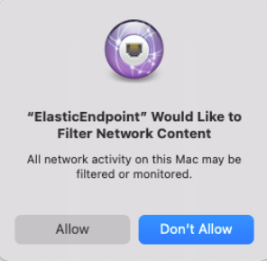
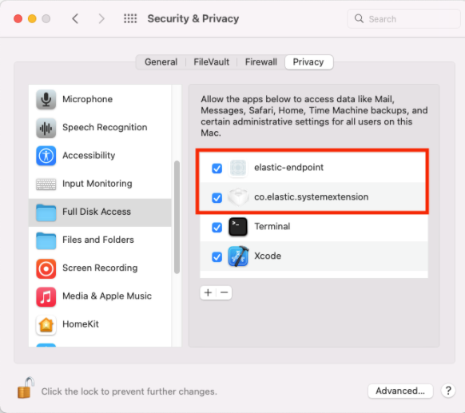

<DocBadge template="technical preview" />

To properly install and configure ((elastic-endpoint)) manually without a Mobile Device Management (MDM) profile, there are additional permissions that must be enabled on the endpoint before ((elastic-endpoint)) can be fully functional:

* <DocLink id="serverlessSecurityDeployElasticEndpoint" section="approve-the-system-extension-for-((elastic-endpoint))">Approve the system extension</DocLink>
* <DocLink id="serverlessSecurityDeployElasticEndpoint" section="approve-network-content-filtering-for-((elastic-endpoint))">Approve network content filtering</DocLink>
* <DocLink id="serverlessSecurityDeployElasticEndpoint" section="enable-full-disk-access-for-((elastic-endpoint))">Enable Full Disk Access</DocLink>

<DocCallOut title="Note">
The following permissions that need to be enabled are required after you <DocLink id="serverlessSecurityInstallDefend">configure and install the ((elastic-defend)) integration</DocLink>, which includes <DocLink id="serverlessSecurityInstallDefend" section="configure-and-enroll-the-((agent))">enrolling the ((agent))</DocLink>.
</DocCallOut>

## Approve the system extension for ((elastic-endpoint))

For macOS Catalina (10.15) through macOS Monterey (12.6.6), ((elastic-endpoint)) will attempt to load a system extension during installation. This system extension must be loaded in order to provide insight into system events such as process events, file system events, and network events.

The following message appears during installation:

1. Click **Open Security Preferences**.
1. In the lower-left corner of the **Security & Privacy** pane, click the **Lock button**, then enter your credentials to authenticate.

    

1. Click **Allow** to allow the ((elastic-endpoint)) system extension to load.

    

## Approve network content filtering for ((elastic-endpoint))

After successfully loading the ((elastic-endpoint)) system extension,  an additional message appears, asking to allow ((elastic-endpoint)) to filter network content.

* Click **Allow** to enable content filtering for the ((elastic-endpoint)) system extension. Without this approval, ((elastic-endpoint)) cannot receive network events and, therefore, cannot enable network-related features such as <DocLink id="serverlessSecurityHostIsolationOv">host isolation</DocLink>.

## Enable Full Disk Access for ((elastic-endpoint))

((elastic-endpoint)) requires Full Disk Access to subscribe to system events via the ((elastic-defend)) framework and to protect your network from malware and other cybersecurity threats. To enable Full Disk Access on endpoints running macOS Catalina (10.15) and later, you must manually approve ((elastic-endpoint)). 

<DocCallOut title="Note">
The following instructions apply only to ((elastic-endpoint)) version 8.0.0 and later. To see Full Disk Access requirements for the Endgame sensor, refer to <DocLink id="serverlessSecurityEndgameSensorFullDiskAccess" />.
</DocCallOut>
{/* Might need to revisit this note and the section. Keep an eye on https://github.com/elastic/staging-serverless-security-docs/issues/124 */} 

1. Open the **System Preferences** application.
1. Select **Security and Privacy**.

    

1. On the **Security and Privacy** pane, select the **Privacy** tab.
1. From the left pane, select **Full Disk Access**.

    

1. In the lower-left corner of the pane, click the **Lock button**, then enter your credentials to authenticate.
1. In the **Privacy** tab,  confirm that `ElasticEndpoint` AND `co.elastic.systemextension` are selected to properly enable Full Disk Access.

    

If the endpoint is running ((elastic-endpoint)) version 7.17.0 or earlier:
{/* Might need to revisit this note and the section. Keep an eye on https://github.com/elastic/staging-serverless-security-docs/issues/124 */} 

1. In the lower-left corner of the pane, click the **Lock button**, then enter your credentials to authenticate.
1. Click the **+** button to view **Finder**.
1. Navigate to `/Library/Elastic/Endpoint`, then select the `elastic-endpoint` file.
1. Click **Open**.
1. In the **Privacy** tab, confirm that `elastic-endpoint` AND `co.elastic.systemextension` are selected to properly enable Full Disk Access.

    

