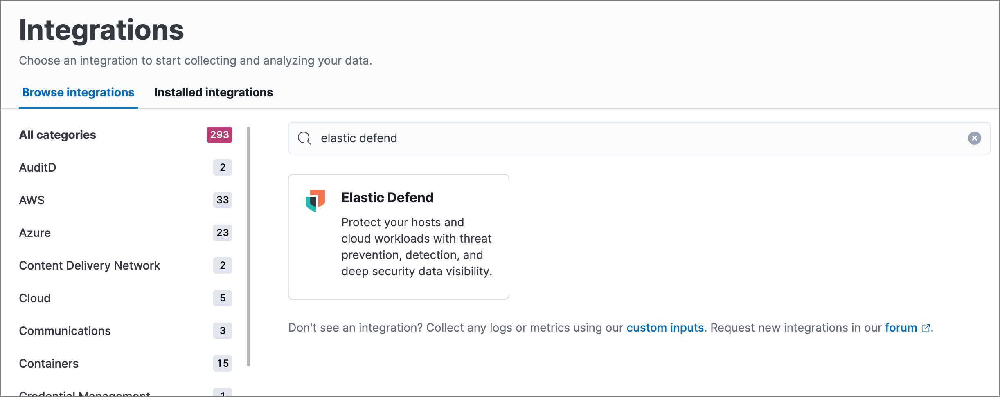

import RoughContent from '../partials/rough-content-notice.mdx'

<RoughContent />

Like other Elastic integrations, ((elastic-defend)) is integrated into the ((agent)) using [((fleet))](((fleet-guide))/fleet-overview.html). Upon configuration, the integration allows the ((agent)) to monitor events on your host and send data to the ((security-app)).

<DocCallOut title="Requirements">

* ((fleet)) is required for ((elastic-defend)).

* To configure the ((elastic-defend)) integration on the ((agent)), you must have permission to use ((fleet)) in ((kib)).

* You must have the **((elastic-defend)) Policy Management : All** <DocLink id="serverlessSecurityEndpointManagementReq">privilege</DocLink> to configure an integration policy, and the **Endpoint List** <DocLink id="serverlessSecurityEndpointManagementReq">privilege</DocLink> to access the **Endpoints** page.

</DocCallOut>

## Before you begin

If you're using macOS, some versions may require you to grant Full Disk Access to different kernels, system extensions, or files. Refer to <DocLink id="serverlessSecurityElasticEndpointDeployReqs">requirements for ((elastic-endpoint))</DocLink> if you're installing the ((elastic-endpoint)) or <DocLink id="serverlessSecurityEndgameSensorFullDiskAccess">requirements for the Endgame sensor</DocLink> for more information.

## Add the ((elastic-defend)) integration

1. Go to the **Integrations** page, which you can access in several ways:

* In ((kib)): **Management** -> **Integrations**
* In the ((security-app)): **Get started** -> **Add security integrations**

    

1. Search for and select **((elastic-defend))**, then select **Add ((elastic-defend))**. The integration configuration page appears.

<DocCallOut title="Note">
If this is the first integration you've installed and the **Ready to add your first integration?** page appears instead, select **Add integration only (skip agent installation)** to proceed. You can <DocLink id="serverlessSecurityInstallDefend" section="add-the-((agent))">install ((agent))</DocLink> after setting up the ((elastic-defend)) integration.

<DocImage size="xl" url="../images/install-endpoint/-getting-started-install-endpoint-endpoint-cloud-security-configuration.png" alt="Add ((elastic-defend)) integration page" />

</DocCallOut>

1. Configure the ((elastic-defend)) integration with an **Integration name** and optional **Description**.
1. Select the type of environment you want to protect, either **Traditional Endpoints** or **Cloud Workloads**.
1. Select a configuration preset. Each preset comes with different default settings for ((agent)) — you can further customize these later by <DocLink id="serverlessSecurityConfigureEndpointIntegrationPolicy">configuring the ((elastic-defend)) integration policy</DocLink>.

    <DocTable columns={[
    {
    "title": "",
    "width": "50%"
    },
    {
    "title": "",
    "width": "50%"
    }
    ]}>
    <DocRow>
    <DocCell>
    **Traditional Endpoint presets**

    </DocCell>
    <DocCell>
    All traditional endpoint presets _except **Data Collection**_ have these preventions enabled by default: malware, ransomware, memory threat, malicious behavior, and credential theft. Each preset collects the following events:

    * **Data Collection:** All events; no preventions
    * **Next-Generation Antivirus (NGAV):** Process events; all preventions
    * **Essential EDR (Endpoint Detection & Response):** Process, Network, File events; all preventions
    * **Complete EDR (Endpoint Detection & Response):** All events; all preventions

    </DocCell>
    </DocRow>
    <DocRow>
    <DocCell>
    **Cloud Workloads presets**

    </DocCell>
    <DocCell>
    Both cloud workload presets are intended for monitoring cloud-based Linux hosts. Therefore, <DocLink id="serverlessSecuritySessionView">session data</DocLink> collection, which enriches process events, is enabled by default. They both have all preventions disabled by default, and collect process, network, and file events.

    * **All events:** Includes data from automated sessions.
    * **Interactive only:** Filters out data from non-interactive sessions by creating an <DocLink id="serverlessSecurityEventFilters">event filter</DocLink>.

    </DocCell>
    </DocRow>
    </DocTable>

1. Enter a name for the agent policy in **New agent policy name**. If other agent policies already exist, you can click the **Existing hosts** tab and select an existing policy instead. For more details on ((agent)) configuration settings, refer to [((agent)) policies](((fleet-guide))/agent-policy.html).
1. When you're ready, click **Save and continue**.
1. To complete the integration, select **Add ((agent)) to your hosts** and continue to the next section to install the ((agent)) on your hosts.

## Configure and enroll the ((agent))

To enable the ((elastic-defend)) integration, you must enroll agents in the relevant policy using ((fleet)).

<DocCallOut title="Important" color="warning">

Before you add an ((agent)), a ((fleet-server)) must be running. Refer to [Add a ((fleet-server))](((fleet-guide))/add-a-fleet-server.html).

((elastic-defend)) cannot be integrated with an ((agent)) in standalone mode.

</DocCallOut>

### Important information about ((fleet-server))

<DocCallOut title="Note">
If you are running an ((stack)) version earlier than 7.13.0, you can skip this section.
</DocCallOut>

If you have upgraded to an ((stack)) version that includes ((fleet-server)) 7.13.0 or newer, you will need to redeploy your agents. Review the following scenarios to ensure you take the appropriate steps.

* If you redeploy the ((agent)) to the same machine through the ((fleet)) application after you upgrade, a new agent will appear.
* If you want to remove the ((agent)) entirely without transitioning to the ((fleet-server)), then you will need to manually uninstall the ((agent)) on the machine. This will also uninstall the endpoint. Refer to [Uninstall Elastic Agent](((fleet-guide))/uninstall-elastic-agent.html).
* In the rare event that the ((agent)) fails to uninstall, you might need to manually uninstall the endpoint. Refer to <DocLink id="serverlessSecurityUninstallEndpoint">Uninstall an endpoint</DocLink> at the end of this topic.

### Add the ((agent))

1. Go to **((fleet))** -> **Agents** -> **Add agent**.

    

1. Select an agent policy for the ((agent)). You can select an existing policy, or select **Create new agent policy** to create a new one. For more details on ((agent)) configuration settings, refer to [((agent)) policies](((fleet-guide))/agent-policy.html).

    The selected agent policy should include ((elastic-defend)).

    <DocImage size="l" url="../images/install-endpoint/-getting-started-install-endpoint-endpoint-cloud-sec-add-agent-detail.png" alt="Add agent flyout with ((elastic-defend)) integration highlighted." />

1. Ensure that the **Enroll in ((fleet))** option is selected. ((elastic-defend)) cannot be integrated with ((agent)) in standalone mode.

1. Select the appropriate platform or operating system for the host, then copy the provided commands.

1. On the host, open a command-line interface and navigate to the directory where you want to install ((agent)). Paste and run the commands from ((fleet)) to download, extract, enroll, and start ((agent)).

1. (Optional) Return to the **Add agent** flyout in ((fleet)), and observe the **Confirm agent enrollment** and **Confirm incoming data** steps automatically checking the host connection. It may take a few minutes for data to arrive in ((es)).

1. After you have enrolled the ((agent)) on your host, you can click **View enrolled agents** to access the list of agents enrolled in ((fleet)). Otherwise, select **Close**.

    The host will now appear on the **Endpoints** page in the ((security-app)). It may take another minute or two for endpoint data to appear in ((elastic-sec)).

1. For macOS, continue with <DocLink id="serverlessSecurityDeployElasticEndpoint">these instructions</DocLink> to grant ((elastic-endpoint)) the required permissions.

