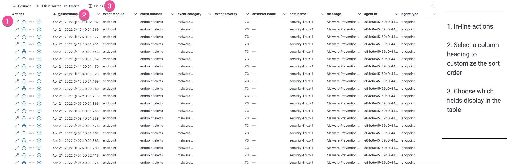
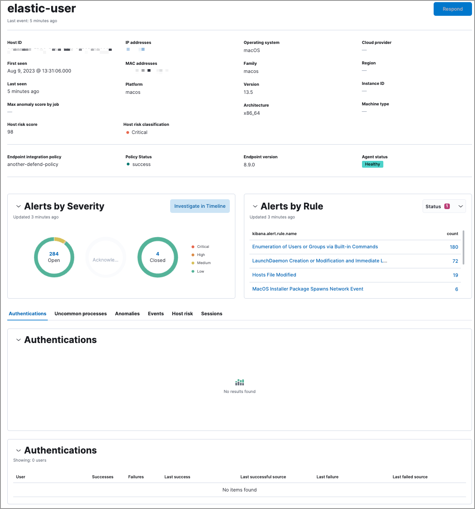

<DocBadge template="technical preview" />

The Hosts page provides a comprehensive overview of all hosts and host-related security events. Key performance indicator (KPI) charts, data tables, and interactive widgets let you view specific data, drill down for deeper insights, and interact with Timeline for further investigation.

The Hosts page has the following sections:

## Host KPI (key performance indicator) charts

KPI charts show metrics for hosts and unique IPs within the time range specified in the date picker. This data is visualized using linear or bar graphs.

<DocCallOut title="Tip">
Hover inside a KPI chart to display the actions menu (<DocIcon type="boxesHorizontal" title="Actions menu icon" />), where you can perform these actions: inspect, open in Lens, and add to a new or existing case.
</DocCallOut>

## Data tables

Beneath the KPI charts are data tables, categorized by individual tabs, which are useful for viewing and investigating specific types of data. Select the relevant tab to view the following data:

* **All hosts**: High-level host details.
* **Uncommon processes**: Uncommon processes running on hosts.
* **Anomalies**: Anomalies discovered by machine learning jobs.
* **Events**: All host events. To display alerts received from external monitoring tools, scroll down to the Events table and select **Show only external alerts** on the right.
* **Host risk**: The latest recorded host risk score for each host, and its host risk classification. This feature requires the Security Complete <DocLink id="serverlessGeneralManageProject" text="project feature"/> and must be enabled to display the data. Click **Enable** on the **Host risk** tab to get started. To learn more, refer to our <DocLink id="serverlessSecurityHostRiskScore">host risk score documentation</DocLink>.  
* **Sessions**: Linux process events that you can open in <DocLink id="serverlessSecuritySessionView">Session View</DocLink>, an investigation tool that allows you to examine Linux process data at a hierarchal level.

The tables within the **Events** and **Sessions** tabs include inline actions and several customization options. To learn more about what you can do with the data in these tables, refer to <DocLink id="serverlessSecurityAlertsUiManage">Manage detection alerts</DocLink>.

## Host details page

A host's details page displays all relevant information for the selected host. To view a host's details page, click its **Host name** link in the **All hosts** table.

The host details page includes the following sections: 

* **Summary**: Details such as the host ID, when the host was first and last seen, the associated IP addresses, and associated operating system. If the host risk score feature is enabled, this section also displays host risk score data. 
* **Alert metrics**: The total number of alerts by severity, rule, and status (`Open`, `Acknowledged`, or `Closed`).  
* **Data tables**: The same data tables as on the main Hosts page, except with values for the selected host instead of all hosts. 

