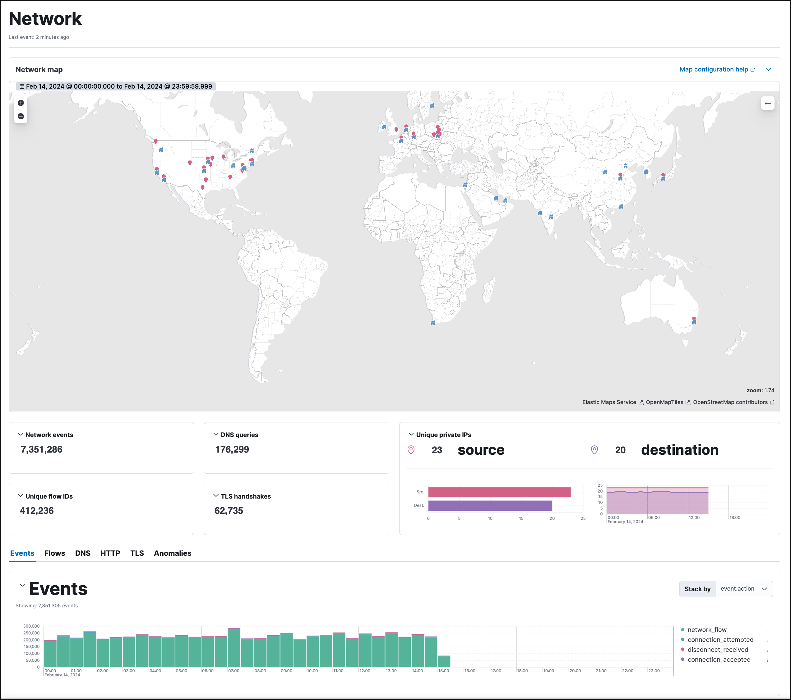

<DocBadge template="technical preview" />

The Network page provides key network activity metrics in an interactive map, and network event tables that enable interaction with Timeline. You can drag and drop items of interest from the Network view to Timeline for further investigation.

## Map

The map provides an interactive visual overview of your network traffic. Hover over source and destination points to show more information, such as host names and IP addresses.

<DocCallOut title="Note">
To access the interactive map, you must have the appropriate user role. To learn more about map setup, refer to <DocLink id="serverlessSecurityConfMapUi">Configure network map data</DocLink>.
</DocCallOut>

There are several ways to drill down: 

* Click a point, hover over the host name or destination IP, then  use the filter icon to add a field to the filter bar. 
* Drag a field from the map to Timeline. 
* Click a host name to go to the Hosts page. 
* Click an IP address to open its details page.

You can start an investigation using the map, and the map refreshes to show related data when you run a query or update the time range.

<DocCallOut title="Tip">
To add and remove layers, click on the **Options** menu (**...**) in the top right corner of the map.
</DocCallOut>

## Widgets and data tables

Interactive widgets let you drill down for deeper insights:

* Network events
* DNS queries
* Unique flow IDs
* TLS handshakes
* Unique private IPs

There are also tabs for viewing and investigating specific types of data:

* **Events**: All network events. To display alerts received from external monitoring tools, scroll down to the events table and select **Show only external alerts** on the right.

The Events table includes inline actions and several customization options. To learn more about what you can do with the data in these tables, refer to <DocLink id="serverlessSecurityAlertsUiManage">Manage detection alerts</DocLink>.
* **Flows**: Source and destination IP addresses and countries.
* **DNS**: DNS network queries.
* **HTTP**: Received HTTP requests (HTTP requests for applications using
    [Elastic APM](((apm-app-ref))/apm-getting-started.html) are monitored by default).

* **TLS**: Handshake details.
* **Anomalies**: Anomalies discovered by <DocLink id="serverlessSecurityMachineLearning">machine learning jobs</DocLink>.

## IP details page

An IP's details page shows related network information for the selected IP address. 

To view an IP's details page, click its IP address link from the Source IPs or Destination IPs table.

The IP's details page includes the following sections: 

* **Summary**: General details such as the location, when the IP address was first and last seen, the associated host ID and host name, and links to external sites for verifying the IP address's reputation. 

    <DocCallOut title="Note">
    By default, the external sites are [Talos](https://talosintelligence.com/) and
    [VirusTotal](https://www.virustotal.com/). Refer to <DocLink id="serverlessSecurityAdvancedSettings" section="display-reputation-links-on-ip-detail-pages">Display reputation links on IP detail pages</DocLink> to learn how to configure IP reputation links.
    </DocCallOut>

* **Alert metrics**: The total number of alerts by severity, rule, and status (`Open`, `Acknowledged`, or `Closed`).  

* **Data tables**: The same data tables as on the main Network page, except with values for the selected IP address instead of all IP addresses.

