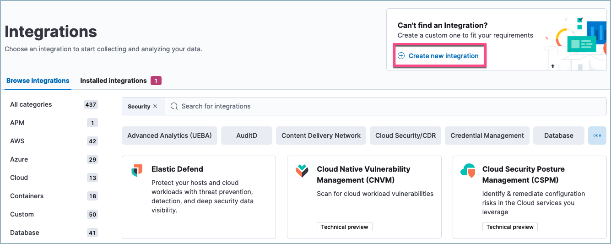
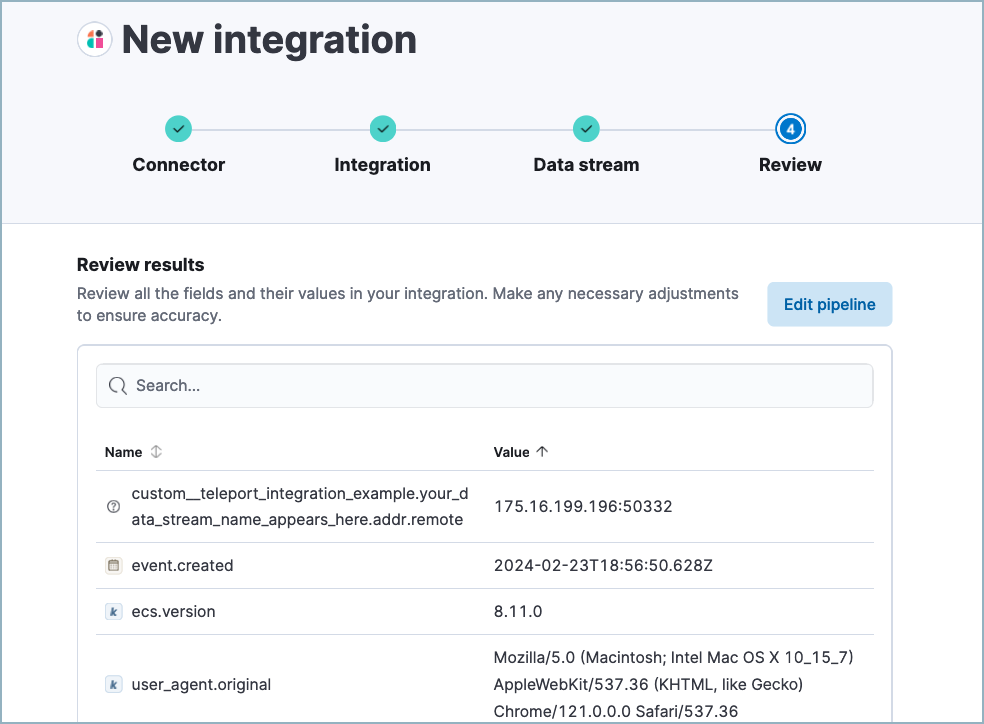
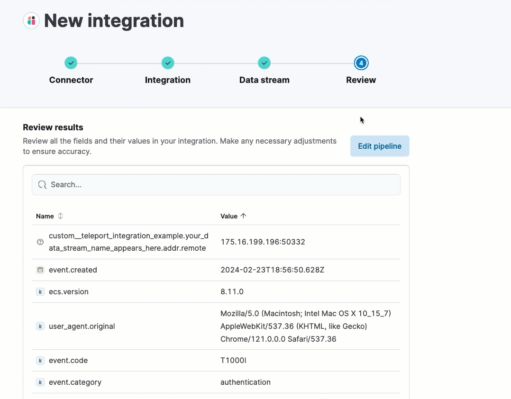
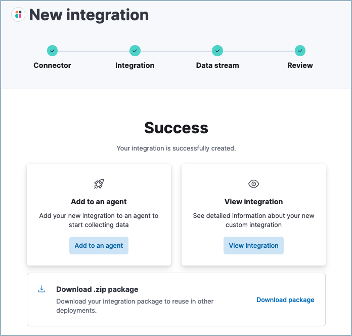

[[automatic-import]]
[chapter]
= Automatic import

:frontmatter-description: Accelerate threat identification by triaging alerts with a large language model.
:frontmatter-tags-products: [security]
:frontmatter-tags-content-type: [overview]
:frontmatter-tags-user-goals: [get-started]

Automatic Import helps you quickly parse, ingest, and create https://www.elastic.co/elasticsearch/common-schema[ECS mappings] for data from sources that don't yet have prebuilt Elastic integrations. This can accelerate your migration to {elastic-sec}, and help you quickly add new data sources to an existing SIEM solution in {elastic-sec}. Automatic Import uses a large language model (LLM) with specialized instructions to quickly analyze your source data and create a custom integration. 

While Elastic has 400+ {integrations-docs}[prebuilt data integrations], Automatic Import helps you extend data coverage to other security-relevant technologies and applications. Elastic integrations (including those created by Automatic Import) normalize data to {ecs-ref}/ecs-reference.html[the Elastic Common Schema (ECS)], which creates uniformity across dashboards, search, alerts, machine learning, and more. 

TIP: Click https://elastic.navattic.com/automatic-import[here] to access an interactive demo that shows the feature in action, before setting it up yourself.

.Requirements
[sidebar]
--
- A working <<llm-connector-guides, LLM connector>>. 
- An https://www.elastic.co/pricing[Enterprise] subscription.
- A sample of the data you want to import.
--

.Notes on sample data
[sidebar]
--
To use Automatic Import, you must provide a sample of the data you wish to import. An LLM will process that sample and automatically create an integration suitable for processing the data represented by the sample. **Any structured or unstructured format is acceptable, including but not limited to JSON, NDJSON, CSV, Syslog.** 

* You can upload a sample of arbitrary size. The LLM will detect its format and select up to 100 documents for detailed analysis.
* The more variety in your sample, the more accurate the pipeline will be. For best results, include a wide range of unique log entries in your sample instead of repeating similar logs.
* When uploading a CSV, a header with column names will be automatically recognized. However if the header is not present, the LLM will still attempt to create descriptive field names based on field formats and values.
* For JSON and NDJSON samples, each object in your sample should represent an event, and you should avoid deeply nested object structures.
* When you select `API (CEL input)` as one of the sources, you will be prompted to provide the associated OpenAPI specification (OAS) file to generate a CEL program that consumes this API.
--

WARNING: Note that CEL generation in Automatic Import is in beta and is subject to change. The design and code is less mature than official GA features and is being provided as-is with no warranties. Beta features are not subject to the support SLA of official GA features.

.Recommended models
[sidebar]
--
You can use Automatic Import with any LLM, however model performance varies. Model performance for Automatic Import is similar to model performance for Attack Discovery; models that perform well for Attack Discovery perform well for Automatic Import. Refer to the <<llm-performance-matrix, LLM performance Matrix>>.
--

IMPORTANT: Using Automatic Import allows users to create new third-party data integrations through the use of third-party generative AI models (“GAI models”). Any third-party GAI models that you choose to use are owned and operated by their respective providers. Elastic does not own or control these third-party GAI models, nor does it influence their design, training, or data-handling practices. Using third-party GAI models with Elastic solutions, and using your data with third-party GAI models is at your discretion. Elastic bears no responsibility or liability for the content, operation, or use of these third-party GAI models, nor for any potential loss or damage arising from their use. Users are advised to exercise caution when using GAI models with personal, sensitive, or confidential information, as data submitted may be used to train the models or for other purposes. Elastic recommends familiarizing yourself with the development practices and terms of use of any third-party GAI models before use. You are responsible for ensuring that your use of Automatic Import complies with the terms and conditions of any third-party platform you connect with.

[discrete]
== Create a new custom integration

1. In {elastic-sec}, click **Add integrations**.
2. Under **Can't find an integration?** click **Create new integration**.
+

+
3. Click **Create integration**.
4. Select an <<llm-connector-guides, LLM connector>>. 
5. Define how your new integration will appear on the Integrations page by providing a **Title**, **Description**, and **Logo**.  Click **Next**.
6. Define your integration's package name, which will prefix the imported event fields. 
7. Define your **Data stream title**, **Data stream description**, and **Data stream name**. These fields appear on the integration's configuration page to help identify the data stream it writes to.
8. Select your {filebeat-ref}/configuration-filebeat-options.html[**Data collection method**]. This determines how your new integration will ingest the data (for example, from an S3 bucket, an HTTP endpoint, or a file stream).
9. Upload a sample of your data. Make sure to include all the types of events that you want the new integration to handle. 
10. Click **Analyze logs**, then wait for processing to complete. This may take several minutes.
11. After processing is complete, the pipeline's field mappings appear, including ECS and custom fields.
+

+
12. (Optional) After reviewing the proposed pipeline, you can fine-tune it by clicking **Edit pipeline**. Refer to the <<siem-field-reference,{elastic-sec} ECS reference>> to learn more about formatting field mappings. When you're satisfied with your changes, click **Save**. 
+

+
13. Click **Add to Elastic**. After the **Success** message appears, your new integration will be available on the Integrations page. 
+

+
14. Click **Add to an agent** to deploy your new integration and start collecting data, or click **View integration** to view detailed information about your new integration. 

NOTE: Once you've added an integration, you can't edit any details other than the ingest pipeline, which you can edit by going to **Stack Management → Ingest Pipelines**. 

TIP: You can use the <<data-quality-dash, Data Quality dashboard>> to check the health of your data ingest pipelines and field mappings.