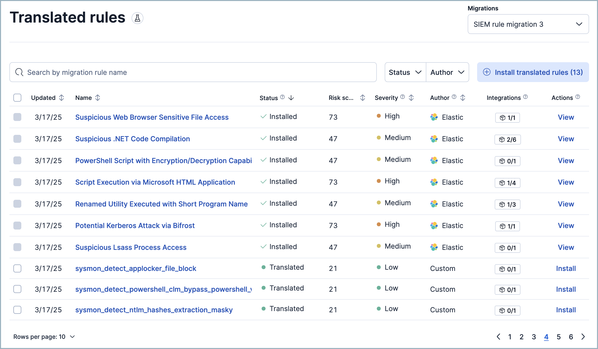
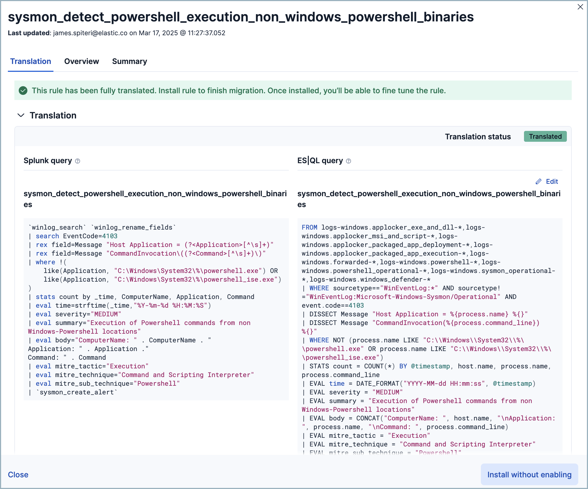

[[siem-migration]]
[chapter]
= Automatic migration

Automatic Migration for detection rules helps you quickly convert SIEM rules from the Splunk Processing Language (SPL) to the Elasticsearch Query Language ({esql}). If comparable Elastic-authored rules exist, it simplifies onboarding by mapping your rules to them. Otherwise, it creates custom rules on the fly so you can verify and edit them instead of writing them from scratch.

You can ingest your data before migrating your rules, or migrate your rules first in which case the tool will recommend which data sources you need to power your migrated rules. 

.Requirements
[sidebar]
--
* The `SIEM migrations: All` Security sub-feature privilege.
* A working <<llm-connector-guides, LLM connector>>.
* {stack} users: an https://www.elastic.co/pricing[Enterprise] subscription. 
* {Stack} users: {ml} must be enabled.
* {serverless-short} users: a https://www.elastic.co/pricing/serverless-security[Security Complete] subscription.
* {ecloud} users: {ml} must be enabled. We recommend a minimum size of 4GB of RAM per {ml} zone.
--

[discrete]
== Get started with Automatic Migration

1. Find **Get started** in the navigation menu or use the {kibana-ref}/introduction.html#kibana-navigation-search[global search field].
2. Under **Configure AI provider**, select a configured model or <<llm-connector-guides, add a new one>>. For information on how different models perform, refer to the <<llm-performance-matrix>>.
3. Next, under **Migrate rules & add data**, click **Translate your existing SIEM rules to Elastic**, then **Upload rules**.
4. Follow the instructions on the **Upload Splunk SIEM rules** flyout to export your rules from Splunk as JSON. 
+
image::images/security-siem-migration-1.png[automatic migration setup page,700]
+
.NOTE
[sidebar] 
--
The provided query downloads Splunk correlation rules and saved searches. Alternatively, as long as you    export your results in a JSON format, you can use a different query. For example:

[source,sh]
------------------
| rest /servicesNS/-/-/saved/searches
| search is_scheduled=1 AND eai:acl.app=splunksysmonsecurity
| where disabled=0
| table id, title, search, description, action.escu.eli5, 
------------------
The above sample query would download rules related to just the `splunksysmonsecurity` app.

We don't recommend downloading all searches (for example with `| rest /servicesNS/-/-/saved/searches`) since most of the data will be irrelevant to SIEM rule migration. 
--
+
5. Select your JSON file and click **Upload**. 
+
NOTE: If the file is large, you may need to separate it into multiple parts and upload them individually to avoid exceeding your LLM's context window.
+
6. After you upload your Splunk rules, Automatic Migration will detect whether they use any Splunk macros or lookups. If so, follow the instructions which appear to export and upload them. Alternatively, you can complete this step later — however, until you upload them, some of your migrated rules will have a `partially translated` status. If you upload them now, you don't have to wait on the page for them to be processed — a notification will appear when processing is complete.

7. Click **Translate** to start the rule translation process. You don't need to stay on this page. A notification will appear when the process is complete. 

8. When migration is complete, click the notification or return to the **Get started** page then click **View translated rules** to open the **Translated rules** page. 

[discrete]
== The Translated rules page

This section describes the **Translated rules** page's interface and explains how the data that appears here is derived. 

When you upload a new batch of rules, they are assigned a name and number, for example `SIEM rule migration 1`, or `SIEM rule migration 2`. Use the **Migrations** dropdown menu in the upper right to select which batch appears. 

The table's fields are as follows:

* **Name:** The names of Elastic-authored rules cannot be edited until after rule installation. To edit the name of a custom translated rule, click the name and select **Edit**.
* **Status:** The rule's translation status:
** `Installed`: Already added to Elastic SIEM. Click **View** to manage and enable it.
** `Translated`: Ready to install. This rule was mapped to an Elastic-authored rule, or translated by Automatic Import. Click **Install** to install it.
** `Partially translated`: Part of the query could not be translated. You may need to specify an index pattern for the rule query, upload missing macros or lookups, or fix broken rule syntax.
** `Not translated`: None of the original query could be translated.
** `Error`: Rule translation failed. Refer to the the error details.
* **Risk Score:** For Elastic-authored rules, risk scores are predefined. For custom translated rules, risk scores are defined as follows:
** If the source rule has a field comparable to Elastic's `risk score`, we use that value.
** Otherwise, if the source rule has a field comparable to Elastic's `rule severity` field, we base the risk score on that value according to <<rule-ui-basic-params, these guidelines>>.
** If neither of the above apply, we assign a default value.
* **Rule severity:** For Elastic-authored rules, severity scores are predefined. For custom translated rules, risk scores are based on the source rule's severity field. Splunk severity scores are translated to Elastic rule severity scores as follows:

[cols="1,1", options="header"]
|===
| Splunk severity | Elastic rule severity 
| 1 (Info)     | Low      
| 2 (Low)      | Low      
| 3 (Medium)   | Medium   
| 4 (High)     | High     
| 5 (Critical) | Critical 
|===

* **Author:** Shows one of two possible values: `Elastic`, or `Custom`. Elastic-authored rules are created by Elastic and update automatically. Custom rules are translated by the Automatic Migration tool or your team, and do not update automatically.
* **Integrations:** Shows the number of Elastic integrations that must be installed to provide data for the rule to run successfully.
* **Actions:** Allows you to click **Install** to add a rule to Elastic. Installed rules must also be enabled before they will run. To install rules in bulk, select the check box at the top of the table before clicking **Install**.

[discrete]
== Finalize translated rules

Once you're on the **Translated rules** page, to install any rules that were partially translated or not translated, you will need to edit them. Optionally, you can also edit custom rules that were successfully translated to finetune them. 

NOTE: You cannot edit Elastic-authored rules using this interface, but after they are installed you can <<rules-ui-management, edit them>> from the **Rules** page. 

[discrete]
=== Edit a custom rule

Click the rule's name to open the rule's details flyout to the **Translation** tab, which shows the source rule alongside the translated — or partially translated — Elastic version. You can update any part of the rule. When finished, click **Save**.

NOTE: If you haven't yet ingested your data, you will likely encounter `Unknown index` or `Unknown column` errors while editing. You can ignore these and add your data later.

[discrete]
=== View rule details

The rule details flyout (which appears when you click on a rule's name in the **Translate rules** table) has two other tabs, **Overview** and **Summary**. The **Overview** tab displays information such as the rule's severity, risk score, rule type, and how frequently it runs. The **Summary** tab explains the logic behind how the rule was translated, such as why specific {esql} commands were used, or why a source rule was mapped to a particular Elastic-authored rule.

IMPORTANT: All the details about your migrations is stored in the `.kibana-siem-rule-migrations-rules-default` index. You can use {kibana-ref}/discover.html[Discover] to review a variety of metrics, analyze metrics, and more.

[discrete]
== Frequently asked questions (FAQ)

**How does Automatic Migration handle rules that can't be exactly translated for various reasons, such as feature parity issues?**

After translation, rules that can't be translated appear with a status of either partially translated (yellow) or not translated (red). From there, you can address them individually.

**Are nested macros supported?**

Yes, Automatic Migration can handle nested macros.

**How can we ensure rules stay up to date?**

Automatic Migration maps your rules to Elastic-authored rules whenever possible, which are updated automatically. Like all custom rules, rules created by Automatic Migration must be maintained by you.

**What index does information about each migration appear in?**

No matter how many times you use Automatic Migration, migration data will continue to appear in `.kibana-siem-rule-migrations-rules-default`.

**How does Automatic Migration handle Splunk rules which lookup other indices?**

Rules that fall into this category will typically appear with a status of partially translated. You can use the {ref}/esql-commands.html#esql-lookup-join[`LOOKUP JOIN`] {esql} command to help in this situation. 