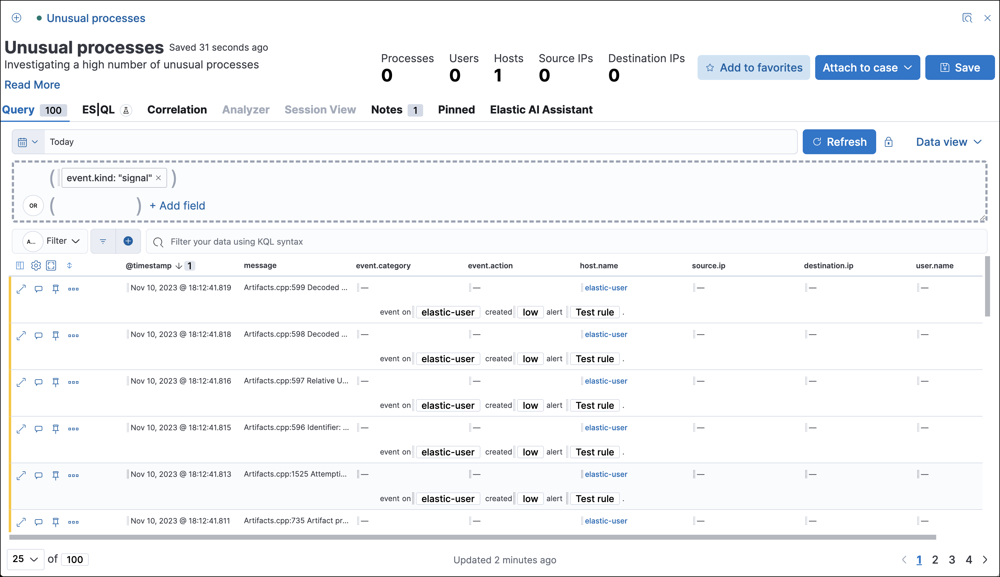
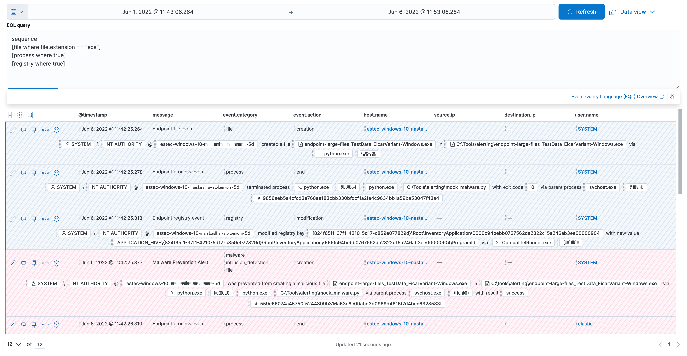

<DocBadge template="technical preview" />
<div id="timelines-ui"></div>

Use Timeline as your workspace for investigations and threat hunting.
You can add alerts from multiple indices to a Timeline to facilitate advanced investigations.

You can drag or send fields of interest to a Timeline to create the desired query. For example, you can add fields from tables and histograms
on the **Overview**, **Alerts**, **Hosts**, and **Network** pages, as well as from
other Timelines. Alternatively, you can add a query directly in Timeline
by expanding the <DocLink id="serverlessSecurityTimelinesUi" section="narrow-expand">query builder</DocLink> and clicking **+ Add field**.



In addition to Timelines, you can create and attach Timeline templates to
<DocLink id="serverlessSecurityDetectionEngineOverview">detection rules</DocLink>. Timeline templates allow you to
define the source event fields used when you investigate alerts in
Timeline. You can select whether the fields use predefined values or values
retrieved from the alert. For more information, refer to <DocLink id="serverlessSecurityTimelineTemplatesUi">Create Timeline templates</DocLink>.

<div id="open-create-timeline"></div>

## Create new or open existing Timeline

To make a new Timeline, choose one of the following:

* Go to the Timelines page (**Investigations** → **Timelines**), then click **Create new Timeline**. 
* Go to the Timeline bar (which is at the bottom of most pages), click the <DocIcon type="plusInCircle" title="New Timeline" /> button, then click **Create new Timeline**.
* From an open Timeline or Timeline template, click **New** → **New Timeline**.

To open an existing Timeline, choose one of the following: 
* Go to the Timelines page, then click a Timeline's title. 
* Go to the Timeline bar, click the <DocIcon type="plusInCircle" title="New Timeline" /> button, then click **Open Timeline**.
* From an open Timeline or Timeline template, click **Open**, then select the appropriate Timeline. 

To avoid losing your changes, you must save the Timeline before moving to a different ((security-app)) page. If you change an existing Timeline, you can use the **Save as new timeline** toggle to make a new copy of the Timeline, without overwriting the original one.

<DocCallOut title="Tip">
Click the star icon (<DocIcon type="starEmpty" title="Favorite" />) to favorite your Timeline and quickly find it later.
</DocCallOut>

<div id="refine-timeline-results"></div>

## View and refine Timeline results

You can select whether Timeline displays detection alerts and other raw events, or just alerts. By default, Timeline displays both raw events and alerts. To hide raw events and display alerts only, click **Data view** to the left of the KQL query bar, then select **Show only detection alerts**.

<div id="timeline-inspect-events-alerts"></div>

## Inspect an event or alert
To further inspect an event or detection alert, click the **View details** button. A flyout with event or <DocLink id="serverlessSecurityViewAlertDetails">alert details</DocLink> appears.

<div id="conf-timeline-display"></div>

## Configure Timeline event context and display

Many types of events automatically appear in preconfigured views that provide relevant
contextual information, called **Event Renderers**. You can display and turn them on or off
with the Settings menu in the upper left corner of the results pane:


The example above displays the Flow event renderer, which highlights the movement of
data between its source and destination. If you see a particular part of the rendered event that
interests you, you can drag it up to the drop zone below the query bar for further investigation.

You can also modify a Timeline's display in other ways:

* Add, remove, reorder, or resize columns
* Create <DocLink id="serverlessSecurityRuntimeFields">runtime fields</DocLink> and display them in the Timeline
* View the Timeline in full screen mode
* Add or delete notes on individual events
* Add or delete investigation notes on the entire Timeline
* Pin interesting events to the Timeline

<div id="narrow-expand"></div>

## Use the Timeline query builder

Expand the query builder by clicking the query builder button (<DocIcon type="timeline" title="Query builder" />) to the right of the KQL query bar. Drop in fields to build a query that filters Timeline results. The fields' relative placement specifies their logical relationships: horizontally adjacent filters use `AND`, while vertically adjacent filters use `OR`.

<DocCallOut title="Tip">
Collapse the query builder and provide more space for Timeline results by clicking the query builder button (<DocIcon type="timeline" title="Query builder" />). 
</DocCallOut>

<div id="pivot"></div>

## Edit existing filters

Click a filter to access additional operations such as **Add filter**, **Clear all**, **Load saved query**, and more:

<DocImage size="m" url="../images/timelines-ui/-events-timeline-ui-filter-options.png" alt="" />

Here are examples of various types of filters:

Field with value 
    : Filters for events with the specified field value:

    <DocImage size="m" url="../images/timelines-ui/-events-timeline-filter-value.png" alt="" />

Field exists 
    : Filters for events containing the specified field:

    <DocImage size="m" url="../images/timelines-ui/-events-timeline-field-exists.png" alt="" />

Exclude results 
    : Filters for events that do not contain the specified field value
    (`field with value` filter) or the specified field (`field exists` filter):

    <DocImage size="m" url="../images/timelines-ui/-events-timeline-filter-exclude.png" alt="" />

Temporarily disable 
    : The filter is not used in the query until it is enabled again:

    <DocImage size="m" url="../images/timelines-ui/-events-timeline-disable-filter.png" alt="" />

Filter for field present 
    : Converts a `field with value` filter to a `field exists` filter.

<DocCallOut title="Note">
When you convert a <DocLink id="serverlessSecurityTimelineTemplatesUi">Timeline template</DocLink> to a
Timeline, some fields may be disabled. For more information, refer to
<DocLink id="serverlessSecurityTimelineTemplatesUi" section="timeline-template-legend">Timeline template legend</DocLink>.
</DocCallOut>

<div id="timeline-to-cases-ui"></div>

## Attach Timeline to a case

To attach a Timeline to a new or existing case, open it, click **Attach to case** in the upper right corner,
then select either **Attach to new case** or **Attach to existing case**.

To learn more about cases, refer to <DocLink id="serverlessSecurityCasesOverview">Cases</DocLink>.

<div id="manage-timelines-ui"></div>

## Manage existing Timelines

You can view, duplicate, export, delete, and create templates from existing Timelines:

1. Go to **Investigations** → **Timelines**.
1. Click the **All actions** menu in the desired row, then select an action:

* **Create template from timeline** (refer to <DocLink id="serverlessSecurityTimelineTemplatesUi">Create Timeline templates</DocLink>)
* **Duplicate timeline**
* **Export selected** (refer to <DocLink id="serverlessSecurityTimelinesUi" section="export-and-import-timelines">Export and import Timelines</DocLink>)
* **Delete selected**
* **Create query rule from timeline** (only available if the Timeline contains a KQL query)
* **Create EQL rule from timeline** (only available if the Timeline contains an EQL query)

<DocCallOut title="Tip">
To perform an action on multiple Timelines, first select the Timelines,
then select an action from the **Bulk actions** menu.
</DocCallOut>

<div id="import-export-timelines"></div>

## Export and import Timelines

You can export and import Timelines, which enables you to share Timelines from one {/* space or */} ((elastic-sec)) instance to another. Exported Timelines are saved as [`.ndjson`](http://ndjson.org) files.

To export Timelines:

* Go to **Investigations** → **Timelines**.
* Either click the **All actions** menu in the relevant row and select **Export selected**, or select multiple Timelines and then click **Bulk actions** → **Export selected**.

To import Timelines:

* Click **Import**, then select or drag and drop the relevant `.ndjson` file.

    <DocCallOut title="Note">
    Multiple Timeline objects are delimited with newlines.
    </DocCallOut>

<div id="filter-with-eql"></div>

## Filter Timeline results with EQL
Use the **Correlation** tab to investigate Timeline results with [EQL queries](((ref))/eql.html).

When forming EQL queries, you can write a basic query to return a list of events and alerts. Or, you can create sequences of EQL queries to view matched, ordered events across multiple event categories. Sequence queries are useful for identifying and predicting related events. They can also provide a more complete picture of potential adversary behavior in your environment, which you can use to create or update rules and detection alerts.

The following image shows what matched ordered events look like in the Timeline table. Events that belong to the same sequence are matched together in groups and shaded red or blue. Matched events are also ordered from oldest to newest in each sequence.



From the **Correlation** tab, you can also do the following:

* Specify the date and time range that you want to investigate.
* Reorder the columns and choose which fields to display.
* Choose a data view and whether to show detection alerts only.


<div id="esql-in-timeline"></div>

## Use ((esql)) to investigate events 

The [Elasticsearch Query Language (((esql)))](((ref))/esql.html) provides a powerful way to filter, transform, and analyze event data stored in ((es)). ((esql)) queries use "pipes" to manipulate and transform data in a step-by-step fashion. This approach allows you to compose a series of operations, where the output of one operation becomes the input for the next, enabling complex data transformations and analysis.

You can use ((esql)) in Timeline by opening the **((esql))** tab. From there, you can: 

- Write an ((esql)) query to explore your events. For example, start with the following query, then iterate on it to tailor your results: 

    ```esql
    FROM .alerts-security.alerts-default,apm-*-transaction*,auditbeat-*,endgame-*,filebeat-*,logs-*,packetbeat-*,traces-apm*,winlogbeat-*,-*elastic-cloud-logs-*
    | LIMIT 10
    | KEEP @timestamp, message, event.category, event.action, host.name, source.ip, destination.ip, user.name
    ```

        This query does the following:

        - It starts by querying documents within the Security alert index (`.alerts-security.alerts-default`) and indices specified in the <DocLink id="serverlessSecurityAdvancedSettings" section="update-sec-indices">Security data view</DocLink>.
        - Then, the query limits the output to the top 10 results.
        - Finally, it keeps the default Timeline fields (`@timestamp`, `message`, `event.category`, `event.action`, `host.name`, `source.ip`, `destination.ip`, and `user.name`) in the output.

            <DocCallOut title="Tip">
            When querying indices that tend to be large (for example, `logs-*`), performance can be impacted by the number of fields returned in the output. To optimize performance, we recommend using the [`KEEP`](((ref))/esql-commands.html#esql-keep) command to specify fields that you want returned. For example, add the clause `KEEP @timestamp, user.name` to the end of your query to specify that you only want the `@timestamp` and `user.name` fields returned.
            </DocCallOut>

        <DocCallOut title="Note">
        An error message displays when the query bar is empty. 
        </DocCallOut> 

- Click the help icon (<DocIcon type="iInCircle" title="Click the ES|QL help icon" />) on the far right side of the query editor to open the in-product reference documentation for all ((esql)) commands and functions.  
- Visualize query results using [Discover](((kibana-ref))/discover.html) functionality.

<DocImage size="xl" url="../images/timelines-ui/-events-esql-tab.png" alt="Example of the ES|QL tab in Timeline" />

<div id="esql-in-timeline-resources"></div> 

## Additional ((esql)) resources 

To get started using ((esql)), read the tutorial for [using ((esql)) in ((kib))](((ref))/esql-kibana.html). Much of the functionality available in ((kib)) is also available in Timeline.  

To find examples of using ((esql)) for threat hunting, check out [our blog](https://www.elastic.co/blog/introduction-to-esql-new-query-language-flexible-iterative-analytics).
