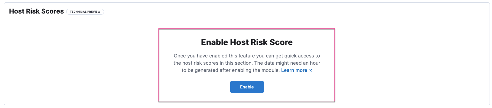
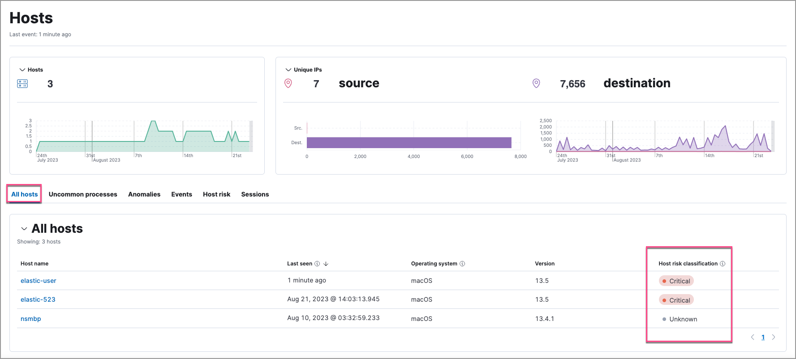
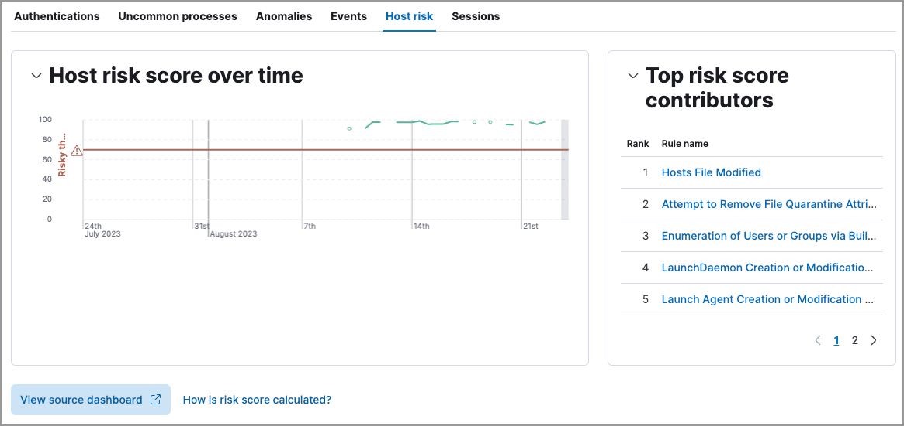

<DocBadge template="technical preview" />
<div id="host-risk-score"></div>

<DocCallOut title="Requirements">
This feature requires the Security Complete <DocLink id="serverlessGeneralManageProject" text="project feature"/>.
</DocCallOut>

The host risk score feature highlights risky hosts from within your environment. It utilizes a transform with a scripted metric aggregation to calculate host risk scores based on alerts that were generated within the past five days. The transform runs hourly to update the score as new alerts are generated.

Each rule's contribution to the host risk score is based on the rule's risk score (`signal.rule.risk_score`) and a time decay factor to reduce the impact of stale alerts. The risk score is calculated using a weighted sum where rules with higher time-corrected risk scores also have higher weights. Each host risk score is normalized on a scale of 0 to 100.

Specific host attributes can boost the final risk score. For example, alert activity on a server poses a greater risk than that on a laptop. Therefore, the host risk score is 1.5 times higher if the host is a server. This boosted score is finalized after calculating the weighted sum of the time-corrected risks.

The following table shows how risk levels are applied to a host, based on the normalized risk score:

| Risk level | Host risk score |
|---|---|
| Unknown | \< 20 |
| Low | 20-40 |
| Moderate | 40-70 |
| High     | 70-90 |
| Critical  | \> 90 |

<div id="enable-host-risk-score"></div>

## Enable host risk score

<DocCallOut title="Note">
To enable the host risk score feature, you must have alerts in your environment. 
</DocCallOut>

You can enable host risk score from the following places in the ((security-app)):

* The Entity Analytics dashboard 
* The **Host risk** tab on the Hosts page
* The **Host risk** tab on a host's details page
* Console

To enable host risk score from the Entity Analytics dashboard: 

1. Go to **Dashboards** → **Entity Analytics**. 
1. In the Host Risk Scores section, click **Enable** to install the module. 

To enable host risk score from the Hosts page: 

1. Go to **Explore** → **Hosts**. 
1. Select the **Host risk** tab, then click **Enable** to install the module. 



To enable host risk score from a host's details page: 

1. Go to **Explore** → **Hosts**. 
1. Select the **All hosts** tab, then click a host name. 
1. On the details page, scroll down to the data tables, then select the **Host risk** tab. 
1. Click **Enable** to install the module. 


To enable host risk score from Console, open a browser window and enter the following URL:

```console
{KibanaURL}/s/{spaceID}/app/dev_tools#/console?load_from={KibanaURL}/s/{spaceID}/internal/risk_score/prebuilt_content/dev_tool/enable_host_risk_score
```
{/* URL to be updated as it references Kibana URL and space ID */}

<DocCallOut title="Note">
If there's existing content in Console, scroll to the bottom to find the output loaded. 
</DocCallOut>

<DocCallOut title="Note">
After you enable host risk score, you might get a message that says, "No host risk score data available to display." To verify that the transform that installs the host risk score module is picking up data, refer to <DocLink id="serverlessSecurityVerifyHostRiskScore">Verify host risk score data (Optional)</DocLink>. 
</DocCallOut>

<div id="analyze-host-risk-score"></div>

## Analyze host risk score data

It is recommended you analyze hosts with the highest risk scores first -- those in the `Critical` and `Moderate` categories. Host risk score data appears in the following places in the ((security-app)):

The `host.risk.calculated_level` column in the Alerts table:


The **Overview** tab on the Alert details flyout:


The **Host risk classification** column in the All hosts table on the Hosts page:



The **Host risk** tab on the Hosts page:


The Overview section on the host details page:


The **Host risk** tab on the host details page:



You can also visualize host risk score data using prebuilt dashboards that are automatically imported when the feature is enabled. 

To access the dashboards:

1. Click **Dashboards**, then under **Custom** search for `risk score`.
1. Select **Drilldown of Host Risk Score** to analyze the risk components of a host, or **Current Risk Score for Hosts** to display a list of current risky hosts in your environment.


In this example, we'll explore the **Drilldown of Host Risk Score** dashboard.


Use the histogram to track how the risk score for a particular host has changed over time. To specify a date range, use the date and time picker, or drag and select a time range within the histogram.


To go to the host's details page, click any host's corresponding bar in the histogram, then select **Go to Host View**.


The histogram shows historical changes in a particular host's risk score(s). To specify a date range, use the date and time picker, or drag and select a time range within the histogram.


