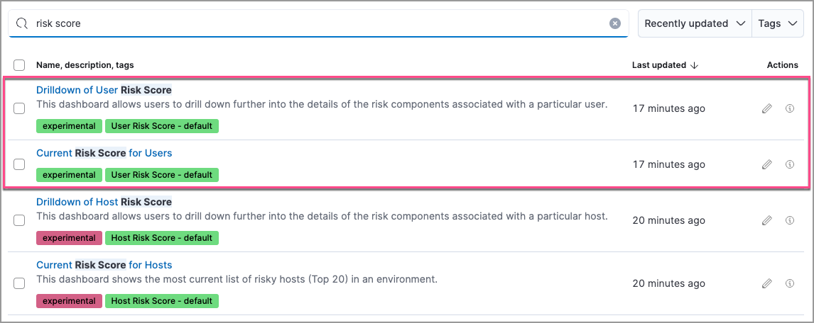
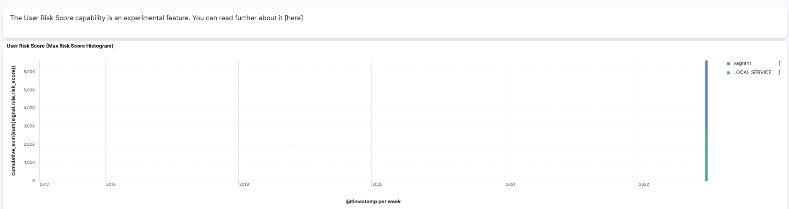

<DocBadge template="technical preview" />
<div id="user-risk-score"></div>

<DocCallOut title="Requirements">
This feature requires the Security Complete <DocLink id="serverlessGeneralManageProject" text="project feature"/>.
</DocCallOut>

The user risk score feature highlights risky usernames in your environment. It utilizes a transform with a scripted metric aggregation to calculate user risk scores based on alerts generated within the past 90 days. The transform runs hourly to update scores as new alerts are generated.

Each alert's contribution to the user risk score is based on the alert's risk score (`signal.rule.risk_score`). The risk score is calculated using a weighted sum where rules with higher time-corrected risk scores also have higher weights. Each risk score is normalized on a scale of 0 to 100.

The following table shows how risk levels are applied to a username, based on the normalized risk score:

| Risk level | User risk score |
|---|---|
| Unknown | \< 20 |
| Low | 20-40 |
| Moderate | 40-70 |
| High     | 70-90 |
| Critical  | \> 90 |

<div id="deploy-user-risk-score"></div>

## Enable user risk score

You can enable user risk score from the following places in the ((security-app)):

* The Entity Analytics dashboard 
* The **User risk** tab on the Users page
* The **User risk** tab on a user's details page
* Console

To enable user risk score from the Entity Analytics dashboard: 

1. Go to **Dashboards** -> **Entity Analytics**. 
1. In the User Risk Scores section, click **Enable** to install the module. 

To enable user risk score from the Users page: 

1. Go to **Explore** -> **Users**. 
1. Select the **User risk** tab, then click **Enable** to install the module. 


To enable user risk score from a user's details page: 

1. Go to **Explore** -> **Users**. 
1. Select the **All users** tab, then click a user name. 
1. On the details page, scroll down to the data tables, then select the **User risk** tab. 
1. Click **Enable** to install the module. 

To enable user risk score from Console, open a browser window and enter the following URL:

```console
{KibanaURL}/s/{spaceID}/app/dev_tools#/console?load_from={KibanaURL}/s/{spaceID}/internal/risk_score/prebuilt_content/dev_tool/enable_user_risk_score
```
{/* URL to be updated as it references Kibana URL and space ID */}

<DocCallOut title="Note">
If there's existing content in Console, scroll to the bottom to find the output loaded. 
</DocCallOut>

<DocCallOut title="Note">
After you enable user risk score, you might get a message that says, "No user risk score data available to display." To verify that the transform that installs the user risk score module is picking up data, refer to <DocLink id="serverlessSecurityVerifyUserRiskScore">Verify user risk score data (Optional)</DocLink>. 
</DocCallOut>

<div id="view-user-risk-score"></div>

## Analyze user risk score data

It is recommended you analyze users with the highest risk scores first -- those in the `Critical` and `Moderate` categories. User risk score data appears in the following places in the ((security-app)):

The `user.risk.calculated_level` column in the Alerts table:


The **Overview** tab on the Alert details flyout:


The **User risk** tab on the Users page:


The Overview section on the user details page:


The **User risk** tab on the user details page:


You can also visualize user risk score data using prebuilt dashboards that are automatically imported when the feature is enabled. 

To access the dashboards:

1. Click **Dashboards**, then under **Custom** search for `risk score`.
1. Select **Drilldown of User Risk Score** to analyze the risk components of a user, or **Current Risk Score for Users** to display a list of current risky users in your environment.

In this example, we'll explore the **Drilldown of User Risk Score** dashboard.



The histogram shows historical changes in a particular user's risk score(s). To specify a date range, use the date and time picker, or drag and select a time range within the histogram. Click **View source dashboard** to view the top values of `user.name` and `risk.keyword`.



The data tables beneath the histogram display associated rules, users, and MITRE ATT&CK tactics seen for risky users. By default, the tables are sorted by risk, with the highest total risk scores at the top. Use this information to triage your highest risk users.


