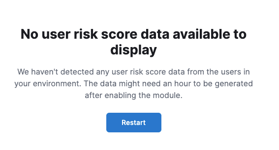

<div id="verify-user-risk-score"></div>

After you enable or upgrade user risk score, the following message may appear: 



If so, click **Restart** and allow at least an hour for the data to be generated. If data still doesn't appear, verify that user risk score data has been generated:

In ((kib)), run the following commands in Console to query the `ml_user_risk_score_<space-id>` index: 

```console
GET ml_user_risk_score_<space-id>/_search
```

If no data returns, you'll need to check if the alerts index (`.alerts-security.alerts-<space-id>`) had alert data when `ml_userriskscore_pivot_transform_<space-id>` was started.

Example:

```console
GET transform/ml_userriskscore_pivot_transform_<space-id>/_stats?human=true
```

Here's an example response: 

```console
{
  "count": 1,
  "transforms": [
    {
      "id": "ml_userriskscore_pivot_transform_<space-id>",
      "state": "started",
      "node": {
        "id": "H1tlwfTyRkWls-C0sarmHw",
        "name": "instance-0000000000",
        "ephemeral_id": "SBqlp5ywRuuop2gtcdCljA",
        "transport_address": "10.43.255.164:19635",
        "attributes": {}
      },
      "stats": {
        "pages_processed": 29,
        "documents_processed": 11805,
        "documents_indexed": 8,
        "documents_deleted": 0,
        "trigger_count": 9,
        "index_time_in_ms": 52,
        "index_total": 7,
        "index_failures": 0,
        "search_time_in_ms": 201,
        "search_total": 29,
        "search_failures": 0,
        "processing_time_in_ms": 14,
        "processing_total": 29,
        "delete_time_in_ms": 0,
        "exponential_avg_checkpoint_duration_ms": 59.02353261024906,
        "exponential_avg_documents_indexed": 0.8762710605864747,
        "exponential_avg_documents_processed": 1664.7724779548555
      },
      "checkpointing": {
        "last": {
          "checkpoint": 8,
          "timestamp": "2022-10-17T14:49:50.315Z",
          "timestamp_millis": 1666018190315,
          "time_upper_bound": "2022-10-17T14:47:50.315Z",
          "time_upper_bound_millis": 1666018070315
        },
        "operations_behind": 380,
        "changes_last_detected_at_string": "2022-10-17T14:49:50.113Z",
        "changes_last_detected_at": 1666018190113,
        "last_search_time_string": "2022-10-17T14:49:50.113Z",
        "last_search_time": 1666018190113
      }
    }
  ]
}
```

Take note of the value from `time_upper_bound_millis` and enter it as a range query for the alerts index. 

Example: 

```console
GET .alerts-security.alerts-<space-id>/_search
{
  "query": {
    "range": {
      "@timestamp": {
        "lt": 1666018070315
      }
    }
  }
}
```

