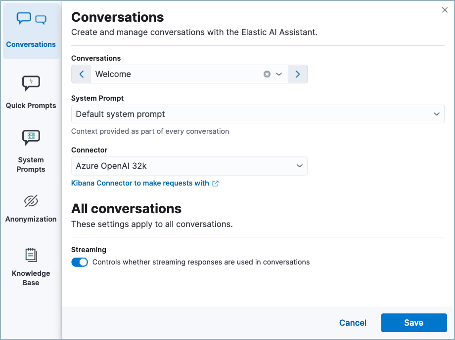
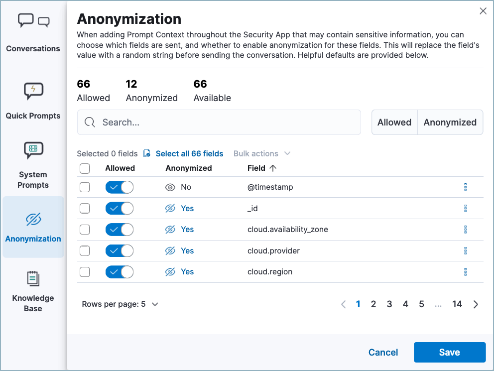
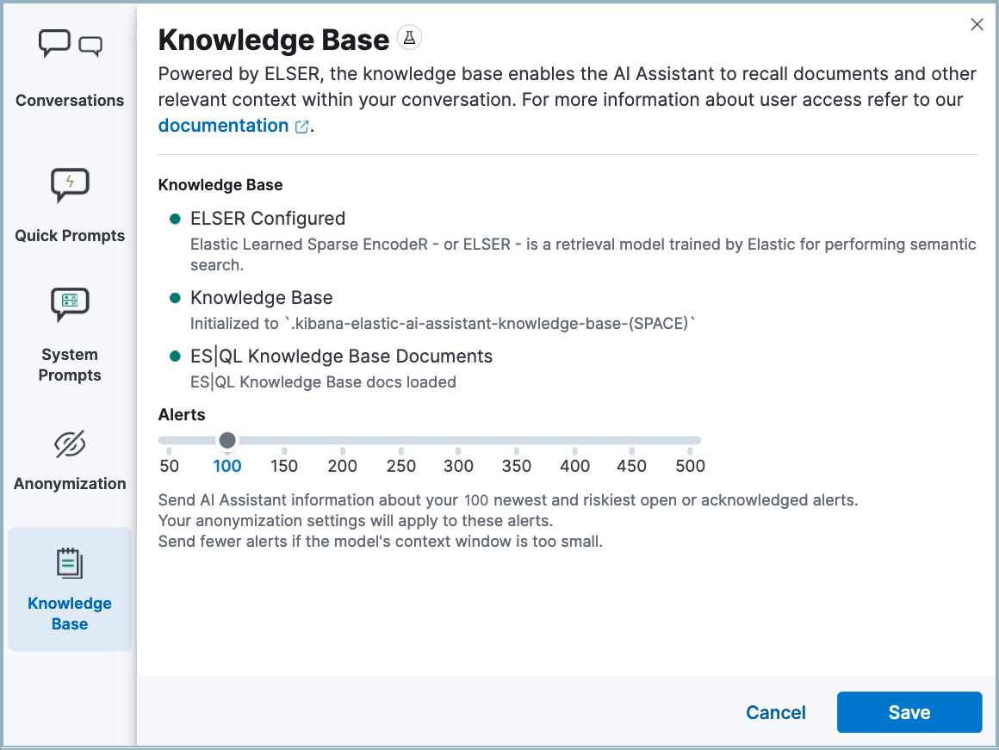

<DocBadge template="technical preview" />

The Elastic AI Assistant utilizes generative AI to bolster your cybersecurity operations team. It allows users to interact with ((elastic-sec)) for tasks such as alert investigation, incident response, and query generation or conversion using natural language and much more.

<DocImage size="xl" url="../images/ai-assistant/assistant-basic-view.png" alt="Image of AI Assistant chat window" />

<DocCallOut title="Important" color="warning">
Elastic AI Assistant is designed to enhance your analysis with smart dialogues. Its capabilities are still developing. Users should exercise caution as the quality of its responses might vary. Your insights and feedback will help us improve this feature. Always cross-verify AI-generated advice for accuracy.
</DocCallOut>

<DocCallOut title="Requirements">

* This feature requires the Security Analytics Complete <DocLink slug="/serverless/elasticsearch/manage-project" text="project feature"/>.

* You need an account with a third-party generative AI provider, which AI Assistant uses to generate responses. Supported providers are OpenAI, Azure OpenAI Service, and Amazon Bedrock.

</DocCallOut>

## Your data and AI Assistant

Elastic does not store or examine prompts or results used by AI Assistant, or use this data for model training. This includes anything you send the model, such as alert or event data, detection rule configurations, queries, and prompts. However, any data you provide to AI Assistant will be processed by the third-party large language model (LLM) provider you connected as part of AI Assistant setup.

Elastic does not control third-party tools, and assumes no responsibility or liability for their content, operation, or use, nor for any loss or damage that may arise from your using such tools. Please exercise caution when using AI tools with personal, sensitive, or confidential information. Any data you submit may be used by the provider for AI training or other purposes. There is no guarantee that the provider will keep any information you provide secure or confidential. You should familiarize yourself with the privacy practices and terms of use of any generative AI tools prior to use.

<DocCallOut title="Note">
Elastic can automatically anonymize event data that you provide to AI Assistant as context. To learn more, refer to <DocLink slug="/serverless/security/ai-assistant" section="configure-ai-assistant">Configure AI Assistant</DocLink>.
</DocCallOut>

## Set up AI Assistant

You must create a generative AI connector before you can use AI Assistant. AI Assistant can connect to multiple large language model (LLM) providers so you can select the best model for your needs. To set up a connector, refer to <DocLink slug="/serverless/security/llm-connector-guides" text="LLM connector setup guides"/>.

<DocCallOut title="Recommended models">
While AI Assistant is compatible with many different models, our testing found increased quality with Azure 32k, and faster, more cost-effective responses with Claude 3 Haiku and OpenAI GPT4 Turbo. For more information, refer to the <DocLink slug="/serverless/security/llm-performance-matrix" text="LLM performance matrix"/>.
</DocCallOut>

## Start chatting

To open AI Assistant, select the **AI Assistant** button in the top toolbar from anywhere in the ((security-app)). You can also use the keyboard shortcut **Cmd + ;** (or **Ctrl + ;** on Windows). 

<DocImage size="m" url="../images/ai-assistant/-assistant-ai-assistant-button.png" alt="AI Assistant button" />

This opens the **Welcome** chat interface, where you can ask general questions about ((elastic-sec)).

You can also chat with AI Assistant from several particular pages in ((elastic-sec)) where you can easily send context-specific data and prompts to AI Assistant.

* <DocLink slug="/serverless/security/view-alert-details">Alert details</DocLink> or Event details flyout: Click **Chat** while viewing the details of an alert or event.
* <DocLink slug="/serverless/security/rules-ui-management">Rules page</DocLink>: Use AI Assistant to help create or correct rule queries.
* <DocLink slug="/serverless/security/data-quality-dash">Data Quality dashboard</DocLink>: Select the **Incompatible fields** tab, then click **Chat**. (This is only available for fields marked red, indicating they’re incompatible). 
* <DocLink slug="/serverless/security/timelines-ui">Timeline</DocLink>: Select the **Security Assistant** tab.

<DocCallOut title="Note">
Each user's chat history and custom quick prompts are automatically saved, so you can leave ((elastic-sec)) and return to pick up a conversation later. Chat history is saved in the `.kibana-elastic-ai-assistant-conversations` data stream. 
</DocCallOut>

## Interact with AI Assistant

Use these features to adjust and act on your conversations with AI Assistant:

* Select a _system prompt_ at the beginning of a conversation to establish how detailed and technical you want AI Assistant's answers to be.

    <DocImage size="xl" url="../images/ai-assistant/-assistant-system-prompt.gif" alt="The system prompt drop-down menu" />

    System prompts provide context to the model, informing its response. To create a custom system prompt, open the system prompts dropdown menu and click **+ Add new system prompt...**.

* Select a _quick prompt_ at the bottom of the chat window to get help writing a prompt for a specific purpose, such as summarizing an alert or converting a query from a legacy SIEM to ((elastic-sec)).

    <DocImage size="xl" url="../images/ai-assistant/-assistant-quick-prompts.png" alt="Quick prompts highlighted below a conversation" />

    Quick prompt availability varies based on context — for example, the **Alert summarization** quick prompt appears when you open AI Assistant while viewing an alert. To customize existing quick prompts and create new ones, click **Add Quick prompt**.

* In an active conversation, you can use the inline actions that appear on messages to incorporate AI Assistant's responses into your workflows:

    * **Add note to timeline** (<DocIcon type="editorComment" title="Comment" />): Add the selected text to your currently active Timeline as a note.
    * **Add to existing case** (<DocIcon type="addDataApp" title="Add data" />): Add a comment to an existing case using the selected text.
    * **Copy to clipboard** (<DocIcon type="copyClipboard" title="Copy to clipboard" />): Copy the text to clipboard to paste elsewhere. Also helpful for resubmitting a previous prompt.
    * **Add to timeline** (<DocIcon type="timeline" title="Timeline" />): Add a filter or query to Timeline using the text. This button appears for particular queries in AI Assistant's responses.

   Be sure to specify which language you'd like AI Assistant to use when writing a query. For example: "Can you generate an Event Query Language query to find four failed logins followed by a successful login?"

<DocCallOut title="Tip">
AI Assistant can remember particular information you tell it to remember. For example, you could tell it: "When anwering any question about srv-win-s1-rsa or an alert that references it, mention that this host is in the New York data center". This will cause it to remember the detail you highlighted.
</DocCallOut>

## Configure AI Assistant
The **Settings** menu (<DocIcon type="controlsVertical" title="EQL settings" />) allows you to configure default conversations, quick prompts, system prompts, and data anonymization.

The **Settings** menu has the following tabs:

* **Conversations:** When you open AI Assistant from certain pages, such as Timeline or Alerts, it defaults to the relevant conversation type. Choose the system prompt for each conversation type, the connector, and model (if applicable). The **Streaming** setting controls whether AI Assistant's responses appear word-by-word (streamed), or as a complete block of text. Streaming is currently only available for OpenAI models.
* **Quick Prompts:** Modify existing quick prompts or create new ones. To create a new quick prompt, type a unique name in the **Name** field, then press **enter**. Under **Prompt**, enter or update the quick prompt's text. Under **Contexts**, select where the quick prompt should appear.
* **System Prompts:** Edit existing system prompts or create new ones. To create a new system prompt, type a unique name in the **Name** field, then press **enter**. Under **Prompt**, enter or update the system prompt's text. 

    <DocCallOut title="Note">
    To delete a custom prompt, open the **Name** drop-down menu, hover over the prompt you want to delete, and click the *X* that appears. You cannot delete the default prompts.
    </DocCallOut>

* **Anonymization:** Select fields to include as plaintext, to obfuscate, and to not send when you provide events to AI Assistant as context. 
* **Knowledge base:** Provide additional context to AI Assistant so it can answer questions about ((esql)) and alerts in your environment. 

### Anonymization

The **Anonymization** tab of the AI Assistant settings menu allows you to define default data anonymization behavior for events you send to AI Assistant. Fields with **Allowed** toggled on are included in events provided to AI Assistant. **Allowed** fields with **Anonymized** set to **Yes** are included, but with their values obfuscated.

The **Show anonymized** toggle controls whether you see the obfuscated or plaintext versions of the fields you sent to AI Assistant. It doesn't control what gets obfuscated — that's determined by the anonymization settings. It also doesn't affect how event fields appear _before_ being sent to AI Assistant. Instead, it controls how fields that were already sent and obfuscated appear to you.

When you include a particular event as context, such as an alert from the Alerts page, you can adjust anonymization behavior for the specific event. Be sure the anonymization behavior meets your specifications before sending a message with the event attached.

### Knowlege base

<DocCallOut template="beta" />

The **Knowledge base** tab of the AI Assistant settings menu allows you to enable AI Assistant to answer questions about the Elastic Search Query Language (((esql))), and about alerts in your environment. To use it, you must <DocLink slug="/serverless/security/ml-requirements" text="enable machine learning"/>,

### Knowledge base for ((esql))

<DocCallOut title="Important" color="warning">
((esql)) queries generated by AI Assistant might require additional validation. To ensure they're correct, refer to the [((esql)) documentation](((ref))/esql-language.html).
</DocCallOut>

When this feature is enabled, AI Assistant can help you write an ((esql)) query for a particular use case, or answer general questions about ((esql)) syntax and usage. To enable AI Assistant to answer questions about ((esql)):

* Turn on the knowledge base by clicking **Setup**. If the **Setup** button doesn't appear, knowledge base is already enabled.
* Click **Save**. The knowledge base is now active. A quick prompt for ((esql)) queries becomes available, which provides a good starting point for your ((esql)) conversations and questions.

<DocCallOut title="Note">
AI Assistant's knowledge base gets additional context from [Elastic Learned Sparse EncodeR (ELSER)](((ml-docs))/ml-nlp-elser.html#download-deploy-elser).
</DocCallOut>

### Knowledge base for alerts

When this feature is enabled, AI Assistant will receive multiple alerts as context for each of your prompts. It will receive alerts from the last 24 hours that have a status of `open` or `acknowledged`, ordered first by risk score, then by recency. Building block alerts are excluded. This enables it to answer questions about multiple alerts in your environment, rather than just the individual alerts you choose to include as context.

To enable RAG for alerts:

* Turn on the knowledge base by clicking **Setup**. If the **Setup** button doesn't appear, knowledge base is already enabled.
* Use the slider to select the number of alerts to send to AI Assistant. Click **Save**.

<DocCallOut title="Note">
Including a large number of alerts may cause your request to exceed the maximum token length of your third-party generative AI provider. If this happens, try selecting a lower number of alerts to send.
</DocCallOut>

### Get the most from your queries

Elastic AI Assistant helps you take full advantage of the Elastic Security platform to improve your security operations. Its ability to assist you depends on the specificity and detail of your questions. The more context and detail you provide, the more tailored and useful its responses will be.

To maximize its usefulness, consider using more detailed prompts or asking for additional information. For instance, after asking for an ES|QL query example, you could ask a follow-up question like, “Could you give me some other examples?” You can also ask for clarification or further exposition, for example "Please provide comments explaining the query you just gave."

In addition to practical advice, AI Assistant can offer conceptual advice, tips, and best practices for enhancing your security measures. You can ask it, for example:

* “How do I set up a machine learning job in Elastic Security to detect anomalies in network traffic volume over time?”
* “I need to monitor for unusual file creation patterns that could indicate ransomware activity. How would I construct this query using EQL?”

