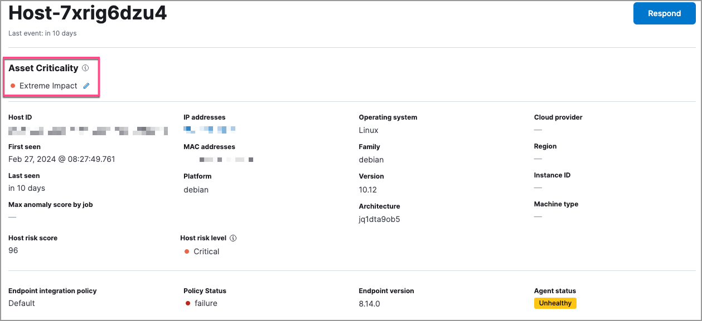
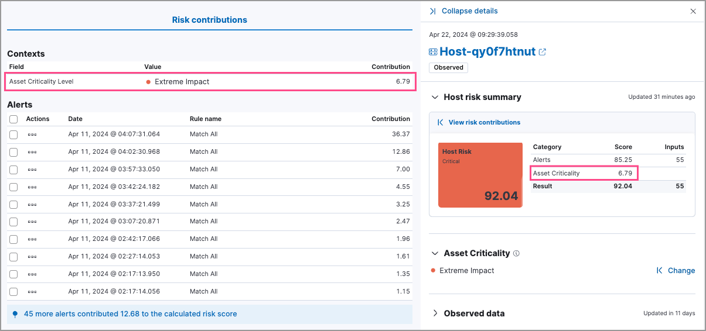

<DocBadge template="technical preview" />

<DocCallOut title="Requirements">
To view and assign asset criticality, you must:
* Have the appropriate user role.
* Turn on the `securitySolution:enableAssetCriticality` <DocLink id="serverlessSecurityAdvancedSettings" section="enable-asset-criticality-workflows" >advanced setting</DocLink>.

For more information, refer to <DocLink id="serverlessSecurityERSRequirements">Entity risk scoring prerequisites</DocLink>.
</DocCallOut>

The asset criticality feature allows you to classify your organization's entities based on various operational factors that are important to your organization. Through this classification, you can improve your threat detection capabilities by focusing your alert triage, threat-hunting, and investigation activities on high-impact entities.

You can assign one of the following asset criticality levels to your entities, based on their impact:

* Low impact
* Medium impact
* High impact
* Extreme impact

For example, you can assign **Extreme impact** to business-critical entities, or **Low impact** to entities that pose minimal risk to your security posture.

## View and assign asset criticality

Entities do not have a default asset criticality level. You can either assign asset criticality to your entities individually, or <DocLink id="serverlessSecurityAssetCriticality" section="bulk-assign-asset-criticality">bulk assign</DocLink> it to multiple entities by importing a text file.

When you assign, change, or unassign an individual entity's asset criticality level, that entity's risk score is immediately recalculated.

<DocCallOut title="Note">
If you assign asset criticality using the file import feature, risk scores are **not** immediately recalculated. The newly assigned or updated asset criticality levels will impact entity risk scores during the next hourly risk scoring calculation.
</DocCallOut>

You can view, assign, change, or unassign asset criticality from the following places in the ((elastic-sec)) app:

* The <DocLink id="serverlessSecurityHostsOverview" section="host-details-page">host details page</DocLink> and <DocLink id="serverlessSecurityUsersPage" section="user-details-page">user details page</DocLink>:

   

* The <DocLink id="serverlessSecurityHostsOverview" section="host-details-flyout">host details flyout</DocLink> and <DocLink id="serverlessSecurityUsersPage" section="user-details-flyout">user details flyout</DocLink>:

  

* The host details flyout and user details flyout in <DocLink id="serverlessSecurityTimelinesUi">Timeline</DocLink>:

  

### Bulk assign asset criticality

You can bulk assign asset criticality to multiple entities by importing a CSV, TXT or TSV file from your asset management tools.

The file must contain three columns, with each entity record listed on a separate row:

1. The first column should indicate whether the entity is a `host` or a `user`.
1. The second column should specify the entity's `host.name` or `user.name`.
1. The third column should specify one of the following asset criticality levels:
    * `extreme_impact`
    * `high_impact`
    * `medium_impact`
    * `low_impact`

The maximum file size is 1 MB.

File structure example:

```
user,user-001,low_impact
user,user-002,medium_impact
host,host-001,extreme_impact
````

To import a file:
1. Go to **Project Settings** → **Stack Management** → **Asset criticality**.
1. Select or drag and drop the file you want to import.

    <DocCallOut title="Note">
    The file validation step highlights any lines that don't follow the required file structure. The asset criticality levels for those entities won't be assigned. We recommend that you fix any invalid lines and re-upload the file.
    </DocCallOut>

1. Click **Assign**. 

This process overwrites any previously assigned asset criticality levels for the entities included in the imported file. The newly assigned or updated asset criticality levels are immediately visible within all asset criticality workflows and will impact entity risk scores during the next risk scoring calculation.

## Improve your security operations

With asset criticality, you can improve your security operations by:

* <DocLink id="serverlessSecurityAssetCriticality" section="prioritize-open-alerts">Prioritizing open alerts</DocLink>
* <DocLink id="serverlessSecurityAssetCriticality" section="monitor-an-entitys-risk">Monitoring an entity's risk</DocLink>

### Prioritize open alerts

You can use asset criticality as a prioritization factor when triaging alerts and conducting investigations and response activities.

Once you assign a criticality level to an entity, all subsequent alerts related to that entity are enriched with its criticality level. This additional context allows you to  <DocLink id="serverlessSecurityAnalyzeRiskScoreData" section="triage-alerts-associated-with-high-risk-or-business-critical-entities">prioritize alerts associated with business-critical entities</DocLink>.

### Monitor an entity's risk

The risk scoring engine dynamically factors in an entity's asset criticality, along with `Open` and `Acknowledged` detection alerts to <DocLink id="serverlessSecurityEntityRiskScoring" section="how-is-risk-score-calculated">calculate the entity's overall risk score</DocLink>. This dynamic risk scoring allows you to monitor changes in the risk profiles of your most sensitive entities, and quickly escalate high-risk threats. 

To view the impact of asset criticality on an entity's risk score, follow these steps:

1. Open the <DocLink id="serverlessSecurityHostsOverview" section="host-details-flyout">host details flyout</DocLink> or <DocLink id="serverlessSecurityUsersPage" section="user-details-flyout">user details flyout</DocLink>. The risk summary section shows asset criticality's contribution to the overall risk score.
1. Click **View risk contributions** to open the flyout's left panel.
1. In the **Risk contributions** section, verify the entity's criticality level from the time the alert was generated.


