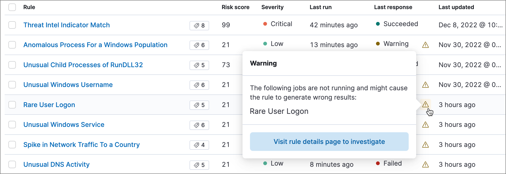

<DocBadge template="technical preview" />

[((ml-cap))](((ml-docs))/ml-ad-overview.html) functionality is available when
you have the appropriate role. Refer to <DocLink slug="/serverless/security/ml-requirements">Machine learning job and rule requirements</DocLink> for more information.

You can view the details of detected anomalies within the `Anomalies` table
widget shown on the Hosts, Network, and associated details pages, or even narrow
to the specific date range of an anomaly from the `Max anomaly score by job` field
in the overview of the details pages for hosts and IPs. These interfaces also
offer the ability to drag and drop details of the anomaly to Timeline, such as
the `Entity` itself, or any of the associated `Influencers`.

## Manage ((ml)) jobs
If you have the `machine_learning_admin` role, you can use the **ML job settings** interface on the **Alerts**, **Rules**, and **Rule Exceptions** pages to view, start, and stop ((elastic-sec)) ((ml)) jobs.

### Manage ((ml)) detection rules

You can also check the status of ((ml)) detection rules, and start or stop their associated ((ml)) jobs:

* On the **Rules** page, the **Last response** column displays the rule's current <DocLink slug="/serverless/security/rules-ui-management" section="check-the-current-status-of-rules">status</DocLink>. An indicator icon (<DocIcon type="alert" title="Error" size="s"/>) also appears if a required ((ml)) job isn't running. Click the icon to list the affected jobs, then click **Visit rule details page to investigate** to open the rule's details page.

    

* On a rule's details page, check the **Definition** section to confirm whether the required ((ml)) jobs are running. Switch the toggles on or off to run or stop each job.

    

### Prebuilt jobs

((elastic-sec)) comes with prebuilt ((ml)) ((anomaly-jobs)) for automatically detecting
host and network anomalies. The jobs are displayed in the `Anomaly Detection`
interface. They are available when either:

* You ship data using [Beats](https://www.elastic.co/products/beats) or the
    <DocLink slug="/serverless/security/install-edr">((agent))</DocLink>, and ((kib)) is configured with the required index
    patterns (such as `auditbeat-*`, `filebeat-*`, `packetbeat-*`, or `winlogbeat-*`
    in **Project settings** → **Management** → **Index Management**).

Or

* Your shipped data is ECS-compliant, and ((kib)) is configured with the shipped
    data's index patterns in **Project settings** → **Management** → **Index Management**.

Or

* You install one or more of the <DocLink slug="/serverless/security/behavioral-detection-use-cases" section="elastic-integrations-for-behavioral-detection-use-cases">Advanced Analytics integrations</DocLink>.

<DocLink slug="/serverless/security/prebuilt-ml-jobs">Prebuilt job reference</DocLink> describes all available ((ml)) jobs and lists which ECS
fields are required on your hosts when you are not using ((beats)) or the ((agent))
to ship your data. For information on tuning anomaly results to reduce the
number of false positives, see <DocLink slug="/serverless/security/tuning-anomaly-results">Optimizing anomaly results</DocLink>.

<DocCallOut title="Note">
Machine learning jobs look back and analyze two weeks of historical data
prior to the time they are enabled. After jobs are enabled, they continuously
analyze incoming data. When jobs are stopped and restarted within the two-week
time frame, previously analyzed data is not processed again.
</DocCallOut>

## View detected anomalies
To view the `Anomalies` table widget and `Max Anomaly Score By Job` details,
the user must have the `machine_learning_admin` or `machine_learning_user` role.

<DocCallOut title="Note">
To adjust the `score` threshold that determines which anomalies are shown,
you can modify the **`securitySolution:defaultAnomalyScore`** advanced setting.
</DocCallOut>

