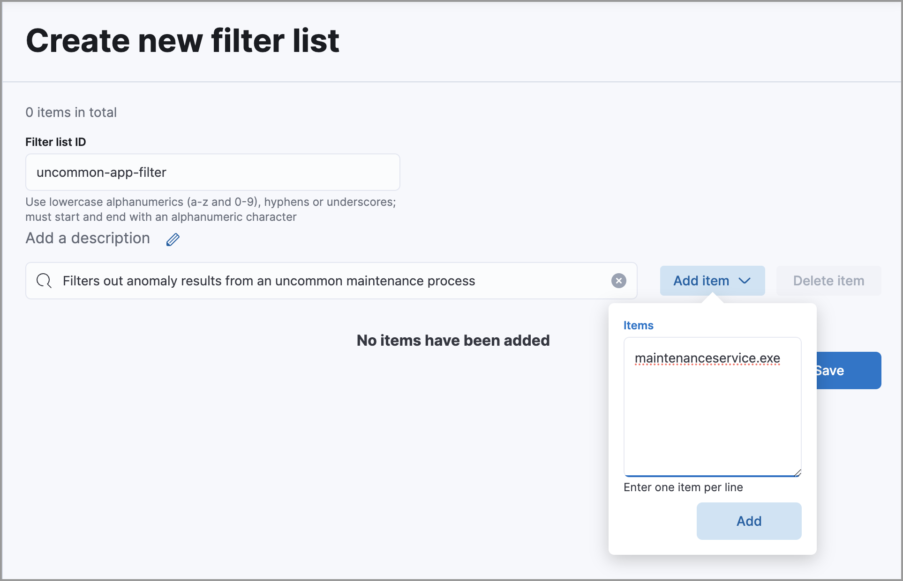
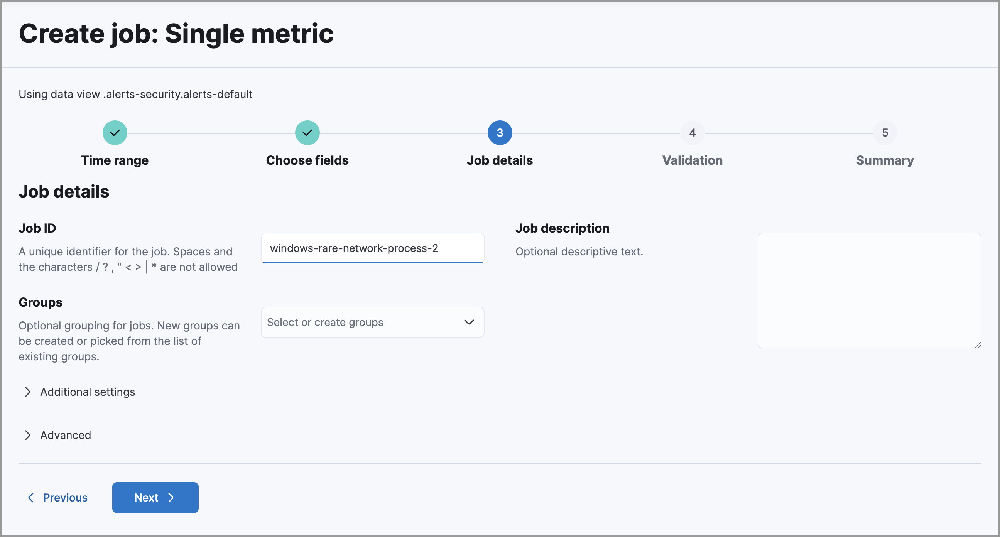
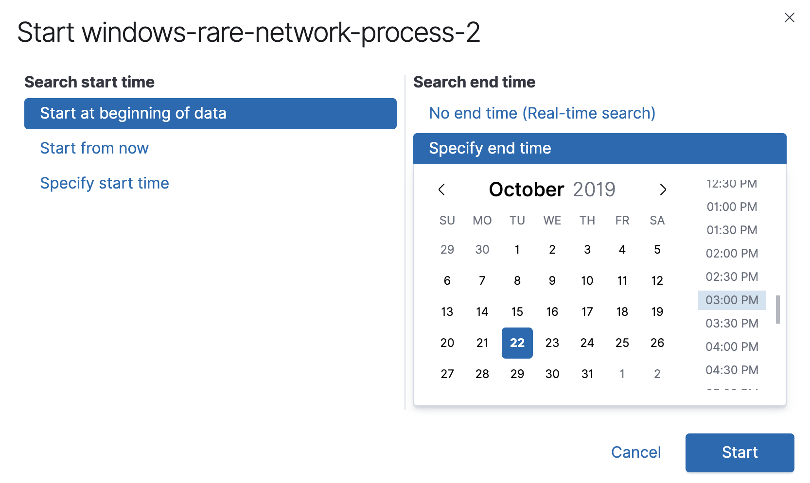

<DocBadge template="technical preview" />

To gain clearer insights into real threats, you can tune the anomaly results. The following procedures help to reduce the number of false positives: 

* <DocLink slug="/serverless/security/tuning-anomaly-results" section="filter-out-anomalies-from-rarely-used-applications-and-processes">Tune results for rare applications and processes</DocLink>
* <DocLink slug="/serverless/security/tuning-anomaly-results" section="define-an-anomaly-threshold-for-a-job">Define an anomaly threshold for a job</DocLink>

## Filter out anomalies from rarely used applications and processes

When anomalies include results from a known process that only runs occasionally,
you can filter out the unwanted results.

For example, to filter out results from a housekeeping process, named
`maintenanceservice.exe`, that only executes occasionally you need to:

1. <DocLink slug="/serverless/security/tuning-anomaly-results" section="create-a-filter-list">Create a filter list</DocLink>
1. <DocLink slug="/serverless/security/tuning-anomaly-results" section="add-the-filter-to-the-relevant-job">Add the filter to the relevant job</DocLink>
1. <DocLink slug="/serverless/security/tuning-anomaly-results" section="clone-and-rerun-the-job">Clone and rerun the job</DocLink> (optional)

### Create a filter list

1. Go to **Machine learning** → **Anomaly Detection** → **Settings**.
1. Click **Filter Lists** and then **Create**.

    The **Create new filter list** pane is displayed.

1. Enter a filter list ID.
1. Enter a description for the filter list (optional).
1. Click **Add item**.
1. In the **Items** textbox, enter the name of the process for which you want to
    filter out anomaly results (`maintenanceservice.exe` in our example).

    

1. Click **Add** and then **Save**.

    The new filter appears in the Filter List and can be added to relevant jobs.

### Add the filter to the relevant job

1. Go to **Machine learning** → **Anomaly Detection** → **Anomaly Explorer**.
1. Navigate to the job results for which the filter is required. If the job results
    are not listed, click **Edit job selection** and select the relevant job.

1. In the **actions** column, click the gear icon and then select _Configure rules_.

    The **Create Rule** window is displayed.

    

1. Select:
    1. _Add a filter list to limit where the rule applies_.
    1. The _WHEN_ statement for the relevant detector (`process.name` in our
        example).

    1. The _IS IN_ statement.
    1. The filter you created as part of the <DocLink slug="/serverless/security/tuning-anomaly-results" section="create-a-filter-list">Create a filter list</DocLink> procedure.

        <DocCallOut title="Tip">
        For more information, see
        [Customizing detectors with custom rules](((ml-docs))/ml-configuring-detector-custom-rules.html).
        </DocCallOut>

1. Click **Save**.

<DocCallOut title="Note">
Changes to rules only affect new results. All anomalies found by the job
before the filter was added are still displayed.
</DocCallOut>

### Clone and rerun the job

If you want to remove all the previously detected results for the process, you
must clone and run the cloned job.

<DocCallOut title="Important" color="warning">
Running the cloned job can take some time. Only run the job after you
have completed all job rule changes.
</DocCallOut>

1. Go to **Machine learning** → **Anomaly Detection** → **Jobs**.
1. Navigate to the job for which you configured the rule.
{/* Should this be "Navigate to the job that you want to clone"? */} 
1. Optionally, expand the job row and click **JSON** to verify the configured filter
    appears under `custom rules` in the JSON code.

1. In the **actions** column, click the options menu (<DocIcon type="boxesHorizontal" title="Options menu" />) and select **Clone job**.

    The **Configure datafeed** page is displayed.

1. Click **Data Preview** and check the data is displayed without errors.
{/* Unable to verify this step - don't think it exists anymore. */} 
1. Click **Next** until the **Job details** page is displayed.
1. Enter a Job ID for the cloned job that indicates it is an iteration of the
    original one. For example, append a number or a username to the original job
    name, such as `windows-rare-network-process-2`.

    

1. Click **Next** and check the job validates without errors. You can ignore
    warnings about multiple influencers.

1. Click **Next** and then **Create job**.

    The **Start \<job name>** window is displayed. 
    {/* This page doesn't display. */} 

    

1. Select the point of time from which the job will analyze anomalies.
{/* Users can't do this. I think their only option is to start the job in real time. */} 
1. Click **Start**.

    After a while, results will start to appear on the **Anomaly Explorer** page.

## Define an anomaly threshold for a job

{/* Unable to test these steps because I don't have the privs needed to enable/run ML jobs */} 

Certain jobs use a high-count function to look for unusual spikes in 
process events. For some processes, a burst of activity is a normal, such as
automation and housekeeping jobs running on server fleets. However, sometimes a
high-delta event count is unlikely to be the result of routine behavior. In
these cases, you can define a minimum threshold for when a high-event count is
considered an anomaly.

Depending on your anomaly detection results, you may want to set a 
minimum event count threshold for the `packetbeat_dns_tunneling` job:

1. Go to **Machine learning** → **Anomaly Detection** → **Anomaly Explorer**.
1. Navigate to the job results for the `packetbeat_dns_tunneling` job. If the 
    job results are not listed, click **Edit job selection** and select 
    `packetbeat_dns_tunneling`.

1. In the **actions** column, click the gear icon and then select
    **Configure rules**.

    The **Create Rule** window is displayed.

    

1. Select **Add numeric conditions for when the rule applies** and the following 
    `when` statement:

    _WHEN actual IS GREATER THAN \<X>_

    Where `<X>` is the threshold above which anomalies are detected.

1. Click **Save**.
1. To apply the new threshold, rerun the job (**Job Management** → **Actions** → **Start datafeed**).
{/* Re-added the part that was missing from this step (might've not been migrated over), but am unable to verify this step because idk where the Job Management page is. */} 

