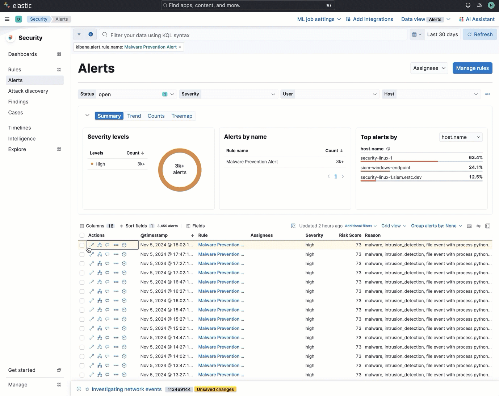
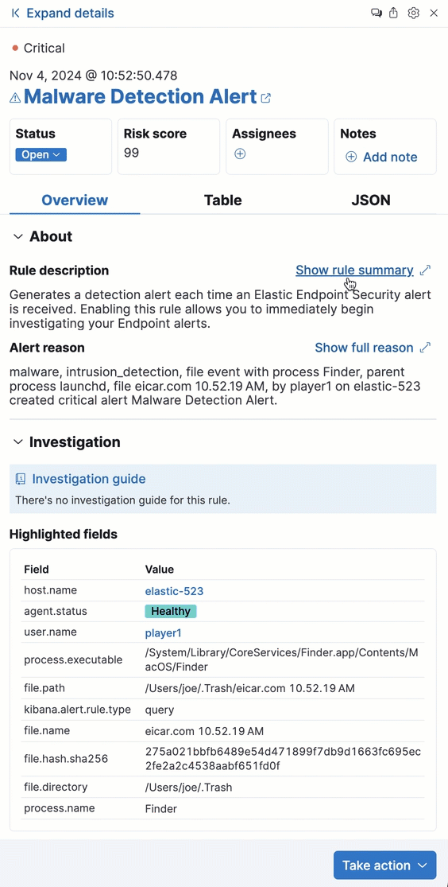
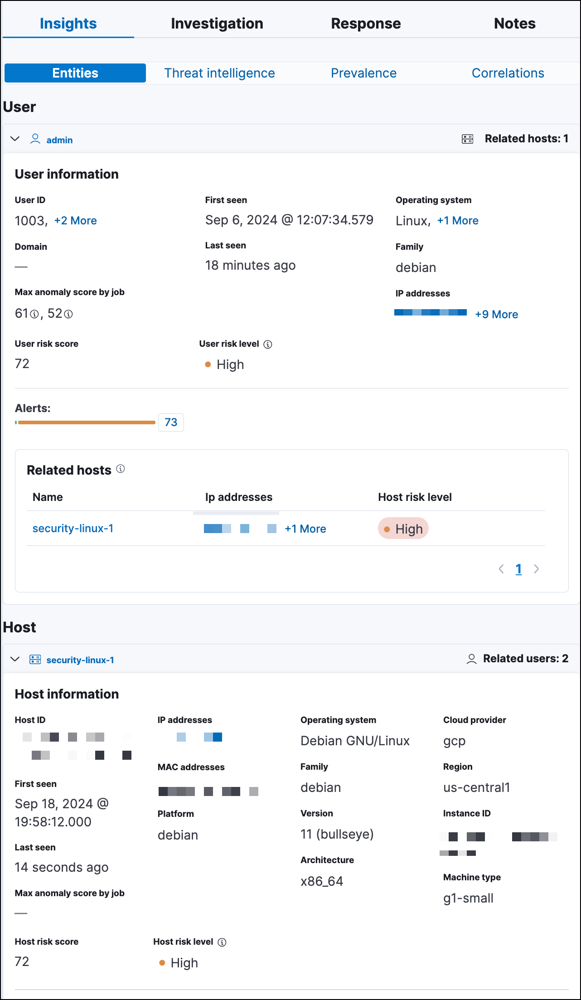
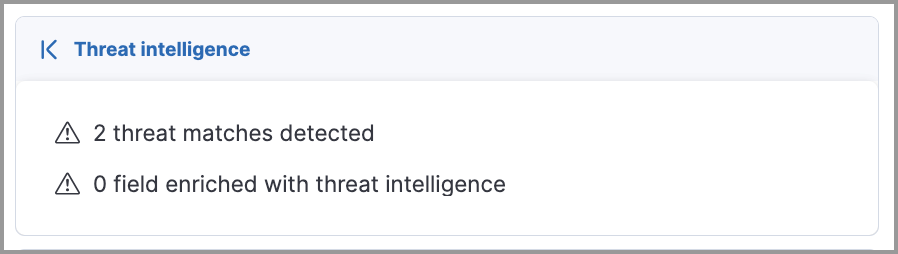
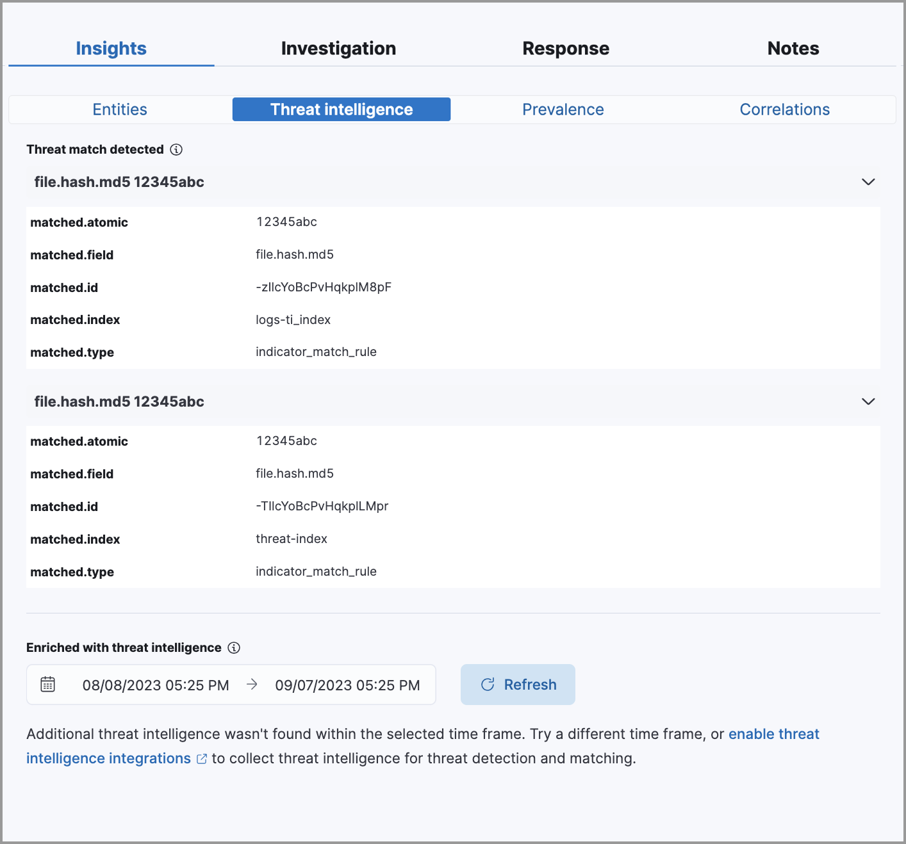
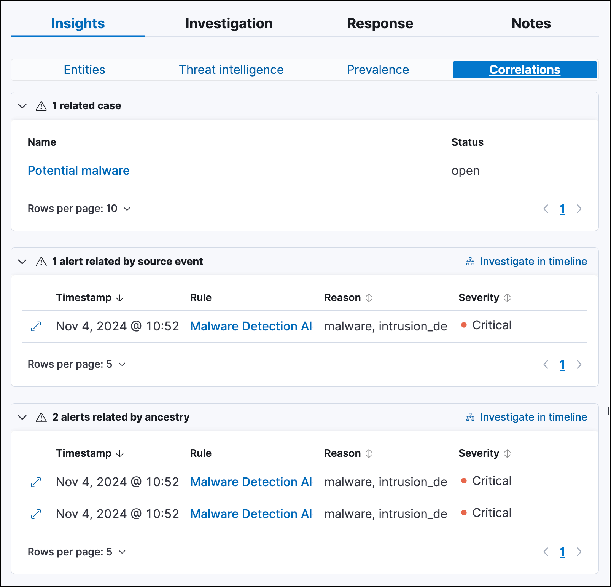
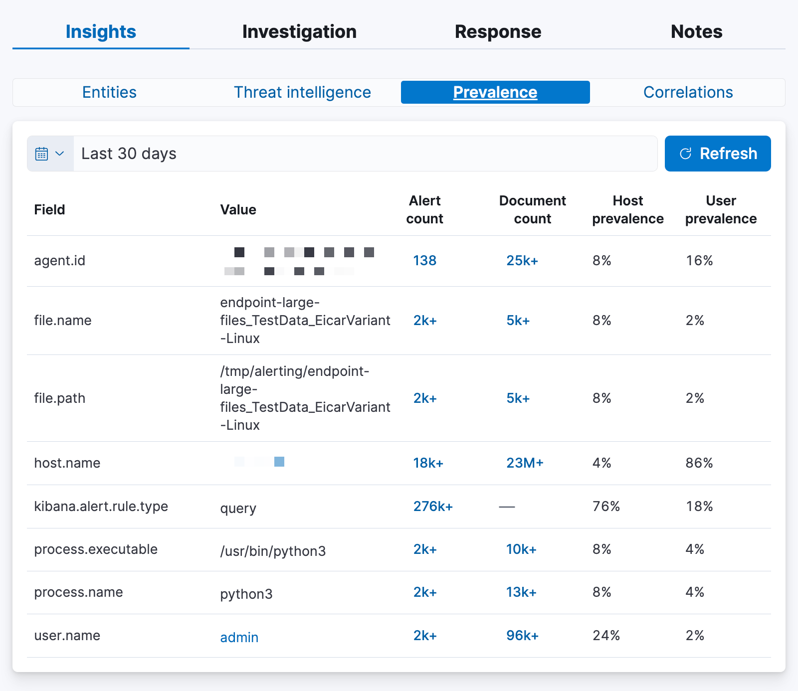

<DocBadge template="technical preview" />

To learn more about an alert, click the **View details** button from the Alerts table. This opens the alert details flyout, which helps you understand and manage the alert. 

Use the alert details flyout to begin an investigation, open a case, or plan a response. Click **Take action** at the bottom of the flyout to find more options for interacting with the alert.

<DocCallOut title="Note">
To use the simplified alert details flyout design, turn off the <DocLink id="serverlessSecurityAdvancedSettings" section="display-the-expandable-flyout">`securitySolution:enableExpandableFlyout`</DocLink> advanced setting. 
</DocCallOut>

## Alert details flyout UI 

The alert details flyout has a right panel, a preview panel, and a left panel. Each panel provides a different perspective of the alert.  

### Right panel 

The right panel provides an overview of the alert. Expand any of the collapsed sections to learn more about the alert. You can also hover over fields on the **Overview** and **Table** tabs to display available <DocLink id="serverlessSecurityEsUiOverview" section="inline-actions-for-fields-and-values">inline actions</DocLink>. 

<DocImage size="xl" url="../images/view-alert-details/-detections-alert-details-flyout-right-panel.png" alt="Right panel of the alert details flyout"/>

From the right panel, you can also:

* Click **Expand details** to open the <DocLink id="serverlessSecurityViewAlertDetails" section="left-panel">left panel</DocLink>, which shows more information about sections in the right panel.
* Click the **Chat** icon (<DocIcon type="discuss" title="Chat" />) to access the <DocLink id="serverlessSecurityAIAssistant" />.
* Click the **Share alert** icon (<DocIcon type="share" title="Share alert" />) to get a shareable alert URL. We _do not_ recommend copying the URL from your browser's address bar, which can lead to inconsistent results if you've set up filters or relative time ranges for the Alerts page. 

    <DocCallOut title="Note">
    If you've configured the [`server.publicBaseUrl`](((kibana-ref))/settings.html#server-publicBaseUrl) setting in the `kibana.yml` file, the shareable URL is also in the `kibana.alert.url` field. You can find the field by searching for `kibana.alert.url` on the **Table** tab.
    </DocCallOut>

    <DocCallOut title="Important" color="warning">
    If you've enabled grouping on the Alerts page, the alert details flyout won't open until you expand a collapsed group and select an individual alert.
    </DocCallOut>

* Find basic details about the alert, such as the:

    * Associated rule
    * Alert status
    * Date and time the alert was created
    * Alert severity and risk score (these are inherited from rule that generated the alert)
    * Users assigned to the alert (click the <DocIcon type="plusInCircle" title="Assign alert" /> icon to assign more users)
* Click the **Table** or **JSON** tabs to display the alert details in table or JSON format. In table format, alert details are displayed as field-value pairs. 

### Preview panel 

The preview panel shows more information about the rule associated with the alert and the reason the alert was generated. This panel overlays the right panel when you click **Show rule details** or **Show full reason** in the <DocLink id="serverlessSecurityViewAlertDetails" section="about">About</DocLink> section. To close the preview panel, click **x**. 

### Left panel 

The left panel provides an expanded view of what's shown in the right panel. To open the left panel, do one of the following:

* Click **Expand details** at the top of the right panel.

    <DocImage size="l" url="../images/view-alert-details/-detections-expand-details-button.png" alt="Expand details button at the top of the alert details flyout"/>

* Click one of the section titles on the **Overview** tab within the right panel. 

    <DocImage size="l" url="../images/view-alert-details/-detections-alert-details-flyout-left-panel.png" alt="Left panel of the alert details flyout"/>
    

## About 

The About section is located on the **Overview** tab in the right panel. It provides a brief description of the rule that's related to the alert and an explanation of what generated the alert. 

<DocImage size="xl" url="../images/view-alert-details/-detections-about-section-rp.png" alt="About section of the Overview tab"/>

The About section has the following information:

* **Rule description**: Describes the rule's purpose or detection goals. Click **Show rule summary** to display more details about the rule within the <DocLink id="serverlessSecurityViewAlertDetails" section="preview-panel">preview panel</DocLink>. From the preview panel, click **Show rule details** to view the rule's details page. 

* **Alert reason**: Describes the source event that generated the alert. Event details are displayed in plain text and ordered logically to provide context for the alert. Click **Show full reason** to display the alert reason in the event rendered format within the <DocLink id="serverlessSecurityViewAlertDetails" section="preview-panel">preview panel</DocLink>.  

    <DocCallOut title="Note">
    The event renderer only displays if an event renderer exists for the alert type. Fields are interactive; hover over them to access the available actions.
    </DocCallOut>

* **Last Alert Status Change**: Shows the last time the alert's status was changed, along with the user who changed it.
* **MITRE ATT&CK**: Provides relevant [MITRE ATT&CK](https://attack.mitre.org/) framework tactics, techniques, and sub-techniques.

## Investigation 

The Investigation section is located on the **Overview** tab in the right panel. It offers a couple of ways to begin investigating the alert. 

<DocImage size="xl" url="../images/view-alert-details/-detections-investigation-section-rp.png" alt="Investigation section of the Overview tab"/>

The Investigation section provides the following information:

* **Investigation guide**: The **Show investigation guide** button displays if the rule associated with the alert has an investigation guide. Click the button to open the expanded Investigation view in the left panel.  

    <DocCallOut title="Tip">
    Add an <DocLink id="serverlessSecurityInteractiveInvestigationGuides" section="add-investigation-guide-actions-to-a-rule">investigation guide</DocLink> to a rule when creating a new custom rule or modifying an existing custom rule's settings.
    </DocCallOut>

* **Highlighted fields**: Shows relevant fields for the alert and any custom highlighted fields you added to the rule. 
    {/* link to custom highlighted fields docs */}

## Visualizations 

The Visualizations section is located on the **Overview** tab in the right panel. It offers a glimpse of the processes that led up to the alert and occurred after it. 

<DocImage size="xl" url="../images/view-alert-details/-detections-visualizations-section-rp.png" alt="Visualizations section of the Overview tab"/>

Click **Visualizations** to display the following previews:

* **Session view preview**: Shows a preview of <DocLink id="serverlessSecuritySessionView">session view</DocLink> data. Click **Session viewer preview** to open the **Session View** tab in Timeline. 

* **Analyzer preview**: Shows a preview of the <DocLink id="serverlessSecurityVisualEventAnalyzer">visual analyzer graph</DocLink>. The preview displays up to three levels of the analyzed event's ancestors and up to three levels of the event's descendants and children. The ellipses symbol (**`...`**) indicates the event has more ancestors and descendants to examine. Click **Analyzer preview** to open the **Event Analyzer** tab in Timeline.

## Insights 

The Insights section is located on the **Overview** tab in the right panel. It offers different perspectives from which you can assess the alert. Click **Insights** to display overviews for <DocLink id="serverlessSecurityViewAlertDetails" section="entities">related entities</DocLink>, <DocLink id="serverlessSecurityViewAlertDetails" section="threat-intelligence">threat intelligence</DocLink>, <DocLink id="serverlessSecurityViewAlertDetails" section="correlations">correlated data</DocLink>, and <DocLink id="serverlessSecurityViewAlertDetails" section="prevalence">host and user prevalence</DocLink>.  

<DocImage size="xl" url="../images/view-alert-details/-detections-insights-section-rp.png" alt="Insights section of the Overview tab"/>

### Entities 

The Entities overview provides high-level details about the user and host that are related to the alert. Host and user risk classifications are also available if you have the Security Analytics Complete <DocLink id="serverlessGeneralManageProject" text="project feature"/>. 

<DocImage size="xl" url="../images/view-alert-details/-detections-entities-overview.png" alt="Overview of the entity details  section in the right panel"/>

#### Expanded entities view

From the right panel, click **Entities** to open a detailed view of the host and user associated with the alert. The expanded view also includes risk scores and classifications (if you have the Security Analytics Complete <DocLink id="serverlessGeneralManageProject" text="project feature"/>) and activity on related hosts and users. 

### Threat intelligence 

The Threat intelligence overview shows matched indicators, which provide threat intelligence relevant to the alert. 

The Threat intelligence overview provides the following information:

* **Threat match detected**: Only available when examining an alert generated from an <DocLink id="serverlessSecurityRulesUiCreate" section="create-an-indicator-match-rule">indicator match</DocLink> rule. Shows the number of matched indicators that are present in the alert document. Shows zero if there are no matched indicators or you're examining an alert generated by another type of rule.

* **Fields enriched with threat intelligence**: Shows the number of matched indicators that are present on an alert that _wasn't_ generated from an indicator match rule. If none exist, the total number of matched indicators is zero.

#### Expanded threat intelligence view

From the right panel, click **Threat intelligence** to open the expanded Threat intelligence view within the left panel. 

<DocCallOut title="Note">
The expanded threat intelligence view queries indices specified in the `securitySolution:defaultThreatIndex` advanced setting. Refer to <DocLink id="serverlessSecurityAdvancedSettings" section="update-default-elastic-security-threat-intelligence-indices">Update default Elastic Security threat intelligence indices</DocLink> to learn more about threat intelligence indices. 
</DocCallOut>

The expanded Threat intelligence view shows individual indicators within the alert document. You can expand and collapse indicator details by clicking the arrow button at the end of the indicator label. Each indicator is labeled with values from the `matched.field` and `matched.atomic` fields and displays the threat intelligence provider. 

Matched threats are organized into two sections, described below. Within each section, matched threats are shown in reverse chronological order, with the most recent at the top. All mapped fields are displayed for each matched threat.

**Threat match detected**

The Threat match detected section is only populated with indicator match details if you're examining an alert that was generated from an indicator match rule. Indicator matches occur when alert field values match with threat intelligence data you've ingested. 

**Fields enriched with threat intelligence**

Threat intelligence can also be found on alerts that weren't generated from indicator match rules. To find this information, ((elastic-sec)) queries alert documents from the past 30 days and searches for fields that contain known threat intelligence. If any are found, they're logged in this section. 

<DocCallOut title="Tip">
Use the date time picker to modify the query time frame, which looks at the past 30 days by default. You can also click the **Inspect** button to examine the query that the Fields enriched with threat intelligence section uses.
</DocCallOut>

When searching for threat intelligence, ((elastic-sec)) queries the alert document for the following fields:

- `file.hash.md5`: The MD5 hash
- `file.hash.sha1`: The SHA1 hash
- `file.hash.sha256`: The SHA256 hash
- `file.pe.imphash`: Imports in a PE file
- `file.elf.telfhash`: Imports in an ELF file
- `file.hash.ssdeep`: The SSDEEP hash
- `source.ip`: The IP address of the source (IPv4 or IPv6)
- `destination.ip`: The event's destination IP address
- `url.full`: The full URL of the event source
- `registry.path`: The full registry path, including the hive, key, and value

### Correlations 

The Correlations overview shows how an alert is related to other alerts and offers ways to investigate related alerts. Use this information to quickly find patterns between alerts and then take action. 

<DocImage size="xl" url="../images/view-alert-details/-detections-correlations-overview.png" alt="Overview of available correlation data"/>

The Correlations overview provides the following information: 

* **Suppressed alerts**: Indicates that the alert was created with alert suppression, and shows how many duplicate alerts were suppressed. This information only appears if alert suppression is enabled for the rule.
* **Alerts related by source event**: Shows the number of alerts that were created by the same source event.  
* **Cases related to the alert**: Shows the number of cases to which the alert has been added.
* **Alerts related by session ID**: Shows the number of alerts generated by the same session. 
* **Alerts related by process ancestry**: Shows the number of alerts that are related by process events on the same linear branch. 

#### Expanded correlations view

From the right panel, click **Correlations** to open the expanded Correlations view within the left panel. 

In the expanded view, corelation data is organized into several tables:

* **Suppressed alerts**: <DocBadge template="technical preview" /> Shows how many duplicate alerts were suppressed. This information only appears if alert suppression is enabled for the rule.
* **Related cases**: Shows cases to which the alert has been added. Click a case's name to open its details.
* **Alerts related by source event**: Shows alerts created by the same source event. This can help you find alerts with a shared origin and provide more context about the source event. Click the **Investigate in timeline** button to examine related alerts in Timeline.
* **Alerts related by session**: Shows alerts generated during the same <DocLink id="serverlessSecuritySessionView">session</DocLink>. These alerts share the same session ID, which is a unique ID for tracking a given Linux session. To use this feature, you must enable the **Include session data** setting in your ((elastic-defend)) integration policy. Refer to <DocLink id="serverlessSecuritySessionView" section="enable-session-view-data">Enable Session View data</DocLink> for more information.
* **Alerts related by ancestry**: Shows alerts that are related by process events on the same linear branch. Note that alerts generated from processes on child or related branches are not shown. To further examine alerts, click **Investigate in timeline**.

### Prevalence

The Prevalence overview shows whether data from the alert was frequently observed on other host events from the last 30 days. Prevalence calculations use values from the alert’s highlighted fields. Highlighted field values that are observed on less than 10% of hosts in your environment are considered uncommon (not prevalent) and are listed individually in the Prevalence overview. Highlighted field values that are observed on more than 10% of hosts in your environment are considered common (prevalent) and are described as frequently observed in the Prevalence overview. 

#### Expanded prevalence view

From the right panel, click **Prevalence** to open the expanded Prevalence view within the left panel. Examine the table to understand the alert's relationship with other alerts, events, users, and hosts.

<DocCallOut title="Tip">
Update the date time picker for the table to show data from a different time range. 
</DocCallOut>

The expanded Prevalence view provides the following details:

* **Field**: Shows <DocLink id="serverlessSecurityViewAlertDetails" section="investigation">highlighted fields</DocLink> for the alert and any custom highlighted fields that were added to the alert's rule.

* **Value**: Shows values for highlighted fields and any custom highlighted fields that were added to the alert's rule.

* **Alert count**: Shows the total number of alert documents that have identical highlighted field values, including the alert you're currently examining. For example, if the `host.name` field has an alert count of 5, that means there are five total alerts with the same `host.name` value. The Alert count column only retrieves documents that contain the [`event.kind:signal`](((ecs-ref))/ecs-allowed-values-event-kind.html#ecs-event-kind-signal) field-value pair.

* **Document count**: Shows the total number of event documents that have identical field values. A dash (`——`) displays if there are no event documents that match the field value. The Document count column only retrieves documents that don't contain the [`event.kind:signal`](((ecs-ref))/ecs-allowed-values-event-kind.html#ecs-event-kind-signal) field-value pair.

* **Host prevalence**: Shows the percentage of unique hosts that have identical field values. Host prevalence for highlighted fields is calculated by taking the number of unique hosts with identical highlighted field values and dividing that number by the total number of unique hosts in your environment.  

* **User prevalence**: Shows the percentage of unique users that have identical highlighted field values. User prevalence for highlighted fields is calculated by taking the number of unique users with identical field values and dividing that number by the total number of unique users in your environment. 

## Response 

The **Response** section is located on the **Overview** tab in the right panel. It shows <DocLink id="serverlessSecurityRulesUiCreate">response actions</DocLink> that were added to the rule associated with the alert. Click **Response** to display the response action's results in the left panel.

<DocImage size="l" url="../images/view-alert-details/-detections-response-action-rp.png" alt="Response section of the Overview tab"/>
