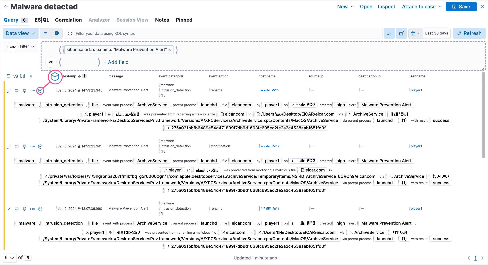
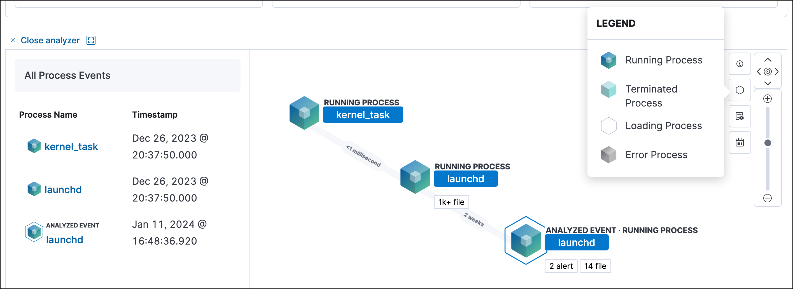
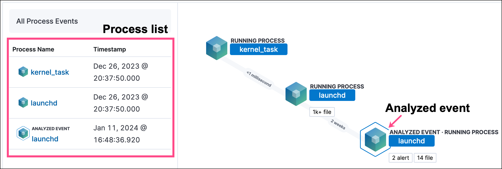
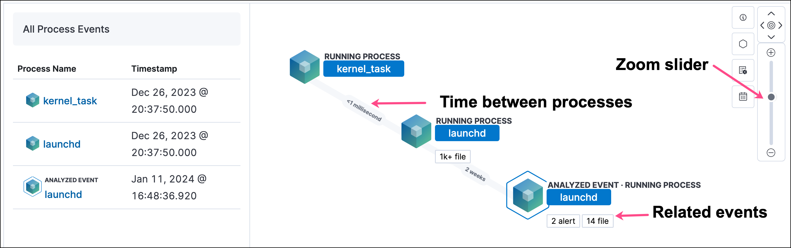
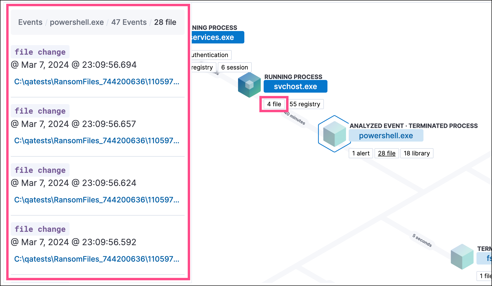
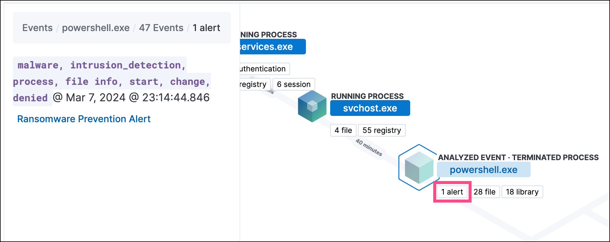

<DocBadge template="technical preview" />

((elastic-sec)) allows any event detected by ((elastic-endpoint)) to be analyzed using a process-based visual analyzer, which shows a graphical timeline of processes that led up to the alert and the events that occurred immediately after. Examining events in the visual event analyzer is useful to determine the origin of potentially malicious activity and other areas in your environment that may be compromised. It also enables security analysts to drill down into all related hosts, processes, and other events to aid in their investigations.

<DocCallOut title="Tip">
If you're experiencing performance degradation, you can  <DocLink slug="/serverless/security/advanced-settings" section="exclude-cold-and-frozen-tier-data-from-analyzer-queries">exclude cold and frozen tier data</DocLink> from analyzer queries.
</DocCallOut>

## Find events to analyze

You can only visualize events triggered by hosts configured with the ((elastic-defend)) integration or any `sysmon` data from `winlogbeat`.

In KQL, this translates to any event with the `agent.type` set to either:

* `endpoint`
* `winlogbeat` with `event.module` set to `sysmon`

To find events that can be visually analyzed:

1. First, display a list of events by doing one of the following:
    * Go to **Explore** → **Hosts**, then select the **Events** tab. A list of all your hosts' events appears at the bottom of the page.
    * Go to **Alerts**, then scroll down to the Alerts table.

1. Filter events that can be visually analyzed by entering either of the following queries in the KQL search bar, then selecting **Enter**:
    * `agent.type:"endpoint" and process.entity_id :*`

        Or

    * `agent.type:"winlogbeat" and event.module: "sysmon" and process.entity_id : *`

1. Events that can be visually analyzed are denoted by a cubical **Analyze event** icon. Select this option to open the event in the visual analyzer.

    <DocImage size="xl" url="../images/visual-event-analyzer/-detections-analyze-event-button.png" alt="Shows analyze event option" />

    <DocCallOut title="Note">
    Events that cannot be analyzed will not have the **Analyze event** option available. This might occur if the event has incompatible field mappings.
    </DocCallOut>

    

    <DocCallOut title="Tip">
    You can also analyze events from <DocLink slug="/serverless/security/timelines-ui">Timelines</DocLink>.
    </DocCallOut>

## Visual event analyzer UI

Within the visual analyzer, each cube represents a process, such as an executable file or network event. Click and drag in the analyzer to explore the hierarchy of all process relationships.

To understand what fields were used to create the process, select the **Process Tree** to show the schema that created the graphical view. The fields included are:

* `SOURCE`: Can be either `endpoint` or `winlogbeat`
* `ID`: Event field that uniquely identifies a node
* `EDGE`: Event field which indicates the relationship between two nodes

Click the **Legend** to show the state of each process node.

Use the date and time filter to analyze the event within a specific time range. By default, the selected time range matches that of the table from which you opened the alert. 

Select a different data view to further filter the alert's related events.

To expand the analyzer to a full screen, select the **Full Screen** icon above the left panel.

The left panel contains a list of all processes related to the event, starting with the event chain's first process. **Analyzed Events** — the event you selected to analyze from the events list or Timeline — are highlighted with a light blue outline around the cube.

In the graphical view, you can:

- Zoom in and out of the graphical view using the slider on the far right
- Click and drag around the graphical view to more process relationships
- Observe child process events that spawned from the parent process
- Determine how much time passed between each process
- Identify all events related to each process

## Process and event details

To learn more about each related process, select the process in the left panel or the graphical view. The left panel displays process details such as:

* The number of events associated with the process
* The timestamp of when the process was executed
* The file path of the process within the host
* The `process-pid`
* The user name and domain that ran the process
* Any other relevant process information
* Any associated alerts

When you first select a process, it appears in a loading state. If loading data for a given process fails, click **Reload `{process_name}`** beneath the process to reload the data.

Access event details by selecting that event's URL at the top of the process details view or choosing one of the event pills in the graphical view.

Events are categorized based on the `event.category` value.

When you select an `event.category` pill, all the events within that category are listed in the left panel. To display more details about a specific event, select it from the list.

<DocCallOut title="Note">
There is no limit to the number of events that can be associated with a process.
</DocCallOut>

You can also examine alerts associated with events.

To examine alerts associated with the event, select the alert pill (**_x_ alert**). The left pane lists the total number of associated alerts, and alerts are ordered from oldest to newest. Each alert shows the type of event that produced it (`event.category`), the event timestamp (`@timestamp`), and rule that generated the alert (`kibana.alert.rule.name`). Click on the rule name to open the alert's details.

In the example screenshot below, five alerts were generated by the analyzed event (`lsass.exe`). The left pane displays the associated alerts and basic information about each one.

