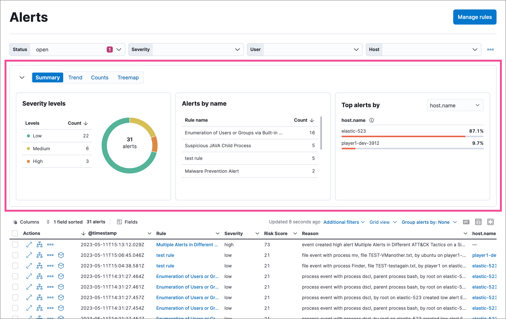
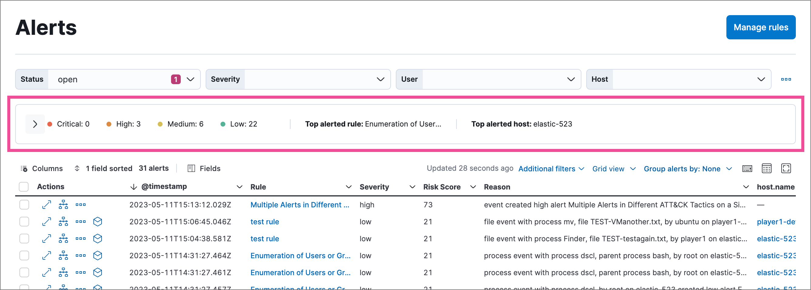
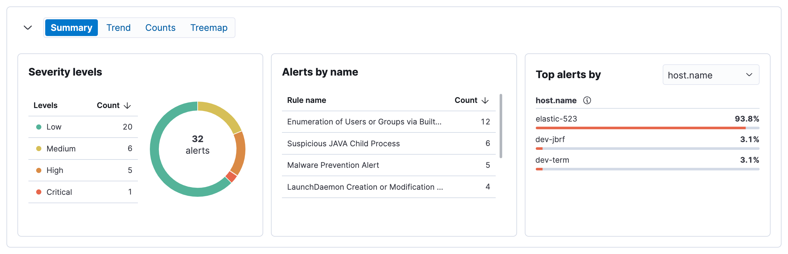
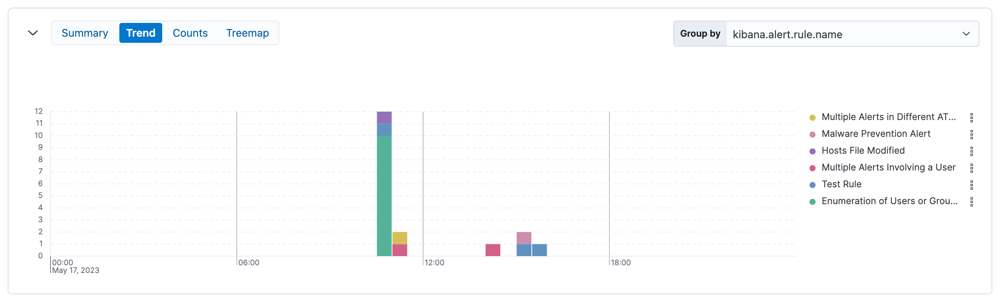
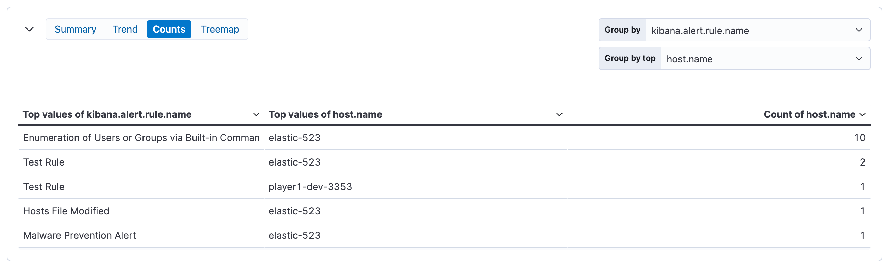

<DocBadge template="technical preview" />

Visualize and group detection alerts by specific parameters in the visualization section of the Alerts page. 

Use the left buttons to select a view type (**Summary**, **Trend**, **Counts**, or **Treemap**), and use the right menus to select the ECS fields to use for grouping: 

* **Top alerts by** or **Group by**: Primary field for grouping alerts.
* **Group by top** (if available): Secondary field for further subdividing grouped alerts.

For example, you can group first by rule name (`Group by: kibana.alert.rule.name`), then by host name (`Group by top: host.name`) to visualize which detection rules generated alerts, and which hosts triggered each of those rules. For groupings with a lot of unique values, the top 1,000 results are displayed.

<DocCallOut title="Note">
Some view types don't have the **Group by top** option. You can also leave **Group by top** blank to group by only the primary field in **Group by**.
</DocCallOut>

To reset a view to default settings, hover over it and click the options menu (<DocIcon type="boxesHorizontal" title="More actions" />) that appears, then select **Reset group by fields**. 

<DocCallOut title="Tip">
The options menu also lets you inspect the visualization's queries. For the trend and counts views, you can add the visualization to a new or existing case, or open it in Lens.
</DocCallOut>

Click the collapse icon (<DocIcon type="arrowDown" title="Markdown" />) to minimize the visualization section and display a summary of key information instead.

## Summary

On the Alerts page, the summary visualization displays by default and shows how alerts are distributed across these indicators:

* **Severity levels**: How many alerts are in each severity level.
* **Alerts by name**: How many alerts each detection rule created.
* **Top alerts by**: Percentage of alerts with a specified field value: `host.name` (default), `user.name`, `source.ip`, or `destination.ip`.

You can hover and click on elements within the summary — such as severity levels, rule names, and host names — to add filters with those values to the Alerts page.

## Trend
The trend view shows the occurrence of alerts over time. By default, it groups alerts by detection rule name (`kibana.alert.rule.name`).

<DocCallOut title="Note">
The **Group by top** menu is unavailable for the trend view.
</DocCallOut>

## Counts
The counts view shows the count of alerts in each group. By default, it groups alerts first by detection rule name (`kibana.alert.rule.name`), then by host name (`host.name`).

## Treemap
The treemap view shows the distribution of alerts as nested, proportionally-sized tiles. This view can help you quickly pinpoint the most prevalent and critical alerts.

Larger tiles represent more frequent alerts, and each tile's color is based on the alerts' risk score:

* **Green**: Low risk (`0` - `46`)
* **Yellow**: Medium risk (`47` - `72`)
* **Orange**: High risk (`73` - `98`)
* **Red**: Critical risk (`99` - `100`)

By default, the treemap groups alerts first by detection rule name (`kibana.alert.rule.name`), then by host name (`host.name`). This shows which rules generated the most alerts, and which hosts were responsible.

<DocCallOut title="Note">
Depending on the amount of alerts, some tiles and text might be very small. Hover over the treemap to display information in a tooltip.
</DocCallOut>

You can click on the treemap to narrow down the alerts displayed in both the treemap and the alerts table below. Click the label above a group to display the alerts in that group, or click an individual tile to display the alerts related to that tile. This adds filters under the KQL search bar, which you can edit or remove to further customize the view.

