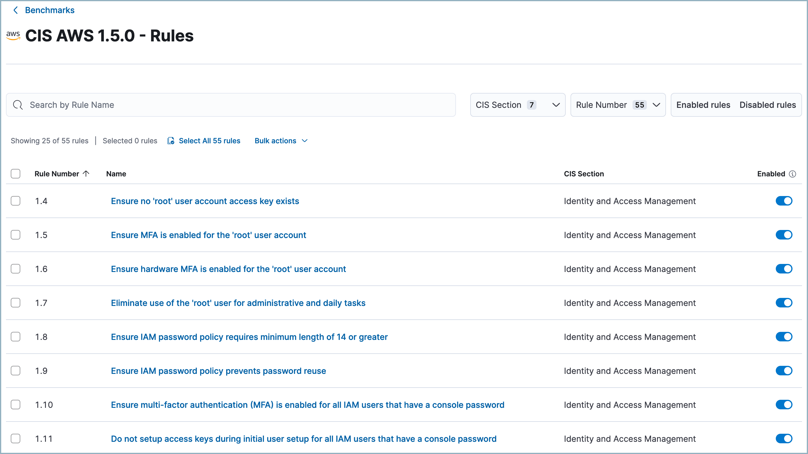

<DocBadge template="technical preview" />

The Benchmarks page lets you view the cloud security posture (CSP) benchmarks for the <DocLink id="serverlessSecurityCspm">Cloud security posture management</DocLink> (CSPM) and <DocLink id="serverlessSecurityKspm">Kubernetes security posture management</DocLink> (KSPM) integrations.

## What are benchmarks?
Each benchmark contains benchmark rules which are used by the CSPM and KSPM integrations to identify configuration risks in your cloud infrastructure. There are different benchmarks for different cloud services, such as AWS, GCP, or Azure. They are based on the Center for Internet Security's (CIS) [secure configuration benchmarks](https://www.cisecurity.org/cis-benchmarks/).

Each benchmark rule checks to see if a specific type of resource is configured according to a CIS Benchmark. The names of rules describe what they check, for example:

* `Ensure Kubernetes Secrets are encrypted using Customer Master Keys (CMKs) managed in AWS KMS`
* `Ensure the default namespace is not in use`
* `Ensure IAM policies that allow full "*:*" administrative privileges are not attached`
* `Ensure the default namespace is not in use`

When benchmark rules are evaluated, the resulting <DocLink id="serverlessSecurityCspmFindingsPage">findings</DocLink> data appears on the <DocLink id="serverlessSecurityCloudPostureDashboard">Cloud Security Posture dashboard</DocLink>.

<DocCallOut title="Note">
Benchmark rules are not editable.
</DocCallOut>

## Review your benchmarks

To access your active benchmarks, go to **Rules -> Benchmarks**. From there, you can click a benchmark's name to view the benchmark rules associated with it. You can click a benchmark rule's name to see details including information about how to remediate it, and related links. 

Benchmark rules are enabled by default, but you can disable some of them — at the benchmark level — to suit your environment. This means for example that if you have two CSPM integrations using the `CIS AWS` benchmark, disabling a rule for that benchmark affects both integrations. To enable or disable a rule, use the **Enabled** toggle on the right of the rules table. 

<DocCallOut title="Note">
Disabling a benchmark rule automatically disables any associated detection rules and alerts. Re-enabling a benchmark rule **does not** automatically re-enable them.
</DocCallOut>

## How benchmark rules work

1. When a security posture management integration is deployed, and every four hours after that, ((agent)) fetches relevant cloud resources.
1. After resources are fetched, they are evaluated against all applicable enabled benchmark rules.
1. Finding values of `pass` or `fail` indicate whether the standards defined by benchmark rules were met.

