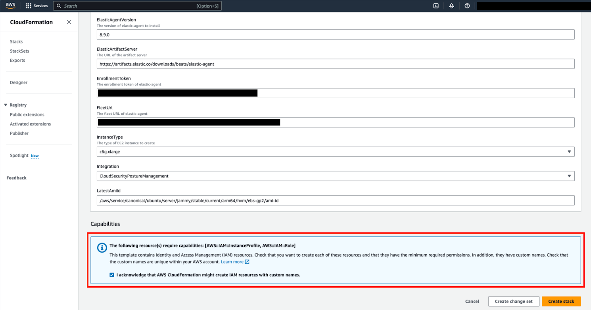
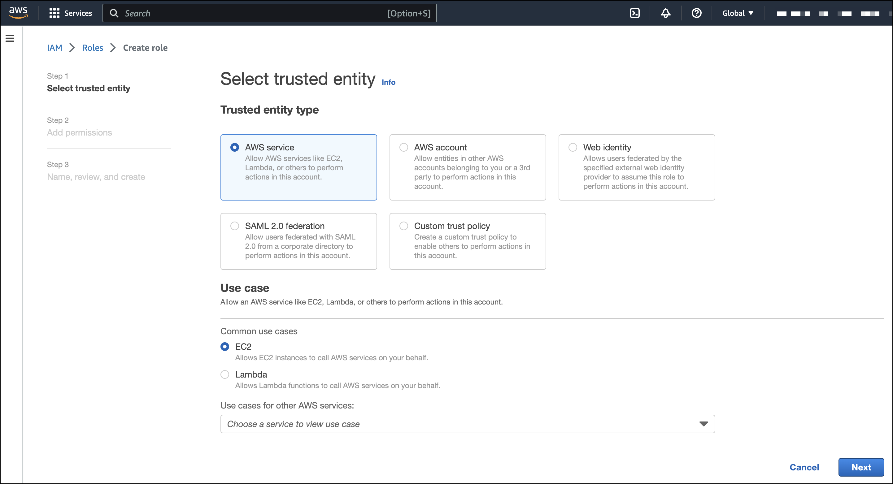

<DocBadge template="technical preview" />
<div id="cspm-get-started"></div>

<div id="cspm-overview"></div>

## Overview

This page explains how to get started monitoring the security posture of your cloud assets using the Cloud Security Posture Management (CSPM) feature.

<DocCallOut title="Requirements">

* CSPM only works in the `Default` ((kib)) space. Installing the CSPM integration on a different ((kib)) space will not work. 
* CSPM is supported only on AWS, GCP, and Azure commercial cloud platforms, and AWS GovCloud. Other government cloud platforms are not supported ([request support](https://github.com/elastic/kibana/issues/new/choose)).
* To view posture data, you need the appropriate user role to read the following ((es)) indices:
    * `logs-cloud_security_posture.findings_latest-*`
    * `logs-cloud_security_posture.scores-*`
    * `Logs-cloud_security_posture.findings`
* The user who gives the CSPM integration AWS permissions must be an AWS account `admin`.

</DocCallOut>

<div id="cspm-setup"></div>

## Set up CSPM for AWS

You can set up CSPM for AWS either by enroling a single cloud account, or by enroling an organization containing multiple accounts. Either way, first you will add the CSPM integration, then enable cloud account access.

<div id="cspm-add-and-name-integration"></div>

## Add the CSPM integration
1. From the Elastic Security **Get started** page, click **Add integrations**.
1. Search for `CSPM`, then click on the result.
1. Click **Add Cloud Security Posture Management (CSPM)**.
1. Select **AWS**, then either **AWS Organization** to onboard multiple accounts, or **Single Account** to onboard an individual account.
1. Give your integration a name that matches the purpose or team of the AWS account/organization you want to monitor, for example, `dev-aws-account`.

<div id="cspm-set-up-cloud-access-section"></div>

## Set up cloud account access
The CSPM integration requires access to AWS’s built-in [`SecurityAudit` IAM policy](https://docs.aws.amazon.com/IAM/latest/UserGuide/access_policies_job-functions.html#jf_security-auditor) in order to discover and evaluate resources in your cloud account. There are several ways to provide access.

For most use cases, the simplest option is to use AWS CloudFormation to automatically provision the necessary resources and permissions in your AWS account. This method, as well as several manual options, are described below.

<div id="cspm-set-up-cloudformation"></div>

### CloudFormation (recommended)
1. In the **Add Cloud Security Posture Management (CSPM) integration** menu, under **Setup Access**, select **CloudFormation**.
1. In a new browser tab or window, log in as an admin to the AWS account or organization you want to onboard.
1. Return to your ((kib)) tab. Click **Save and continue** at the bottom of the page.
1. Review the information, then click **Launch CloudFormation**.
1. A CloudFormation template appears in a new browser tab.
1. For organization-level deployments only, you must enter the ID of the organizational unit where you want to deploy into the `OrganizationalUnitIds` field in the CloudFormation template. You can find it in the AWS console under **AWS Organizations → AWS Accounts** (it appears under the organization name).
1. (Optional) Switch to the AWS region where you want to deploy using the controls in the upper right corner.
1. Tick the checkbox under **Capabilities** to authorize the creation of necessary resources.

    

1. At the bottom of the template, select **Create stack**.

When you return to ((kib)), click **View assets** to review the data being collected by your new integration.

<div id="cspm-setup-organization-manual"></div>

### Manual authentication for organization-level onboarding

<DocCallOut title="Note">
If you're onboarding a single account instead of an organization, skip this section.
</DocCallOut>

When using manual authentication to onboard at the organization level, you need to configure the necessary permissions using the AWS console for the organization where you want to deploy:

* In the organization's management account (root account), create an IAM role called `cloudbeat-root` (the name is important). The role needs several policies:

    * The following inline policy:

<DocAccordion buttonContent="Click to expand policy">

```
{
    "Version": "2012-10-17",
    "Statement": [
        {
            "Action": [
                "organizations:List*",
                "organizations:Describe*"
            ],
            "Resource": "*",
            "Effect": "Allow"
        },
        {
            "Action": [
                "sts:AssumeRole"
            ],
            "Resource": "*",
            "Effect": "Allow"
        }
    ]
}
```

</DocAccordion>

    * The following trust policy:

<DocAccordion buttonContent="Click to expand policy">

```
{
    "Version": "2012-10-17",
    "Statement": [
        {
            "Effect": "Allow",
            "Principal": {
                "AWS": "arn:aws:iam::<Management Account ID>:root"
            },
            "Action": "sts:AssumeRole"
        },
        {
            "Effect": "Allow",
            "Principal": {
                "Service": "ec2.amazonaws.com"
            },
            "Action": "sts:AssumeRole"
        }
    ]
}
```

</DocAccordion>

    * The AWS-managed `SecurityAudit` policy.

<DocCallOut title="Important" color="warning">
You must replace `<Management account ID>` in the trust policy with your AWS account ID.
</DocCallOut>

* Next, for each account you want to scan in the organization, create an IAM role named `cloudbeat-securityaudit` with the following policies:
    * The AWS-managed `SecurityAudit` policy.
    * The following trust policy:

<DocAccordion buttonContent="Click to expand policy">

```
{
    "Version": "2012-10-17",
    "Statement": [
        {
            "Effect": "Allow",
            "Principal": {
                "AWS": "arn:aws:iam::<Management Account ID>:role/cloudbeat-root"
            },
            "Action": "sts:AssumeRole"
        }
    ]
}
```

</DocAccordion>

<DocCallOut title="Important" color="warning">
You must replace `<Management account ID>` in the trust policy with your AWS account ID.
</DocCallOut>

After creating the necessary roles, authenticate using one of the manual authentication methods. 

<DocCallOut title="Important" color="warning">
When deploying to an organization using any of the authentication methods below, you need to make sure that the credentials you provide grant permission to assume `cloudbeat-root` privileges. 
</DocCallOut>

<div id="cspm-set-up-manual"></div>

## Manual authentication methods

* <DocLink slug="/serverless/security/cspm-get-started" section="option-1-default-instance-role">Default instance role (recommended)</DocLink>
* <DocLink slug="/serverless/security/cspm-get-started" section="option-2-direct-access-keys">Direct access keys</DocLink>
* <DocLink slug="/serverless/security/cspm-get-started" section="option-3-temporary-security-credentials">Temporary security credentials</DocLink>
* <DocLink slug="/serverless/security/cspm-get-started" section="option-4-shared-credentials-file">Shared credentials file</DocLink>
* <DocLink slug="/serverless/security/cspm-get-started" section="option-5-iam-role-amazon-resource-name-arn">IAM role Amazon Resource Name (ARN)</DocLink>

<DocCallOut title="Important" color="warning">
Whichever method you use to authenticate, make sure AWS’s built-in [`SecurityAudit` IAM policy](https://docs.aws.amazon.com/IAM/latest/UserGuide/access_policies_job-functions.html#jf_security-auditor) is attached.
</DocCallOut>

<div id="cspm-use-instance-role"></div>

### Option 1 - Default instance role

<DocCallOut title="Note">
If you are deploying to an AWS organization instead of an AWS account, you should already have <DocLink slug="/serverless/security/cspm-get-started" section="manual-authentication-for-organization-level-onboarding">created a new role</DocLink>, `cloudbeat-root`. Skip to step 2 "Attach your new IAM role to an EC2 instance", and attach this role. You can use either an existing or new EC2 instance.
</DocCallOut>

Follow AWS's [IAM roles for Amazon EC2](https://docs.aws.amazon.com/AWSEC2/latest/UserGuide/iam-roles-for-amazon-ec2.html) documentation to create an IAM role using the IAM console, which automatically generates an instance profile.

1. Create an IAM role:
    1. In AWS, go to your IAM dashboard. Click **Roles**, then **Create role**.
    1. On the **Select trusted entity** page, under **Trusted entity type**, select **AWS service**.
    1. Under **Use case**, select **EC2**. Click **Next**.

        

    1. On the **Add permissions** page, search for and select `SecurityAudit`. Click **Next**.

        

    1. On the **Name, review, and create** page, name your role, then click **Create role**.
1. Attach your new IAM role to an EC2 instance:
    1. In AWS, select an EC2 instance.
    1. Select **Actions → Security → Modify IAM role**.

        

    1. On the **Modify IAM role** page, search for and select your new IAM role.
    1. Click **Update IAM role**.
    1. Return to ((kib)) and <DocLink slug="/serverless/security/cspm-get-started" section="finish-manual-setup">finish manual setup</DocLink>.

<DocCallOut title="Important" color="warning">
Make sure to deploy the CSPM integration to this EC2 instance. When completing setup in Kibana, in the **Setup Access** section, select **Assume role** and leave **Role ARN** empty. Click **Save and continue**.
</DocCallOut>

<div id="cspm-use-keys-directly"></div>

### Option 2 - Direct access keys
Access keys are long-term credentials for an IAM user or AWS account root user. To use access keys as credentials, you must provide the `Access key ID` and the `Secret Access Key`. After you provide credentials, <DocLink slug="/serverless/security/cspm-get-started" section="finish-manual-setup">finish manual setup</DocLink>.

For more details, refer to [Access Keys and Secret Access Keys](https://docs.aws.amazon.com/general/latest/gr/aws-sec-cred-types.html).

<DocCallOut title="Important" color="warning">
You must select **Programmatic access** when creating the IAM user.
</DocCallOut>

<div id="cspm-use-temp-credentials"></div>

### Option 3 - Temporary security credentials
You can configure temporary security credentials in AWS to last for a specified duration. They consist of an access key ID, a secret access key, and a security token, which is typically found using `GetSessionToken`.

Because temporary security credentials are short term, once they expire, you will need to generate new ones and manually update the integration's configuration to continue collecting cloud posture data. Update the credentials before they expire to avoid data loss.

<DocCallOut title="Note">
IAM users with multi-factor authentication (MFA) enabled need to submit an MFA code when calling `GetSessionToken`. For more details, refer to AWS's [Temporary Security Credentials](https://docs.aws.amazon.com/IAM/latest/UserGuide/id_credentials_temp.html) documentation.
</DocCallOut>

You can use the AWS CLI to generate temporary credentials. For example, you could use the following command if you have MFA enabled:

```console
sts get-session-token --serial-number arn:aws:iam::1234:mfa/your-email@example.com --duration-seconds 129600 --token-code 123456
```

The output from this command includes the following fields, which you should provide when configuring the KSPM integration:

* `Access key ID`: The first part of the access key.
* `Secret Access Key`: The second part of the access key.
* `Session Token`: The required token when using temporary security credentials.

After you provide credentials, <DocLink slug="/serverless/security/cspm-get-started" section="finish-manual-setup">finish manual setup</DocLink>.

<div id="cspm-use-a-shared-credentials-file"></div>

### Option 4 - Shared credentials file
If you use different AWS credentials for different tools or applications, you can use profiles to define multiple access keys in the same configuration file. For more details, refer to AWS' [Shared Credentials Files](https://docs.aws.amazon.com/sdkref/latest/guide/file-format.html) documentation.

Instead of providing the `Access key ID` and `Secret Access Key` to the integration, provide the information required to locate the access keys within the shared credentials file:

* `Credential Profile Name`: The profile name in the shared credentials file.
* `Shared Credential File`: The directory of the shared credentials file.

If you don't provide values for all configuration fields, the integration will use these defaults:

- If `Access key ID`, `Secret Access Key`, and `ARN Role` are not provided, then the integration will check for `Credential Profile Name`.
- If there is no `Credential Profile Name`, the default profile will be used.
- If `Shared Credential File` is empty, the default directory will be used.
  - For Linux or Unix, the shared credentials file is located at `~/.aws/credentials`.

After providing credentials, <DocLink slug="/serverless/security/cspm-get-started" section="finish-manual-setup">finish manual setup</DocLink>.

<div id="cspm-use-iam-arn"></div>

### Option 5 - IAM role Amazon Resource Name (ARN)
An IAM role Amazon Resource Name (ARN) is an IAM identity that you can create in your AWS account. You define the role's permissions. Roles do not have standard long-term credentials such as passwords or access keys. Instead, when you assume a role, it provides temporary security credentials for your session.

To use an IAM role ARN, select **Assume role** under **Preferred manual method**, enter the ARN, and continue to Finish manual setup.

<div id="cspm-finish-manual"></div>

## Finish manual setup
Once you’ve provided AWS credentials, under **Where to add this integration**:

If you want to monitor an AWS account or organization where you have not yet deployed ((agent)):

* Select **New Hosts**.
* Name the ((agent)) policy. Use a name that matches the purpose or team of the cloud account or accounts you want to monitor. For example, `dev-aws-account`.
* Click **Save and continue**, then **Add ((agent)) to your hosts**. The **Add agent** wizard appears and provides ((agent)) binaries, which you can download and deploy to your AWS account.

If you want to monitor an AWS account or organization where you have already deployed ((agent)):

* Select **Existing hosts**.
* Select an agent policy that applies the AWS account you want to monitor.
* Click **Save and continue**.

