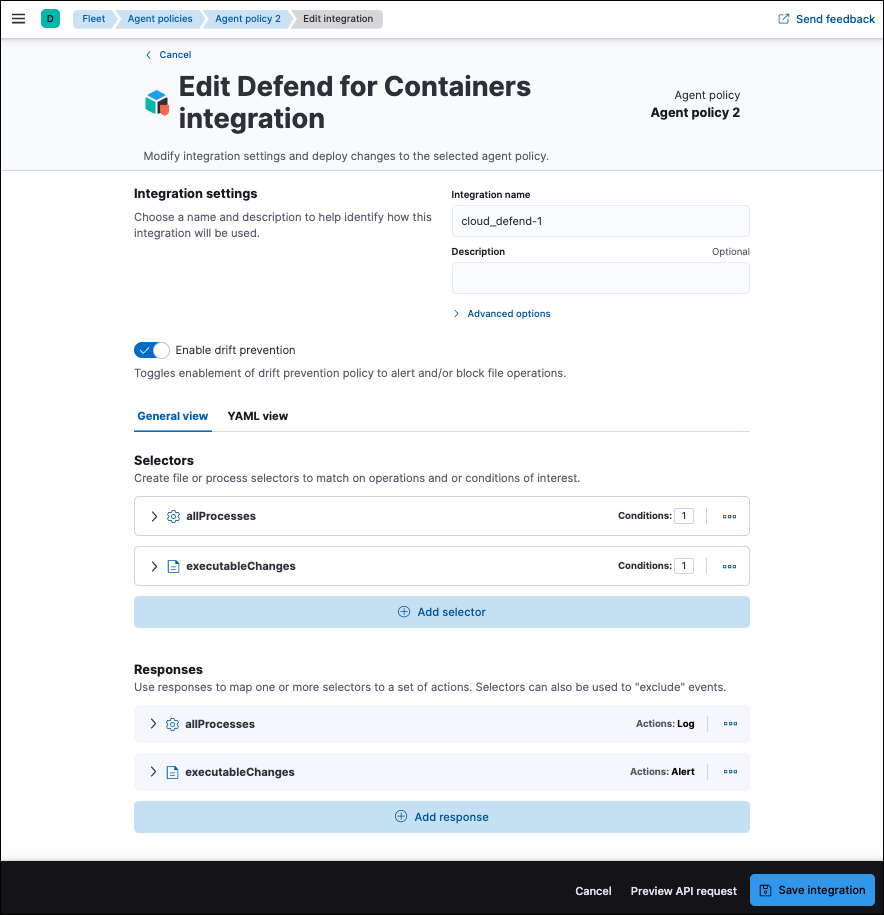

<DocBadge template="technical preview" />

To unlock the full functionality of the Defend for Containers (D4C) integration, you'll need to understand its policy syntax. This will enable you to construct policies that precisely allow expected container behaviors and prevent unexpected behaviors — thereby hardening your container workloads' security posture.

D4C integration policies consist of _selectors_ and _responses_. Each policy must contain at least one selector and one response. Currently, the system supports two types of selectors and responses: `file` and `process`.
Selectors define which system operations to match and can include multiple conditions (grouped using a logical `AND`) to precisely select events. Responses define which actions to take when a system operation matches the conditions specified in an associated selector.

The default policy described on this page provides an example that's useful for understanding D4C policies in general. Following the description, you'll find a comprehensive glossary of selector conditions, response fields, and actions.

## Default policies:
The default D4C integration policy includes two selector-response pairs. It is designed to implement core container workload protection capabilities:

- **Threat Detection:** The first selector-response pair is designed to stream process telemetry data to your ((es)) cluster so ((elastic-sec)) can evaluate it to detect threats. Both the selector and response are named `allProcesses`. The selector selects all fork and exec events. The associated response specifies that selected events should be logged.
- **Drift Detection & Prevention:** The second selector-response pair is designed to create alerts when container drift is detected. Both the selector and response are named `executableChanges`. The selector selects all `createExecutable` and `modifyExecutable` events. The associated response specifies that the selected events should create alerts, which will be sent to your ((es)) cluster. You can modify the response to block drift operations by setting it to block.

## Selectors
A selector requires a name and at least one operation. It will select all events of the specified operation types, unless you also include _conditions_ to narrow down the selection. Some conditions are available for both `file` and `process` selectors, while others only available for one type of selector.

### Common conditions
These conditions are available for both `file` and `process` selectors.

{/* [cols="1,1", options="header"] */}
| Name | Description  |
|---|---|
| containerImageFullName | A list of full container image names to match on. For example: `docker.io/nginx`. |
| containerImageName | A list of container image names to match on. For example: `nginx`. |
| containerImageTag | A list of container image tags to match on. For example: `latest`. |
| kubernetesClusterId | A list of Kubernetes cluster IDs to match on. For consistency with KSPM, the `kube-system` namespace's UID is used as a cluster ID. |
| kubernetesClusterName | A list of Kubernetes cluster names to match on. |
| kubernetesNamespace | A list of Kubernetes namespaces to match on. |
| kubernetesPodName | A list of Kubernetes pod names to match on. Trailing wildcards supported. |
| kubernetesPodLabel | A list of resource labels. Trailing wildcards supported (value only), for example: `key1:val*`. |

### File-selector conditions
These conditions are available only for `file` selectors.

{/* [cols="1,1", options="header"] */}
| Name | Description  |
|---|---|
| operation | The list of system operations to match on. Options include `createExecutable`, `modifyExecutable`, `createFile`, `modifyFile`, `deleteFile`. |
| ignoreVolumeMounts | If set, ignores file operations on _all_ volume mounts. |
| ignoreVolumeFiles | If set, ignores operations on file mounts only. For example: mounted files, `configMaps`, and secrets. |
| targetFilePath | A list of file paths to include. Paths are absolute and wildcards are supported. The `*` wildcard matches any sequence of characters within a single directory, while the `**` wildcard matches any sequence of characters across multiple directories and subdirectories. |

<DocCallOut title="Note">
In order to ensure precise targeting of file integrity monitoring operations, a `TargetFilePath` is required whenever the `deleteFile`, `modifyFile`, or `createFile` operations are used within a selector.
</DocCallOut>

### Process-selector conditions
These conditions are available only for `process` selectors.

{/* [cols="1,1", options="header"] */}
| Name | Description  |
|---|---|
| operation | The list of system operations to match on. Options include `fork` and `exec`. |
| processExecutable | A list of executables (full path included) to match on. For example: `/usr/bin/cat`. Wildcard support is same as targetFilePath above. |
| processName | A list of process names (executable basename) to match on. For example: `bash`, `vi`, `cat`. |
| sessionLeaderInteractive | If set to `true`, will only match on interactive sessions (defined as sessions with a controlling TTY). |

### Response fields
A policy can include one or more responses. Each response is comprised of the following fields:

{/* [cols="1,1", options="header"] */}
| Field | Description  |
|---|---|
| match | An array of one or more selectors of the same type (`file` or `process`). |
| exclude | Optional. An array of one or more selectors to use as exclusions to everything in `match`. |
| actions | An array of actions to perform when at least one `match` selector matches and none of the `exclude` selectors match. Options include `log`, `alert`, and `block`. |

### Response actions
D4C responses can include the following actions:

<DocTable columns={[
  {
    "title": "Action",
    "width": "50%"
  },
  {
    "title": "Description ",
    "width": "50%"
  }
]}>
  <DocRow>
    <DocCell>log</DocCell>
    <DocCell>
      Sends events to the `logs-cloud_defend.file-*` data stream for file responses, and the `logs-cloud_defend.process-*` data stream for process responses.
      
    </DocCell>
  </DocRow>
  <DocRow>
    <DocCell>alert</DocCell>
    <DocCell>
      Writes events (file or process) to the `logs-cloud_defend.alerts-*` data stream.
      
    </DocCell>
  </DocRow>
  <DocRow>
    <DocCell>block</DocCell>
    <DocCell>
      Prevents the system operation from proceeding. This blocking action happens prior to the execution of the event. It is required that the alert action be set if block is enabled.
      
      **Note:** Currently, block is only supported on file operations.
      
    </DocCell>
  </DocRow>
</DocTable>
