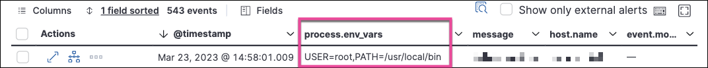

<DocBadge template="technical preview" />

You can configure an Elastic Defend policy to capture up to five environment variables (`env vars`).

<DocCallOut title="Note">

* Env var names must be no more than 63 characters, and env var values must be no more than 1023 characters. Values outside these limits are silently ignored.

* Env var names are case sensitive.

</DocCallOut>

To set up environment variable capture for an ((agent)) policy:

1. Go to **Assets → Fleet → Agent policies**.
1. Select an ((agent)) policy, then the associated Elastic Defend policy.
1. Go to the **Settings** tab, then scroll to the bottom and click **Show advanced settings**.
1. Scroll down or search for `linux.advanced.capture_env_vars`, or `mac.advanced.capture_env_vars`.
1. Enter the names of env vars you want to capture, separated by commas. For example: `PATH,USER`
1. Click **Save**.

## Find captured environment variables
Captured environment variables are associated with process events, and appear in each event's `process.env_vars` field.

To view environment variables in the **Events** table:

1. Click the **Events** tab on the **Hosts**, **Network**, or **Users** pages (**Explore**), then click **Fields** in the Events table.
1. Search for the `process.env_vars` field, select it, and click **Close**.
    A new column appears containing captured environment variable data.

