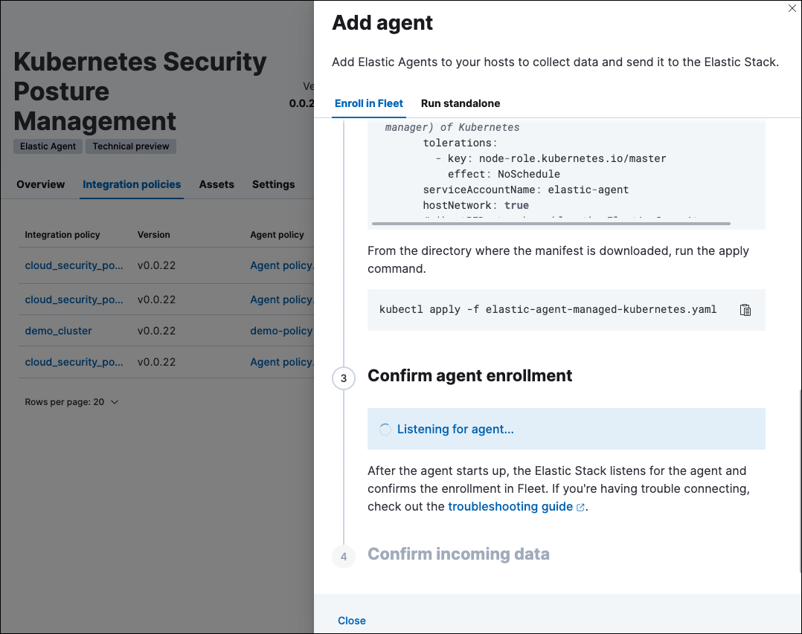

<DocBadge template="technical preview" />
<div id="get-started-with-kspm"></div>

This page explains how to configure the Kubernetes Security Posture Management (KSPM) integration.

<DocCallOut title="Requirements">
* KSPM only works in the `Default` ((kib)) space. Installing the KSPM integration on a different ((kib)) space will not work. 
* KSPM is not supported on EKS clusters in AWS GovCloud ([request support](https://github.com/elastic/kibana/issues/new/choose)).
* To view posture data, ensure you have the appropriate user role to read the following ((es)) indices:

- `logs-cloud_security_posture.findings_latest-*`
- `logs-cloud_security_posture.scores-*`
- `logs-cloud_security_posture.findings`

</DocCallOut>

The instructions differ depending on whether you're installing on EKS or on unmanaged clusters.

* Install on EKS-managed clusters:
  1. <DocLink slug="/serverless/security/get-started-with-kspm" section="set-up-kspm-for-amazon-eks-clusters">Name your integration and select a Kubernetes deployment type</DocLink>
  1. <DocLink slug="/serverless/security/get-started-with-kspm" section="authenticate-to-aws">Authenticate to AWS</DocLink>
  1. <DocLink slug="/serverless/security/get-started-with-kspm" section="finish-configuring-the-kspm-integration-for-eks">Finish configuring the KSPM integration</DocLink>
  1. <DocLink slug="/serverless/security/get-started-with-kspm" section="deploy-the-kspm-integration-to-eks-clusters">Deploy the DaemonSet to your clusters</DocLink>


* Install on unmanaged clusters:
  1. <DocLink slug="/serverless/security/get-started-with-kspm" section="set-up-kspm-for-unmanaged-kubernetes-clusters">Configure the KSPM integration</DocLink>
  1. <DocLink slug="/serverless/security/get-started-with-kspm" section="deploy-the-kspm-integration-to-unmanaged-clusters">Deploy the DaemonSet manifest to your clusters</DocLink>

<div id="kspm-setup-eks-start"></div>

## Set up KSPM for Amazon EKS clusters

### Name your integration and select a Kubernetes Deployment type

1. Go to **Dashboards → Cloud Security Posture**.
1. Click **Add a KSPM integration**.
1. Read the integration's description to understand how it works. Then, click [*Add Kubernetes Security Posture Management*](((integrations-docs))/cloud_security_posture).
1. Name your integration. Use a name that matches the purpose or team of the cluster(s) you want to monitor, for example, `IT-dev-k8s-clusters`.
1. Select **EKS** from the **Kubernetes Deployment** menu. A new section for AWS credentials will appear.

<div id="kspm-setup-eks-auth"></div>

### Authenticate to AWS

There are several options for how to provide AWS credentials:

* <DocLink slug="/serverless/security/get-started-with-kspm" section="option-1-[recommended]-use-kubernetes-service-account-to-assume-iam-role">Use Kubernetes Service Account to assume IAM role</DocLink>
* <DocLink slug="/serverless/security/get-started-with-kspm" section="option-2-use-default-instance-role">Use default instance role</DocLink>
* <DocLink slug="/serverless/security/get-started-with-kspm" section="option-3-use-access-keys-directly">Use access keys directly</DocLink>
* <DocLink slug="/serverless/security/get-started-with-kspm" section="option-4-use-temporary-security-credentials">Use temporary security credentials</DocLink>
* <DocLink slug="/serverless/security/get-started-with-kspm" section="option-5-use-a-shared-credentials-file">Use a shared credentials file</DocLink>
* <DocLink slug="/serverless/security/get-started-with-kspm" section="option-6-use-an-iam-role-amazon-resource-name-arn">Use an IAM role ARN</DocLink>

Regardless of which option you use, you'll need to grant the following permissions:

```console
ecr:GetRegistryPolicy,
eks:ListTagsForResource
elasticloadbalancing:DescribeTags
ecr-public:DescribeRegistries
ecr:DescribeRegistry
elasticloadbalancing:DescribeLoadBalancerPolicyTypes
ecr:ListImages
ecr-public:GetRepositoryPolicy
elasticloadbalancing:DescribeLoadBalancerAttributes
elasticloadbalancing:DescribeLoadBalancers
ecr-public:DescribeRepositories
eks:DescribeNodegroup
ecr:DescribeImages
elasticloadbalancing:DescribeLoadBalancerPolicies
ecr:DescribeRepositories
eks:DescribeCluster
eks:ListClusters
elasticloadbalancing:DescribeInstanceHealth
ecr:GetRepositoryPolicy
```

If you are using the AWS visual editor to create and modify your IAM Policies, you can copy and paste this IAM policy JSON object:

<DocAccordion buttonContent="Click to view JSON object">

```
{
    "Version": "2012-10-17",
    "Statement": [
        {
            "Sid": "VisualEditor0",
            "Effect": "Allow",
            "Action": [
                "ecr:GetRegistryPolicy",
                "eks:ListTagsForResource",
                "elasticloadbalancing:DescribeTags",
                "ecr-public:DescribeRegistries",
                "ecr:DescribeRegistry",
                "elasticloadbalancing:DescribeLoadBalancerPolicyTypes",
                "ecr:ListImages",
                "ecr-public:GetRepositoryPolicy",
                "elasticloadbalancing:DescribeLoadBalancerAttributes",
                "elasticloadbalancing:DescribeLoadBalancers",
                "ecr-public:DescribeRepositories",
                "eks:DescribeNodegroup",
                "ecr:DescribeImages",
                "elasticloadbalancing:DescribeLoadBalancerPolicies",
                "ecr:DescribeRepositories",
                "eks:DescribeCluster",
                "eks:ListClusters",
                "elasticloadbalancing:DescribeInstanceHealth",
                "ecr:GetRepositoryPolicy"
            ],
            "Resource": "*"
        }
    ]
}
```

</DocAccordion>

<div id="kspm-use-irsa"></div>

#### Option 1 - [Recommended] Use Kubernetes Service Account to assume IAM role

Follow AWS's [EKS Best Practices](https://aws.github.io/aws-eks-best-practices/security/docs/iam/#iam-roles-for-service-accounts-irsa) documentation to use the [IAM Role to Kubernetes Service-Account](https://docs.aws.amazon.com/eks/latest/userguide/iam-roles-for-service-accounts.html) (IRSA) feature to get temporary credentials and scoped permissions.

During setup, do not fill in any option in the "Setup Access" section. Instead click **Save and continue**.

<div id="kspm-use-instance-role"></div>

#### Option 2 - Use default instance role
Follow AWS's [IAM roles for Amazon EC2](https://docs.aws.amazon.com/AWSEC2/latest/UserGuide/iam-roles-for-amazon-ec2.html) documentation to create an IAM role using the IAM console, which automatically generates an instance profile.

During setup, do not fill in any option in the "Setup Access" section. Click **Save and continue**.

<div id="kspm-use-keys-directly"></div>

#### Option 3 - Use access keys directly
Access keys are long-term credentials for an IAM user or AWS account root user. To use access keys as credentials, you must provide the `Access key ID` and the `Secret Access Key`.

For more details, refer to AWS' [Access Keys and Secret Access Keys](https://docs.aws.amazon.com/general/latest/gr/aws-sec-cred-types.html) documentation.

<DocCallOut title="Important" color="warning">
You must select "Programmatic access" when creating the IAM user.
</DocCallOut>

<div id="kspm-use-temp-credentials"></div>

#### Option 4 - Use temporary security credentials
You can configure temporary security credentials in AWS to last for a specified duration. They consist of an access key ID, a secret access key, and a security token, which is typically found using `GetSessionToken`.

Because temporary security credentials are short term, once they expire, you will need to generate new ones and manually update the integration's configuration to continue collecting cloud posture data. Update the credentials before they expire to avoid data loss.

<DocCallOut title="Note">
IAM users with multi-factor authentication (MFA) enabled need to submit an MFA code when calling `GetSessionToken`. For more details, refer to AWS' [Temporary Security Credentials](https://docs.aws.amazon.com/IAM/latest/UserGuide/id_credentials_temp.html) documentation.
</DocCallOut>

You can use the AWS CLI to generate temporary credentials. For example, you could use the following command if you have MFA enabled:

```console
`sts get-session-token --serial-number arn:aws:iam::1234:mfa/your-email@example.com --duration-seconds 129600 --token-code 123456`
```

The output from this command includes the following fields, which you should provide when configuring the KSPM integration:

* `Access key ID`: The first part of the access key.
* `Secret Access Key`: The second part of the access key.
* `Session Token`: A token required when using temporary security credentials.

<div id="kspm-use-a-shared-credentials-file"></div>

#### Option 5 - Use a shared credentials file
If you use different AWS credentials for different tools or applications, you can use profiles to define multiple access keys in the same configuration file. For more details, refer to AWS' [Shared Credentials Files](https://docs.aws.amazon.com/sdkref/latest/guide/file-format.html) documentation.

Instead of providing the `Access key ID` and `Secret Access Key` to the integration, provide the information required to locate the access keys within the shared credentials file:

* `Credential Profile Name`: The profile name in the shared credentials file.
* `Shared Credential File`: The directory of the shared credentials file.

If you don't provide values for all configuration fields, the integration will use these defaults:

- If `Access key ID`, `Secret Access Key`, and `ARN Role` are not provided, then the integration will check for `Credential Profile Name`.
- If there is no `Credential Profile Name`, the default profile will be used.
- If `Shared Credential File` is empty, the default directory will be used.
  - For Linux or Unix, the shared credentials file is located at `~/.aws/credentials`.

<div id="kspm-use-iam-arn"></div>

#### Option 6 - Use an IAM role Amazon Resource Name (ARN)
An IAM role Amazon Resource Name (ARN) is an IAM identity that you can create in your AWS account. You define the role's permissions.
Roles do not have standard long-term credentials such as passwords or access keys.
Instead, when you assume a role, it provides temporary security credentials for your session.
An IAM role's ARN can be used to specify which AWS IAM role to use to generate temporary credentials.

For more details, refer to AWS' [AssumeRole API](https://docs.aws.amazon.com/STS/latest/APIReference/API_AssumeRole.html) documentation.
Follow AWS' instructions to [create an IAM user](https://docs.aws.amazon.com/IAM/latest/UserGuide/id_users_create.html), and define the IAM role's permissions using the JSON permissions policy above.

To use an IAM role's ARN, you need to provide either a <DocLink slug="/serverless/security/get-started-with-kspm" section="option-5-use-a-shared-credentials-file">credential profile</DocLink> or <DocLink slug="/serverless/security/get-started-with-kspm" section="option-3-use-access-keys-directly">access keys</DocLink> along with the `ARN role`.
The `ARN Role` value specifies which AWS IAM role to use for generating temporary credentials.

<DocCallOut title="Note">
If `ARN Role` is present, the integration will check if `Access key ID` and `Secret Access Key` are present.
If not, the package will check for a `Credential Profile Name`.
If a `Credential Profile Name` is not present, the default credential profile will be used.
</DocCallOut>

<div id="kspm-setup-eks-finish"></div>

### Finish configuring the KSPM integration for EKS
Once you've provided AWS credentials, finish configuring the KSPM integration:

1. If you want to monitor Kubernetes clusters that aren’t yet enrolled in ((fleet)), select **New Hosts** under “where to add this integration”.
1. Name the ((agent)) policy. Use a name that matches the purpose or team of the cluster(s) you want to monitor. For example, `IT-dev-k8s-clusters`.
1. Click **Save and continue**, then **Add agent to your hosts**. The **Add agent** wizard appears and provides a DaemonSet manifest `.yaml` file with pre-populated configuration information, such as the `Fleet ID` and `Fleet URL`.

<div id="kspm-setup-eks-modify-deploy"></div>

### Deploy the KSPM integration to EKS clusters
The **Add agent** wizard helps you deploy the KSPM integration on the Kubernetes clusters you wish to monitor. For each cluster:

1. Download the manifest and make any necessary revisions to its configuration to suit the needs of your environment.
1. Apply the manifest using the `kubectl apply -f` command. For example: `kubectl apply -f elastic-agent-managed-kubernetes.yaml`

After a few minutes, a message confirming the ((agent)) enrollment appears, followed by a message confirming that data is incoming. You can then click **View assets** to see where the newly-collected configuration information appears, including the <DocLink slug="/serverless/security/cspm-findings-page">Findings page</DocLink> and the <DocLink slug="/serverless/security/cloud-posture-dashboard-dash">Cloud Security Posture dashboard</DocLink>.

<div id="kspm-setup-unmanaged"></div>

## Set up KSPM for unmanaged Kubernetes clusters

Follow these steps to deploy the KSPM integration to unmanaged clusters. Keep in mind credentials are NOT required for unmanaged deployments.

### Configure the KSPM integration
To install the integration on unmanaged clusters:

1. Go to **Dashboards → Cloud Security Posture**.
1. Click **Add a KSPM integration**.
1. Read the integration's description to understand how it works. Then, click [*Add Kubernetes Security Posture Management*](((integrations-docs))/cloud_security_posture).
1. Name your integration. Use a name that matches the purpose or team of the cluster(s) you want to monitor, for example, `IT-dev-k8s-clusters`.
1. Select **Unmanaged Kubernetes** from the **Kubernetes Deployment** menu.
1. If you want to monitor Kubernetes clusters that aren’t yet enrolled in ((fleet)), select **New Hosts** when choosing the ((agent)) policy.
1. Select the ((agent)) policy where you want to add the integration.
1. Click **Save and continue**, then **Add agent to your hosts**. The **Add agent** wizard appears and provides a DaemonSet manifest `.yaml` file with pre-populated configuration information, such as the `Fleet ID` and `Fleet URL`.



<div id="kspm-setup-unmanaged-modify-deploy"></div>

### Deploy the KSPM integration to unmanaged clusters

The **Add agent** wizard helps you deploy the KSPM integration on the Kubernetes clusters you wish to monitor. To do this, for each cluster:

1. Download the manifest and make any necessary revisions to its configuration to suit the needs of your environment.
1. Apply the manifest using the `kubectl apply -f` command. For example: `kubectl apply -f elastic-agent-managed-kubernetes.yaml`

After a few minutes, a message confirming the ((agent)) enrollment appears, followed by a message confirming that data is incoming. You can then click **View assets** to see where the newly-collected configuration information appears, including the <DocLink slug="/serverless/security/cspm-findings-page">Findings page</DocLink> and the <DocLink slug="/serverless/security/cloud-posture-dashboard-dash">Cloud Security Posture dashboard</DocLink>.

<div id="kspm-eck"></div>

### Set up KSPM on ECK deployments
To run KSPM on an [ECK](https://www.elastic.co/guide/en/cloud-on-k8s/current/k8s-quickstart.html) deployment,
you must edit the [Elastic Agent CRD](https://www.elastic.co/guide/en/cloud-on-k8s/current/k8s-elastic-agent-configuration.html) and [Elastic Agent Cluster-Role](https://www.elastic.co/guide/en/cloud-on-k8s/current/k8s-elastic-agent-configuration.html#k8s-elastic-agent-role-based-access-control) `.yaml` files.

<DocAccordion buttonContent="Patch Elastic Agent">

Add `volumes` and `volumeMounts` to `podTemplate`:
```yaml
podTemplate:
  spec:
    containers:
    - name: agent
      volumeMounts:
      - name: proc
        mountPath: /hostfs/proc
        readOnly: true
      - name: cgroup
        mountPath: /hostfs/sys/fs/cgroup
        readOnly: true
      - name: varlibdockercontainers
        mountPath: /var/lib/docker/containers
        readOnly: true
      - name: varlog
        mountPath: /var/log
        readOnly: true
      - name: etc-full
        mountPath: /hostfs/etc
        readOnly: true
      - name: var-lib
        mountPath: /hostfs/var/lib
        readOnly: true
      - name: etc-mid
        mountPath: /etc/machine-id
        readOnly: true
    volumes:
    - name: proc
      hostPath:
        path: /proc
    - name: cgroup
      hostPath:
      path: /sys/fs/cgroup
    - name: varlibdockercontainers
      hostPath:
        path: /var/lib/docker/containers
    - name: varlog
      hostPath:
        path: /var/log
    - name: etc-full
      hostPath:
        path: /etc
    - name: var-lib
      hostPath:
        path: /var/lib
    # Mount /etc/machine-id from the host to determine host ID
    # Needed for Elastic Security integration
    - name: etc-mid
      hostPath:
        path: /etc/machine-id
        type: File
```

</DocAccordion>

<DocAccordion buttonContent="Patch RBAC">

Make sure that the `elastic-agent` service-account has the following Role and ClusterRole:
```yaml
apiVersion: rbac.authorization.k8s.io/v1
kind: RoleBinding
metadata:
  namespace: default
  name: elastic-agent
subjects:
- kind: ServiceAccount
  name: elastic-agent
  namespace: default
roleRef:
  kind: Role
  name: elastic-agent
  apiGroup: rbac.authorization.k8s.io
---
apiVersion: rbac.authorization.k8s.io/v1
kind: ClusterRole
metadata:
  name: elastic-agent
  labels:
    k8s-app: elastic-agent
rules:
- apiGroups: [""]
  resources:
  - nodes
  - namespaces
  - events
  - pods
  - services
  - configmaps
  - serviceaccounts
  - persistentvolumes
  - persistentvolumeclaims
  verbs: ["get", "list", "watch"]
- apiGroups: ["extensions"]
  resources:
  - replicasets
  verbs: ["get", "list", "watch"]
- apiGroups: ["apps"]
  resources:
  - statefulsets
  - deployments
  - replicasets
  - daemonsets
  verbs: ["get", "list", "watch"]
- apiGroups:
  - ""
  resources:
  - nodes/stats
  verbs:
  - get
- apiGroups: [ "batch" ]
  resources:
  - jobs
  - cronjobs
  verbs: [ "get", "list", "watch" ]
- nonResourceURLs:
  - "/metrics"
  verbs:
  - get
- apiGroups: ["rbac.authorization.k8s.io"]
  resources:
  - clusterrolebindings
  - clusterroles
  - rolebindings
  - roles
  verbs: ["get", "list", "watch"]
- apiGroups: ["policy"]
  resources:
  - podsecuritypolicies
  verbs: ["get", "list", "watch"]
---
apiVersion: rbac.authorization.k8s.io/v1
kind: Role
metadata:
  name: elastic-agent
  namespace: default
  labels:
    k8s-app: elastic-agent
rules:
  - apiGroups:
    - coordination.k8s.io
    resources:
    - leases
    verbs: ["get", "create", "update"]
```

</DocAccordion>
