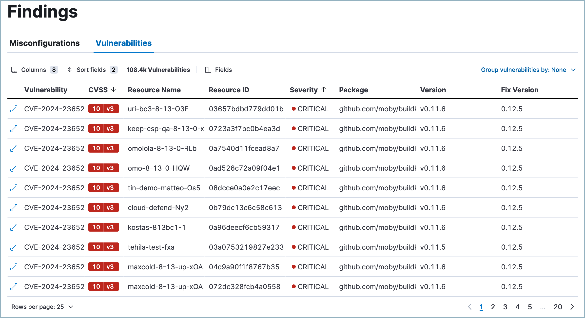

<DocBadge template="technical preview" />

The **Vulnerabilities** tab on the Findings page displays the vulnerabilities detected by the <DocLink slug="/serverless/security/vuln-management-overview">CNVM integration</DocLink>. 

## What are CNVM findings?

CNVM findings represent security vulnerabilities detected in your cloud. They include metadata such as the CVE identifier, CVSS score, severity, affected package, and fix version if available, as well as information about impacted systems.

Clicking on a finding provides a detailed description of the vulnerability, and any available remediation information.

## Group and filter findings

To help you prioritize remediation efforts, you can organize findings in various ways.

### Group findings

Click **Group vulnerabilities by** to group your data by a field. Select one of the suggested fields or **Custom field** to choose your own. You can select up to three group fields at once.

* When grouping is turned on, click a group to expand it and examine all sub-groups or findings within that group.
* To turn off grouping, click **Group vulnerabilities by:** and select **None**.

<DocCallOut title="Note">
Multiple groupings apply to your data in the order you selected them. For example, if you first select **Cloud account**, then select **Resource**, the top-level grouping will be based on **Cloud account**, and its subordinate grouping will be based on **Resource**, as demonstrated in the following screenshot.
</DocCallOut>

### Filter findings
You can filter the data in two ways:

* **KQL search bar**: For example, search for `vulnerability.severity : "HIGH"` to view high severity vulnerabilities.
* **In-table value filters**: Hover over a finding to display available inline actions. Use the **Filter In** (plus) and **Filter Out** (minus) buttons.

### Customize the Findings table
When grouping is turned off, you can use the toolbar buttons in the upper-left of the Findings table to select which columns appear:

* **Columns**: Select the left-to-right order in which columns appear.
* **Sort fields**: Sort the table by one or more columns, or turn sorting off.
* **Fields**: Select which fields to display for each finding. Selected fields appear in the table and the **Columns** menu.

<DocCallOut title="Tip">
You can also click a column's name to open a menu that allows you to perform multiple actions on the column. 
</DocCallOut>

## Learn more about a vulnerability

Click a vulnerability to open the vulnerability details flyout. This flyout includes a link to the related vulnerability database, the vulnerability's publication date, CVSS vector strings, fix versions (if available), and more.

When you open the vulnerability details flyout, it defaults to the **Overview** tab, which highlights key information. To view every field present in the vulnerability document, select the **Table** or **JSON** tabs.

## Remediate vulnerabilities

To remediate a vulnerability and reduce your attack surface, update the affected package if a fix is available.

## Generate alerts for failed Findings
You can create detection rules that detect specific vulnerabilities directly from the Findings page:

. Click a vulnerability to open the vulnerability details flyout flyout.
. Click **Take action**, then **Create a detection rule**. This automatically creates a detection rule that creates alerts when the associated vulnerability is found.
. To review or customize the new rule, click **View rule**.

