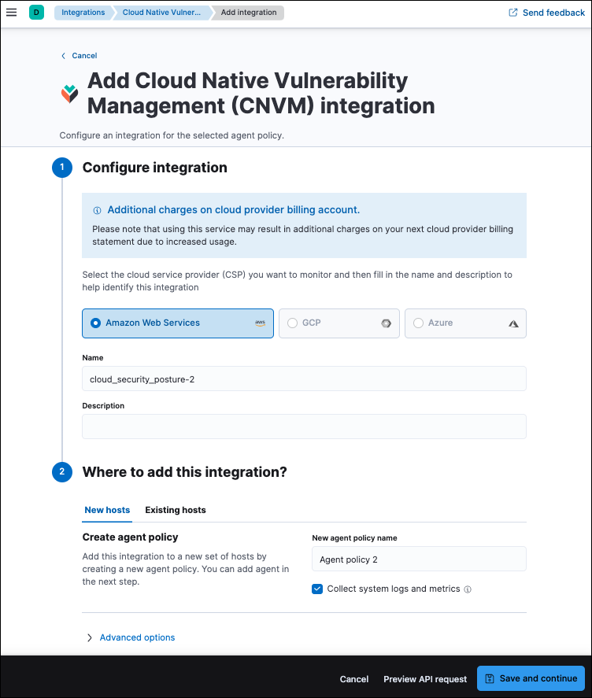

<DocBadge template="technical preview" />

This page explains how to set up Cloud Native Vulnerability Management (CNVM).

<DocCallOut title="Requirements">

* CNVM only works in the `Default` ((kib)) space. Installing the CNVM integration on a different ((kib)) space will not work. 
* Requires ((agent)) version 8.8 or higher.
* To view vulnerability scan findings, you need the appropriate user role to read the following indices:
    * `logs-cloud_security_posture.vulnerabilities-*`
    * `logs-cloud_security_posture.vulnerabilities_latest-*`
* You need an AWS user account with permissions to perform the following actions: run CloudFormation templates, create IAM Roles and InstanceProfiles, and create EC2 SecurityGroups and Instances.

</DocCallOut>

<DocCallOut title="Note">
CNVM currently only supports AWS EC2 Linux workloads.
</DocCallOut>

## Set up CNVM for AWS

To set up the CNVM integration for AWS, install the integration on a new ((agent)) policy, sign into the AWS account you want to scan, and run the [CloudFormation](https://docs.aws.amazon.com/cloudformation/index.html) template.

<DocCallOut title="Important" color="warning">
Do not add the integration to an existing ((agent)) policy. It should always be added to a new policy since it should not run on VMs with existing workloads. For more information, refer to <DocLink id="serverlessSecurityVulnManagementOverview" section="how-cnvm-works">How CNVM works</DocLink>.
</DocCallOut>

### Step 1: Add the CNVM integration

1. In the ((security-app)), go to the **Get started** page, then click **Add security integrations**.
1. Search for **Cloud Native Vulnerability Management**, then click on the result.
1. Click **Add Cloud Native Vulnerability Management**.
1. Give your integration a name that matches its purpose or the AWS account region you want to scan for vulnerabilities (for example, `uswest2-aws-account`.)

    

1. Click **Save and continue**. The integration will create a new ((agent)) policy.
1. Click **Add ((agent)) to your hosts**.

### Step 2: Sign in to the AWS management console

1. Open a new browser tab and use it to sign into your AWS management console.
1. Switch to the cloud region with the workloads that you want to scan for vulnerabilities.

<DocCallOut title="Important" color="warning">
The integration will only scan VMs in the region you select. To scan multiple regions, repeat this setup process for each region.
</DocCallOut>

### Step 3: Run the CloudFormation template

1. Switch back to the tab with Elastic Security.
1. Click **Launch CloudFormation**. The CloudFormation page appears.

    

1. Click **Create stack**.  To avoid authentication problems, you can only make configuration changes to the VM InstanceType, which you could make larger to increase scanning speed.
1. Wait for the confirmation that ((agent)) was enrolled.
1. Your data will start to appear on the **Vulnerabilities** tab of the <DocLink id="serverlessSecurityVulnManagementFindings">Findings page</DocLink>.

