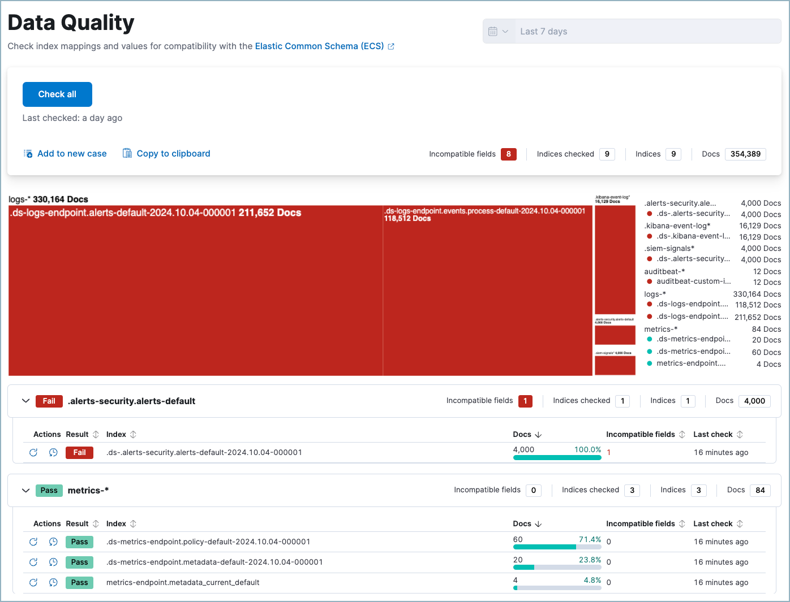
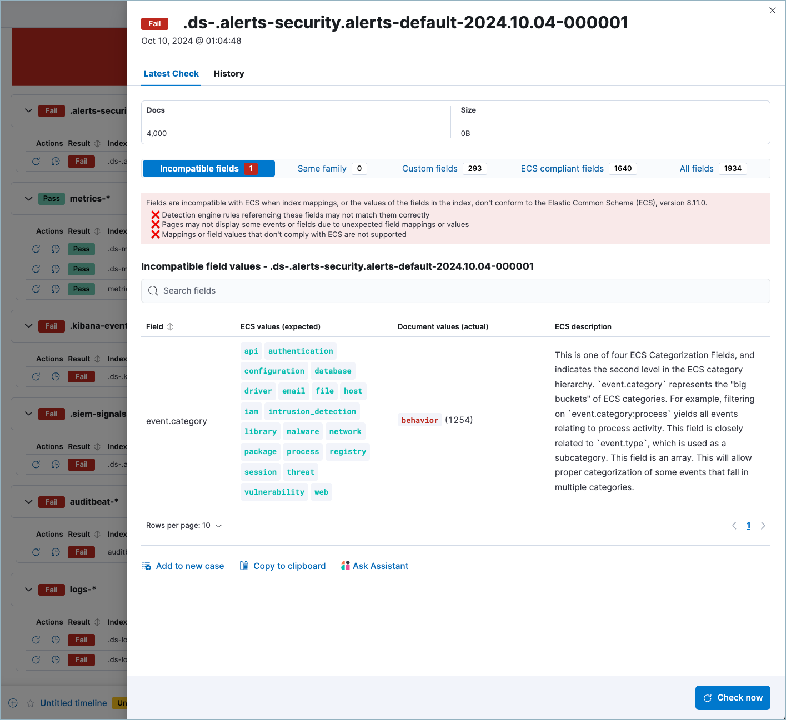

<DocBadge template="technical preview" />

The Data Quality dashboard shows you whether your data is correctly mapped to the [Elastic Common Schema](https://www.elastic.co/guide/en/ecs/current/ecs-reference.html) (ECS). Successful [mapping](((ref))/mapping.html) enables you to search, visualize, and interact with your data throughout ((elastic-sec)).

Use the Data Quality dashboard to:

* Check one or multiple indices for unsuccessful mappings, to help you identify problems (the indices used by ((elastic-sec)) appear by default).
* View the number of documents stored in each of your indices.
* View detailed information about the fields in checked indices.
* Track unsuccessful mappings by creating a case or Markdown report based on data quality results.

<DocCallOut title="Requirements">

To use the Data Quality dashboard, you need the appropriate user role with the following privileges for each index you want to check:

* `monitor` or `manage`
* `view_index_metadata` or `manage` (required for the [Get mapping API](((ref))/indices-get-mapping.html))
* `read` (required for the [Search API](((ref))/search-search.html))

</DocCallOut>

## Check indices
When you open the dashboard, data does not appear until you select indices to check.

* **Check multiple indices**: To check all indices in the current data view, click **Check all** at the top of the dashboard. A progress indicator will appear.

<DocCallOut title="Important" color="warning">
To customize which indices are checked when you click **Check all**, [change the current data view](((security-guide))/data-views-in-sec.html).
</DocCallOut>

* **Check a single index**: To check a single index, click the **Check index** button under **Actions**. Checking a single index is faster than checking all indices.

## Visualize checked indices
The treemap that appears at the top of the dashboard shows the relative document count of your indices. The color of each index's node refers to its status:

* **Blue:** Not yet checked.
* **Green:** Checked, no incompatible fields found.
* **Red:** Checked, one or more incompatible fields found.

Click a node in the treemap to expand the corresponding index.

## Learn more about checked index fields
After an index is checked, `Pass` or `Fail` appears in its **Result** column. `Fail` indicates mapping problems in an index. To view index check details, including which fields weren't successfully mapped, click the **View check details** button under **Actions**.

The index check flyout provides more information about the status of fields in that index. Each of its tabs describe fields grouped by mapping status.

<DocCallOut title="Note">
Fields in the Same family category have the correct search behavior, but might have different storage or performance characteristics (for example, you can index strings to both text and keyword fields). To learn more, refer to [Field data types](((ref))/mapping-types.html).
</DocCallOut>

## Export data quality results

You can share data quality results to help track your team's remediation efforts. First, follow the instructions under <DocLink slug="/serverless/security/data-quality-dash" section="check-indices">Check indices</DocLink> to generate results, then either:

**Export results for all indices in the current data view**:

1. At the top of the dashboard, under the **Check all** button, are two buttons that allow you to share results. Exported results include all the data which appears in the dashboard.
1. Click **Add to new case** to open a new <DocLink slug="/serverless/security/cases-overview">case</DocLink>.
1. Click **Copy to clipboard** to copy a Markdown report to your clipboard.

**Export results for one index**:

1. View details for a checked index that has at least one incompatible field by clicking the **View check details** button under **Actions**.
1. From the **Incompatible fields** tab, select **Add to new case** to open a new <DocLink slug="/serverless/security/cases-overview">case</DocLink>, or click **Copy to clipboard** to copy a Markdown report to your clipboard.

<DocCallOut title="Note">
For more information about how to fix mapping problems, refer to [Mapping](((ref))/mapping.html).
</DocCallOut>

