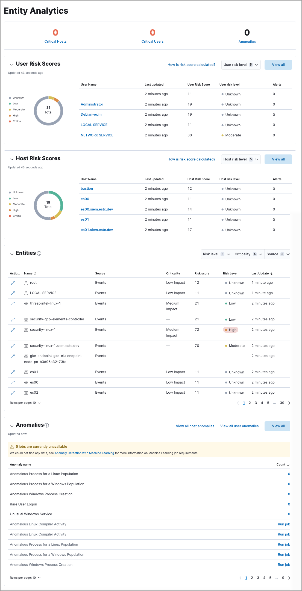
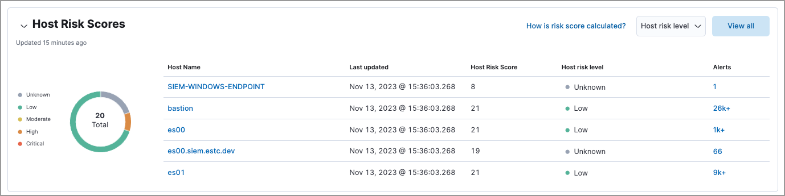
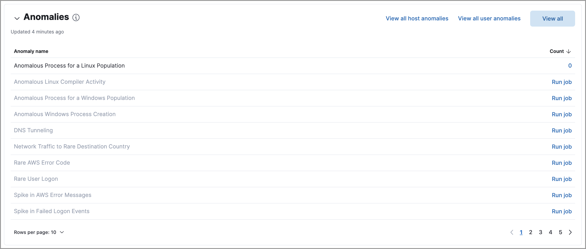

<DocBadge template="technical preview" />

The Entity Analytics dashboard provides a centralized view of emerging insider threats - including host risk, user risk, and anomalies from within your network. Use it to triage, investigate, and respond to these emerging threats.

<DocCallOut title="Requirements">

To display host and user risk scores, you must <DocLink id="serverlessSecurityTurnOnRiskEngine">turn on the risk scoring engine</DocLink>.

</DocCallOut>

The dashboard includes the following sections:

* <DocLink id="serverlessSecurityDetectionEntityDashboard" section="entity-kpis-key-performance-indicators">Entity KPIs (key performance indicators)</DocLink>
* <DocLink id="serverlessSecurityDetectionEntityDashboard" section="host-risk-scores">Host Risk Scores</DocLink>
* <DocLink id="serverlessSecurityDetectionEntityDashboard" section="user-risk-scores">User Risk Scores</DocLink>
* <DocLink id="serverlessSecurityDetectionEntityDashboard" section="anomalies">Anomalies</DocLink> 

## Entity KPIs (key performance indicators)

Displays the total number of critical hosts, critical users, and anomalies. Select a link to jump to the Host risk table, User risk table, or Anomalies table. 

## Host Risk Scores

Displays host risk score data for your environment, including the total number of hosts, and the five most recently recorded host risk scores, with their associated host names, risk data, and number of detection alerts. Host risk scores are calculated using a weighted sum on a scale of 0 (lowest) to 100 (highest). 

Interact with the table to filter data, view more details, and take action: 

* Select the **Host risk level** menu to filter the chart by the selected level. 
* Click a host name link to open the host details flyout.
* Hover over a host name link to display inline actions: **Add to timeline**, which adds the selected value to Timeline, and **Copy to Clipboard**, which copies the host name value for you to paste later. 
* Click **View all** in the upper-right to display all host risk information on the Hosts page. 
* Click the number link in the **Alerts** column to view the alerts on the Alerts page. Hover over the number and select **Investigate in timeline** (<DocIcon type="timeline" title="Timeline" />) to launch Timeline with a query that includes the associated host name value.

For more information about host risk scores, refer to <DocLink id="serverlessSecurityEntityRiskScoring">Entity risk scoring</DocLink>. 

## User Risk Scores

Displays user risk score data for your environment, including the total number of users, and the five most recently recorded user risk scores, with their associated user names, risk data, and number of detection alerts. Like host risk scores, user risk scores are calculated using a weighted sum on a scale of 0 (lowest) to 100 (highest). 

Interact with the table to filter data, view more details, and take action:

* Select the **User risk level** menu to filter the chart by the selected level. 
* Click a user name link to open the user details flyout. 
* Hover over a user name link to display inline actions: **Add to timeline**, which adds the selected value to Timeline, and **Copy to Clipboard**, which copies the user name value for you to paste later. 
* Click **View all** in the upper-right to display all user risk information on the Users page. 
* Click the number link in the **Alerts** column to view the alerts on the Alerts page. Hover over the number and select **Investigate in timeline** (<DocIcon type="timeline" title="Timeline" />) to launch Timeline with a query that includes the associated user name value.

For more information about user risk scores, refer to <DocLink id="serverlessSecurityEntityRiskScoring">Entity risk scoring</DocLink>. 

## Anomalies

Anomaly detection jobs identify suspicious or irregular behavior patterns. The Anomalies table displays the total number of anomalies identified by these prebuilt ((ml)) jobs (named in the **Anomaly name** column).

<DocCallOut title="Requirements">

To display anomaly results, you must [install and run](((ml-docs))/ml-ad-run-jobs.html) one or more [prebuilt anomaly detection jobs](((security-guide))/prebuilt-ml-jobs.html). You cannot add custom anomaly detection jobs to the Entity Analytics dashboard.

</DocCallOut>

Interact with the table to view more details:

* Click **View all host anomalies** to go to the Anomalies table on the Hosts page.
* Click **View all user anomalies** to go to the Anomalies table on the Users page.
* Click **View all** to display and manage all machine learning jobs on the Anomaly Detection Jobs page. 

<DocCallOut title="Tip">
To learn more about ((ml)), refer to [What is Elastic machine learning?](((ml-docs))/machine-learning-intro.html) 
</DocCallOut>

