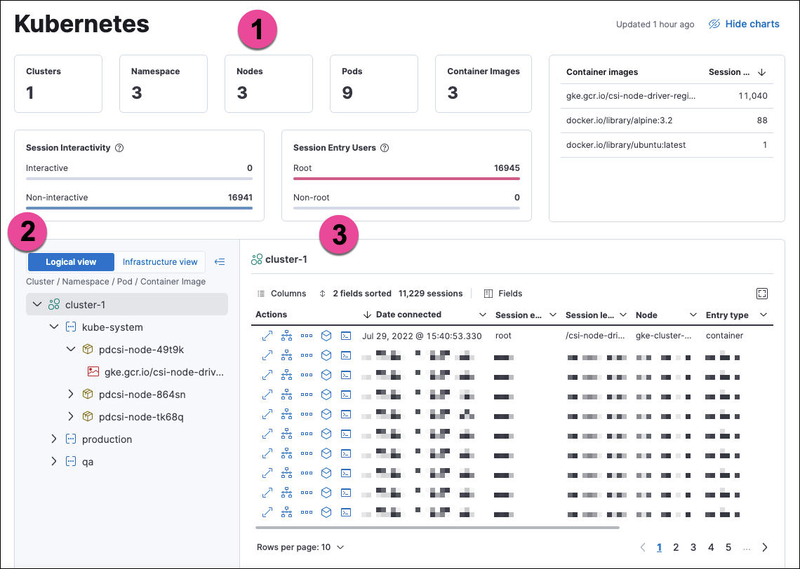

<DocBadge template="technical preview" />

The Kubernetes dashboard provides insight into Linux process data from your Kubernetes clusters. It shows sessions in detail and in the context of your monitored infrastructure.

The numbered sections are described below:

  1. The charts at the top of the dashboard provide an overview of your monitored Kubernetes infrastructure. You can hide them by clicking **Hide charts**.
  1. The tree navigation menu allows you to navigate through your deployments and select the scope of the sessions table to the right. You can select any item in the menu to show its sessions. In Logical view, the menu is organized by Cluster, Namespace, Pod, and Container image. In Infrastructure view, it is organized by Cluster, Node, Pod, and Container image.
  1. The sessions table displays sessions collected from the selected element of your Kubernetes infrastructure. You can view it in fullscreen by selecting the button in the table's upper right corner. You can sort the table by any of its fields.

You can filter the data using the KQL search bar and date picker at the top of the page.

From the sessions table's Actions column, you can take the following investigative actions:

- View details
- <DocLink id="serverlessSecurityTimelinesUi">Open in Timeline</DocLink>
- <DocLink id="serverlessSecurityAlertsRunOsquery">Run Osquery</DocLink>
- <DocLink id="serverlessSecurityVisualEventAnalyzer">Analyze event</DocLink>
- <DocLink id="serverlessSecuritySessionView">Open Session View</DocLink>

Session View displays Kubernetes metadata under the **Metadata** tab of the Detail panel:

The **Metadata** tab is organized into these expandable sections:

- **Metadata:** `hostname`, `id`, `ip`, `mac`, `name`, Host OS information
- **Cloud:** `instance.name`, `provider`, `region`, `account.id`, `project.id`
- **Container:** `id`, `name`, `image.name`, `image.tag`, `image.hash.all`
- **Orchestrator:** `resource.ip`, `resource.name`, `resource.type`, `namespace`, `cluster.id`, `cluster.name`, `parent.type`

## Setup
To get data for this dashboard, set up <DocLink id="serverlessSecurityD4cGetStarted">Cloud Workload Protection for Kubernetes</DocLink> for the clusters you want to display on the dashboard.

<DocCallOut title="Requirements">

- Kubernetes node operating systems must have Linux kernels 5.10.16 or higher.

</DocCallOut>

**Support matrix**:
This feature is currently available on GKE and EKS using Linux hosts and Kubernetes versions that match the following specifications:
|  |  |  |
|---|---|---|
| | EKS 1.24-1.26 (AL2022) | GKE 1.24-1.26 (COS) |
| Process event exports | ✓ | ✓ |
| Network event exports | ✓ | ✓ |
| File event exports | ✓ | ✓ |
| File blocking | ✓ | ✓ |
| Process blocking | ✓ | ✓ |
| Network blocking | ✗ | ✗ |
| Drift prevention | ✓ | ✓ |
| Mount point awareness | ✓ | ✓ |

<DocCallOut title="Important" color="warning">
This dashboard uses data from the `logs-*` index pattern, which is included by default in the <DocLink id="serverlessSecurityAdvancedSettings">`securitySolution:defaultIndex` advanced setting</DocLink>. To collect data from multiple ((es)) clusters (as in a cross-cluster deployment), update `logs-*` to `*:logs-*`.
</DocCallOut>