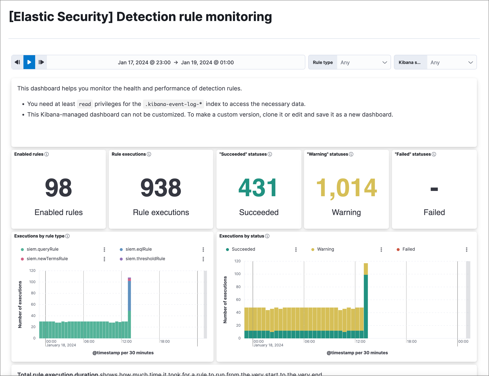

<DocBadge template="technical preview" />

The Detection rule monitoring dashboard provides visualizations to help you monitor the overall health and performance of ((elastic-sec))'s detection rules. Consult this dashboard for a high-level view of whether your rules are running successfully and how long they're taking to run, search data, and create alerts.

<DocCallOut title="Requirements">

To access this dashboard and its data, you must have the appropriate user role.

</DocCallOut>

## Visualization data and types

The dashboard presents a variety of information about your detection rules. Visualizations display and calculate data within the time range and filters selected at the top of the dashboard.

The following visualizations are included:

* **Rule KPIs (key performance indicators)**: The total number of rules enabled, how many times they collectively ran, and their response statuses.
* **Executions by rule type**: Rule executions over time, broken down by rule type.
* **Executions by status**: Rule executions over time, broken down by status.
* **Total rule execution duration**: How long rules take to run, from start to finish.
* **Rule schedule delay**: The delay between a rule's scheduled start time and when it actually starts running.
* **Search/query duration**: How long rules take to query source indices or data views.
* **Indexing duration**: How long rules take to generate alerts and write them to the `.alerts-security.alerts-*` index.
* **Top 10 rules**: Lists of the overall slowest rules, most delayed rules, and rules with the most **Failed** and **Warning** response statuses.

## Visualization panel actions

Open a panel's options menu (<DocIcon type="boxesHorizontal" title="More actions" />) customize the panel or use its data for further analysis and investigation:

* **Edit panel settings**: Customize the panel's display settings. Options vary by visualization type.
* **Inspect**: Examine the panel's underlying data and queries.
* **Explore data in Discover**: Open Discover with preloaded filters to display the panel's data.
* **Maximize panel**: Expand the panel.
* **Download as CSV**: Download the panel's data in a CSV file.
* **Copy to dashboard**: Copy the panel to an existing or new dashboard.
* **Add to existing case**: Add the panel to an existing case.
* **Add to new case**: Create a new case and add the panel to it.
* **Create anomaly detection job**: Create a ((ml)) anomaly detection job using the panel's data.

## Clone and edit the dashboard

To make persistent changes to the dashboard, you can clone the dashboard and edit the cloned copy, but your copy will not get updates from Elastic.

1. Click **Edit**, then **Save as**.
1. On the **Save dashboard** dialog, enter a new **Title** for your cloned copy.
1. Make sure **Save as new dashboard** is selected, then click **Save**. You can now make additional changes and save them to your copy.

