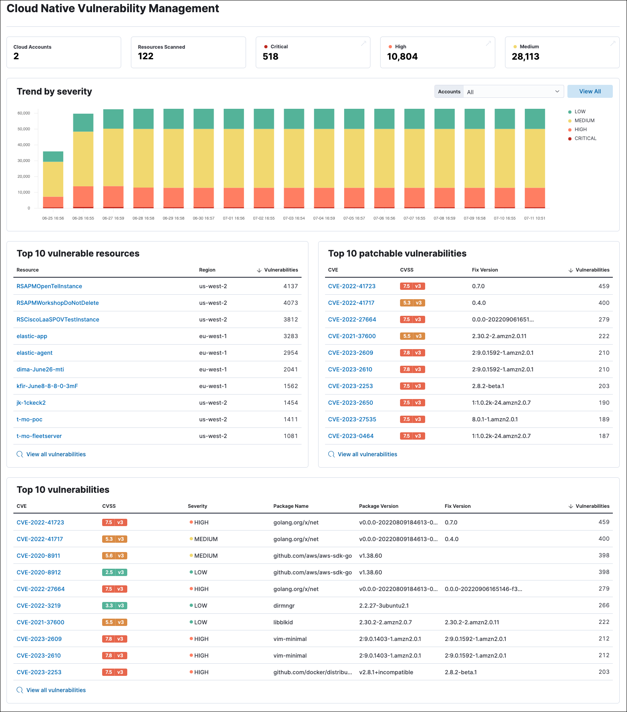

<DocBadge template="technical preview" />

The Cloud Native Vulnerability Management (CNVM) dashboard gives you an overview of vulnerabilities detected in your cloud infrastructure.

<DocCallOut title="Requirements">

* To collect this data, install the <DocLink slug="/serverless/security/vuln-management-get-started">Cloud Native Vulnerability Management</DocLink> integration.

</DocCallOut>

## CNVM dashboard UI
The summary cards at the top of the dashboard display the number of monitored cloud accounts, scanned virtual machines (VMs), and vulnerabilities (grouped by severity).

The **Trend by severity** bar graph complements the summary cards by displaying the number of vulnerabilities found on your infrastructure over time, sorted by severity. It has a maximum time scale of 30 days.

<DocCallOut title="Graph tips">

* Click the severity levels legend on its right to hide/show each severity level.
* To display data from specific cloud accounts, select the account names from the **Accounts** drop-down menu.

</DocCallOut>

The page also includes three tables:

* **Top 10 vulnerable resources** shows your VMs with the highest number of vulnerabilities.
* **Top 10 patchable vulnerabilities** shows the most common vulnerabilities in your environment that can be fixed by a software update.
* **Top 10 vulnerabilities** shows the most common vulnerabilities in your environment, with additional details.

Click **View all vulnerabilities** at the bottom of a table to open the <DocLink slug="/serverless/security/vuln-management-findings">Vulnerabilities Findings</DocLink> page, where you can view additional details.
