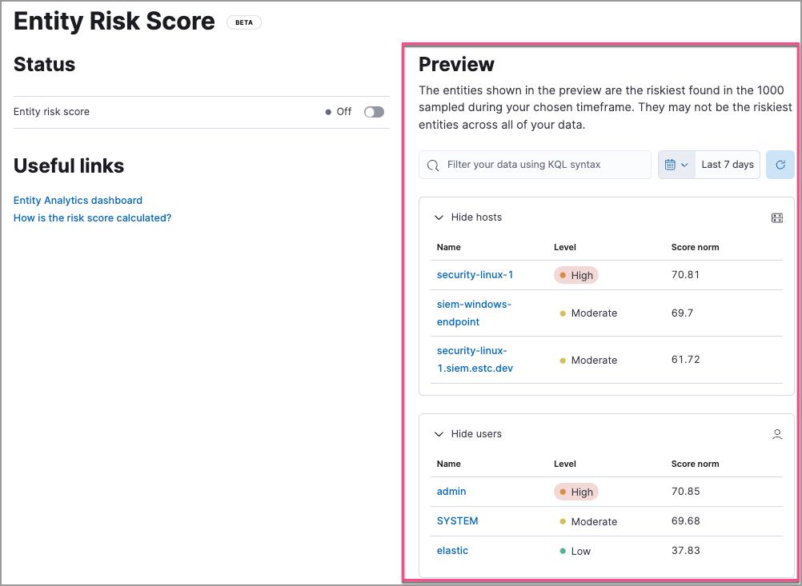

<DocBadge template="technical preview" />

<DocCallOut title="Important" color="warning">

To use entity risk scoring, you must have the appropriate user role. For more information, refer to <DocLink id="serverlessSecurityERSRequirements" />.

</DocCallOut>

The risk scoring engine runs hourly to aggregate `Open` and `Acknowledged` <DocLink id="serverlessSecurityAlertsUiManage">alerts</DocLink> from the last 30 days, and assigns risk score to the host or user. It then aggregates the individual risk scores and normalizes them to a 0-100 range. The engine assigns a risk level by mapping the normalized risk score to one of these levels:

| Risk level    | Risk score    |
| ------------- |--------------:|
| Unknown       | < 20          |
| Low           | 20-40         |
| Moderate      | 40-70         |
| High          | 70-90         |
| Critical      | > 90          |

## Preview risky entities

You can preview risky entities before installing the risk engine. The preview shows the riskiest hosts and users found in the 1000 sampled entities during the time frame selected in the date picker.

<DocCallOut title="Note">
The preview is limited to two risk scores per ((serverless-short)) ((security)) project.
</DocCallOut>

To preview risky entities, go to **Project settings** → **Management** → **Entity Risk Score**:

## Turn on the risk engine

<DocCallOut title="Note">
To view risk score data, you must have alerts generated in your environment.
</DocCallOut>

If you're installing the risk scoring engine for the first time:

1. Go to **Project settings** → **Management** → **Entity Risk Score**.
1. Turn the **Entity risk score** toggle on.

