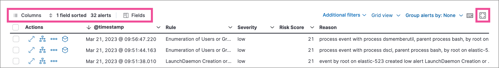
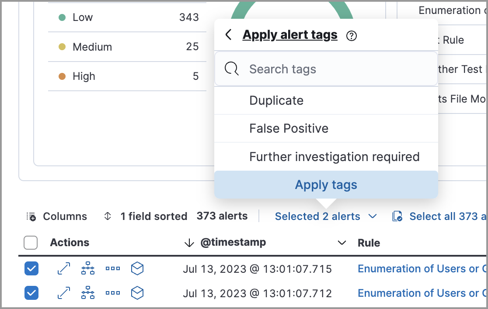

<DocBadge template="technical preview" />

The Alerts page displays all detection alerts. 

## View and filter detection alerts
The Alerts page offers various ways for you to organize and triage detection alerts as you investigate suspicious events. You can:

* View an alert's details. Click the **View details** button from the Alerts table to open the alert details flyout. Learn more at <DocLink id="serverlessSecurityViewAlertDetails">View detection alert details</DocLink>.

    <DocImage size="m" url="../images/alerts-ui-manage/-detections-view-alert-details.png" alt="View details button"/>

* View the rule that created an alert. Click a name in the **Rule** column to open the rule's details page.

* View the details of the host and user associated with the alert. In the Alerts table, click a host name to open the <DocLink id="serverlessSecurityHostsOverview" section="host-details-flyout">host details flyout</DocLink>, or a user name to open the <DocLink id="serverlessSecurityUsersPage" section="user-details-flyout">user details flyout</DocLink>.

* Filter for a specific rule in the KQL bar (for example, `kibana.alert.rule.name :"SSH (Secure Shell) from the Internet"`). KQL autocomplete is available for `.alerts-security.alerts-*` indices.

* Use the date and time filter to define a specific time range. By default, this filter is set to search the last 24 hours.

* Use the drop-down filter controls to filter alerts by up to four fields. By default, you can filter alerts by **Status**, **Severity**, **User**, and **Host**, and you can <DocLink id="serverlessSecurityAlertsUiManage" section="edit-drop-down-filter-controls">edit the controls</DocLink> to use other fields.

* Visualize and group alerts by specific fields in the visualization section. Use the buttons on the left to select a view type (**Summary**, **Trend**, **Counts**, or **Treemap**), and use the menus on the right to select the ECS fields used for grouping alerts. Refer to <DocLink id="serverlessSecurityVisualizeAlerts">Visualize detection alerts</DocLink> for more on each view type.

* Hover over a value to display available <DocLink id="serverlessSecurityEsUiOverview" section="inline-actions-for-fields-and-values">inline actions</DocLink>, such as **Filter In**, **Filter Out**, and **Add to timeline**. Click the expand icon for more options, including **Show top _x_** and **Copy to Clipboard**. The available options vary based on the type of data.

    <DocImage size="l" url="../images/alerts-ui-manage/-detections-inline-actions-menu.png" alt="Inline additional actions menu" />

* Filter alert results to include building block alerts or to only show alerts from indicator match rules by selecting the **Additional filters** drop-down. By default, <DocLink id="serverlessSecurityBuildingBlockRule">building block alerts</DocLink> are excluded from the Overview and Alerts pages. You can choose to include building block alerts on the Alerts page, which expands the number of alerts.

    

    <DocCallOut title="Note">
    When updating alert results to include building block alerts, the Security app searches the `.alerts-security.alerts-<Kibana space>` index for the `kibana.alert.building_block_type` field. When looking for alerts created from indicator match rules, the app searches the same index for `kibana.alert.rule.type:'threat_match'`.
    </DocCallOut>

* View detection alerts generated by a specific rule. Go to **Rules** → **Detection rules (SIEM)**, then select a rule name in the table. The rule details page displays a comprehensive view of the rule's settings, and the Alerts table under the Trend histogram displays the alerts associated with the rule, including alerts from any previous or deleted revision of that rule.

## Edit drop-down filter controls

By default, the drop-down controls on the Alerts page filter alerts by **Status**, **Severity**, **User**, and **Host**. You can edit them to filter by different fields, as well as remove, add, and reorder them if you prefer a different order.

<DocCallOut title="Note">

* You can have a maximum of four controls on the Alerts page.
* You can't remove the **Status** control.
* If you make any changes to the controls, you _must_ save the pending changes for them to persist.
* Saved changes are stored in your browser's local storage, not your [user profile](((ref))/user-profile.html). If you clear your browser's storage or log into your user profile from a different browser, you will lose your customizations.

</DocCallOut>

1. Click the three-dot icon next to the controls (<DocIcon type="boxesHorizontal" title="More actions" />), then select **Edit Controls**.

1. Do any of the following:

    * To reorder controls, click and drag a control by its handle (<DocIcon type="grabHorizontal" title="Reorder" />).

    * To remove a control, hover over it and select **Remove control** (<DocIcon type="cross" title="Remove" />).

    * To edit a control, hover over it and select **Edit control** (<DocIcon type="pencil" title="Edit" />).

    * To add a new control, click **Add Controls** (<DocIcon type="plusInCircle" title="Add" />). If you already have four controls, you must first remove one to make room for the new one.

1. If you're editing or adding a control, do the following in the configuration flyout that opens:

    1. In the **Field** list, select the field for the filter. The **Control type** is automatically applied to the field you selected.

    1. Enter a **Label** to identify the control.

    1. Click **Save and close**.

1. Click **Save pending changes** (<DocIcon type="save" title="Save" />).

## Group alerts

You can group alerts by rule name, user name, host name, source IP address, or any other field. Select **Group alerts by**, then select an option or **Custom field** to specify a different field.

Select up to three fields for grouping alerts. The groups will nest in the order you selected them, and the nesting order is displayed above the table next to **Group alerts by**.

Each group displays information such as the alerts' severity and how many users, hosts, and alerts are in the group. The information displayed varies depending on the selected fields.

To interact with grouped alerts:

* Select the **Take actions** menu to perform a bulk action on all alerts in a group, such as <DocLink id="serverlessSecurityAlertsUiManage" section="change-an-alerts-status">changing their status</DocLink>.

* Click a group's name or the expand icon (<DocIcon type="arrowRight" title="Next" />) to display alerts within that group. You can filter and customize this view like any other alerts table.

    

## Customize the Alerts table
Use the toolbar buttons in the upper-left of the Alerts table to customize the columns you want displayed:

* **Columns**: Reorder the columns.
* **_x_ fields sorted**: Sort the table by one or more columns.
* **Fields**: Select the fields to display in the table. You can also add <DocLink id="serverlessSecurityRuntimeFields">runtime fields</DocLink> to detection alerts and display them in the Alerts table.

Click the **Full screen** button in the upper-right to view the table in full-screen mode.

Use the view options drop-down in the upper-right of the Alerts table to control how alerts are displayed:

* **Grid view**: Displays alerts in a traditional table view with columns for each field
* **Event rendered view**: Display alerts in a descriptive event flow that includes relevant details and context about the event.

<DocCallOut title="Tip">
When using grid view, you can view alert-rendered reason statements and event renderings for specific alerts by clicking the expand icon in the **Reason** column. Some events do not have event renderings.
</DocCallOut>

## Take actions on an alert
From the Alerts table or the alert details flyout, you can:

* <DocLink id="serverlessSecuritySignalsToCases">Add detection alerts to cases</DocLink>
* <DocLink id="serverlessSecurityAlertsUiManage" section="change-an-alerts-status">Change an alert's status</DocLink>
* <DocLink id="serverlessSecurityAlertsUiManage" section="add-a-rule-exception-from-an-alert">Add a rule exception from an alert</DocLink>
* <DocLink id="serverlessSecurityAlertsUiManage" section="apply-and-filter-alert-tags">Apply and filter alert tags</DocLink>
* <DocLink id="serverlessSecurityAlertsUiManage" section="assign-users-to-alerts">Assign users to alerts</DocLink>
* <DocLink id="serverlessSecurityAlertsUiManage" section="filter-assigned-alerts">Filter assigned alerts</DocLink>
* <DocLink id="serverlessSecurityAddExceptions" section="add-((elastic-endpoint))-exceptions">Add an endpoint exception from an alert</DocLink>
* <DocLink id="serverlessSecurityHostIsolationOv">Isolate an alert's host</DocLink>
* <DocLink id="serverlessSecurityResponseActions">Perform response actions on an alert's host</DocLink> (Alert details flyout only)
* <DocLink id="serverlessSecurityAlertsRunOsquery">Run Osquery against an alert</DocLink>
* <DocLink id="serverlessSecurityAlertsUiManage" section="view-alerts-in-timeline">View alerts in Timeline</DocLink>
* <DocLink id="serverlessSecurityVisualEventAnalyzer">Visually analyze an alert's process relationships</DocLink>

### Change an alert's status

You can set an alert's status to indicate whether it needs to be investigated
(**Open**), is under active investigation (**Acknowledged**), or has been resolved
(**Closed**). By default, the Alerts page displays open alerts. To filter alerts that are **Acknowledged** or **Closed**, use the **Status** drop-down filter at the top of the Alerts page. 

To change an alert's status, do one of the following:

* In the Alerts table, click **More actions** (**...**) in the alert's row, then select a status.

* In the Alerts table, select the alerts you want to change, click **Selected _x_ alerts** at the upper-left above the table, and then select a status.

    <DocImage size="l" url="../images/alerts-ui-manage/-detections-alert-change-status.png" alt="Bulk action menu with multiple alerts selected"/>
    
* <DocBadge template="beta" />  To bulk-change the status of <DocLink id="serverlessSecurityAlertsUiManage" section="group-alerts">grouped alerts</DocLink>, select the **Take actions** menu for the group, then select a status.

* In an alert's details flyout, click **Take action** and select a status.

### Apply and filter alert tags

Use alert tags to organize related alerts into categories that you can filter and group. For example, use the `False Positive` alert tag to label a group of alerts as false positives. Then, search for them by entering the `kibana.alert.workflow_tags : "False Positive"` query into the KQL bar. Alternatively, use the Alert table's <DocLink id="serverlessSecurityAlertsUiManage" section="edit-drop-down-filter-controls">drop-down filters</DocLink> to filter for tagged alerts. 

<DocCallOut title="Note">
You can manage alert tag options by updating the `securitySolution:alertTags` advanced setting. Refer to <DocLink id="serverlessSecurityAdvancedSettings" section="manage-alert-tag-options">Manage alert tag options</DocLink> for more information. 
</DocCallOut>

<DocCallOut title="Tip">
To display alert tags in the Alerts table, click **Fields** and add the `kibana.alert.workflow_tags` field. 
</DocCallOut>

To apply or remove alert tags on individual alerts, do one of the following:

    * In the Alerts table, click **More actions** (**...**) in an alert's row, then click **Apply alert tags**. Select or unselect tags, then click **Apply tags**. 
    * In an alert’s details flyout, click **Take action → Apply alert tags**. Select or unselect tags, then click **Apply tags**. 

To apply or remove alert tags on multiple alerts, select the alerts you want to change, then click **Selected _x_ alerts** at the upper-left above the table. Click **Apply alert tags**, select or unselect tags, then click **Apply tags**. 

### Assign users to alerts  

Assign users to alerts that you want them to investigate, and manage alert assignees throughout an alert's lifecycle.  

<DocCallOut title="Requirements">
All <DocLink id="serverlessGeneralAssignUserRoles">Security roles</DocLink>, except for the Viewer role, can assign and unassign users to alerts.
</DocCallOut>

<DocCallOut title="Important">
Users are not notified when they've been assigned to, or unassigned from, alerts.  
</DocCallOut>

<DocTable columns={[
  {
    "title": "Action",
    "width": "40%"
  },
  {
    "title": "Instructions",
    "width": "60%"
  }
]}>
  <DocRow>
    <DocCell>Assign users to an alert</DocCell>
    <DocCell> 
      Choose one of the following:
      * **Alerts table** - Click **More actions** (**...**) in an alert's row, then click **Assign alert**. Select users, then click **Apply**. 

      * **Alert details flyout** - Click **Take action → Assign alert**. Alternatively, click the **Assign alert** icon (<DocIcon type="plusInCircle" title="Assign alert" />) at the top of the alert details flyout, select users, then click **Apply**. 
      
    </DocCell>
  </DocRow>

    <DocRow>
    <DocCell>Unassign all users from an alert</DocCell>
    <DocCell>
      Choose one of the following:
      * **Alerts table** - Click **More actions** (**...**) in an alert's row, then click **Unassign alert**.  
      * **Alert details flyout** - Click **Take action → Unassign alert**. 
      
    </DocCell>
  </DocRow>

    <DocRow>
    <DocCell>Assign users to multiple alerts</DocCell>
    <DocCell>
      From the Alerts table, select the alerts you want to change. Click **Selected _x_ alerts** at the upper-left above the table, then click **Assign alert**. Select users, then click **Apply**. 

      <DocCallOut title="Note">
      Users assigned to some of the selected alerts will be displayed as unassigned in the selection list. Selecting said users will assign them to all alerts they haven't been assigned to yet.
      </DocCallOut>

    </DocCell>
  </DocRow>

      <DocRow>
    <DocCell>Unassign users from multiple alerts</DocCell>
    <DocCell>
      From the Alerts table, select the alerts you want to change and click **Selected _x_ alerts** at the upper-left above the table. Click **Unassign alert** to remove users from the alert. 
    </DocCell>
  </DocRow>

</DocTable>

Show users that have been assigned to alerts by adding the **Assignees** column to the Alerts table (**Fields** → `kibana.alert.workflow_assignee_ids`). Up to four assigned users can appear in the **Assignees** column. If an alert is assigned to five or more users, a number appears instead. 

<DocImage size="xl" url="../images/alerts-ui-manage/-detections-alert-assigned-alerts.png" alt="Alert assignees in the Alerts table"/>

Assigned users are automatically displayed in the alert details flyout. Up to two assigned users can be shown in the flyout. If an alert is assigned to three or more users, a numbered badge displays instead.

<DocImage size="l" url="../images/alerts-ui-manage/-detections-alert-flyout-assignees.png" alt="Alert assignees in the alert details flyout"/>

### Filter assigned alerts  

Click the **Assignees** filter above the Alerts table, then select the users you want to filter by. 

<DocImage size="xl" url="../images/alerts-ui-manage/-detections-alert-filter-assigned-alerts.png" alt="Filtering assigned alerts"/>

### Add a rule exception from an alert

You can add exceptions to the rule that generated an alert directly from the
Alerts table. Exceptions prevent a rule from generating alerts even when its
criteria are met.

To add an exception, click the **More actions** menu (**...**) in the Alerts table, then select
**Add exception**. Alternatively, select **Take action** → **Add rule exception** in the alert details flyout.

For information about exceptions and how to use them, refer to
<DocLink id="serverlessSecurityAddExceptions">Add and manage exceptions</DocLink>.

### View alerts in Timeline

* To view a single alert in Timeline, click the **Investigate in timeline** button in the Alerts table. Alternatively, select **Take action** → **Investigate in timeline** in the alert details flyout.

    <DocImage size="m" url="../images/alerts-ui-manage/-detections-timeline-button.png" alt="Investigate in timeline button"/>
    
* To view multiple alerts in Timeline (up to 2,000), select the checkboxes next to the alerts, then click **Selected _x_ alerts** → **Investigate in timeline**.

    <DocImage size="m" url="../images/alerts-ui-manage/-detections-bulk-add-alerts-to-timeline.png" alt="Bulk add alerts to timeline button" />

<DocCallOut title="Tip">
When you send an alert generated by a
<DocLink id="serverlessSecurityRulesUiCreate">threshold rule</DocLink> to Timeline, all matching events are
listed in the Timeline, even ones that did not reach the threshold value. For
example, if you have an alert generated by a threshold rule that detects 10
failed login attempts, when you send that alert to Timeline, all failed login
attempts detected by the rule are listed.
</DocCallOut>

Suppose the rule that generated the alert uses a Timeline template. In this case, when you investigate the alert in Timeline, the dropzone query values defined in the template are replaced with their corresponding alert values.

**Example**

This Timeline template uses the `host.name: "{host.name}"` dropzone filter in
the rule. When alerts generated by the rule are investigated in Timeline, the
`{host.name}` value is replaced with the alert's `host.name` value. If the
alerts's `host.name` value is `Windows-ArsenalFC`, the Timeline dropzone query
is `host.name: "Windows-ArsenalFC"`.

<DocCallOut title="Note">
Refer to <DocLink id="serverlessSecurityTimelinesUi">Investigate events in Timeline</DocLink> for information on creating Timelines and Timeline
templates. For information on how to add Timeline templates to rules, refer to <DocLink id="serverlessSecurityRulesUiCreate" text="" />.
</DocCallOut>

