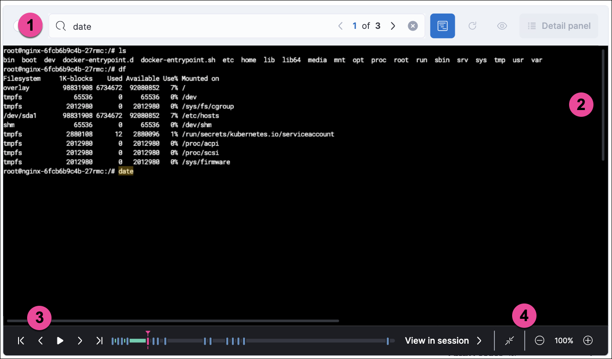

<DocBadge template="technical preview" />

Session View is an investigation tool that allows you to examine Linux process data organized
in a tree-like structure according to the Linux logical event model, with processes organized by parentage and time of execution.
It displays events in a highly readable format that is inspired by the terminal. This makes it a powerful tool for monitoring
and investigating session activity on your Linux infrastructure and understanding user and service behavior.

**Session View displays**:
* **Interactive and non-interactive processes:** Processes and services with or without a controlling terminal.
* **User information:** The Linux user that executed each session or process, and any exec user changes.
* **Process and event telemetry:** Process information included in the Linux logical event model.
* **Nested sessions:** Sessions started by processes descended from the entry session.
* **Alerts:** Process, file, and network alerts in the context of the events which caused them.
* **Terminal output:** Terminal output associated with each process in the session.

<DocCallOut title="Note">
To view Linux session data from your Kubernetes infrastructure, you'll need to set up the <DocLink id="serverlessSecurityKubernetesDashboardDash">Kubernetes dashboard</DocLink>.
</DocCallOut>

## Enable Session View data
Session View uses process data collected by the ((elastic-defend)) integration,
but this data is not always collected by default. To confirm that Session View data is enabled:

1. Go to **Assets** → **Policies**, select a policy and then edit one or more of your ((elastic-defend)) integration policies.
1. Select the **Settings** tab, then scroll down to the Linux event collection section near the bottom.
1. Check the box for **Process** events, and turn on the **Include session data** toggle.
1. If you want to include file and network alerts in Session View, check the boxes for **Network** and **File** events.
1. If you want to enable terminal output capture, turn on the **Capture terminal output** toggle.

Session View can only display data that was collected by ((elastic-defend)) when **Include session data** was enabled. When this setting is enabled, ((elastic-defend)) includes additional process context data in captured process, file, and network events. For more information about the additional
fields collected when this setting is enabled, refer to the [Linux event model RFC](https://github.com/elastic/ecs/blob/main/rfcs/text/0030-linux-event-model.md).

## Open Session View
Session View is accessible from the **Hosts**, **Alerts**, and **Timelines** pages, as well as the **Kubernetes** dashboard.
Events and sessions that you can investigate in Session View have a rectangular
**Open Session View** button in the **Actions** column. For example:

* On the Alerts page, scroll down to view the Alerts table.
    Look for alerts that have the **Open Session View** button in the **Actions** column:

<DocImage size="xl" url="../images/session-view/-detections-session-view-action-icon-detail.png" alt="Detail of the Open Session View button" />

* On the Hosts page (**Explore** → **Hosts**), select the **Sessions** or the **Events** tab.
    From either of these tabs, click the **Open Session View** button for an event or session.

## Session View UI
The Session View UI has the following features:

<DocImage size="xl" url="../images/session-view/-detections-session-view-terminal-labeled.png" alt="Detail of Session view with labeled UI elements" />

1. The **Close Session** and **Full screen** buttons.
1. The search bar. Use it to find and highlight search terms within the current session.
    The left and right arrows allow you to navigate through search results.

1. The **display settings** button. Click to toggle Timestamps and Verbose mode.
    With Verbose mode enabled, Session View shows all processes created in a session, including shell startup,
    shell completion, and forks caused by built-in commands.
    It defaults to **off** to highlight the data most likely to be user-generated and non-standard.

1. The **Detail panel** button. Click it to toggle the Detail panel, which appears below the button
    and displays a wide range of additional information about the selected process’s ancestry and host,
    and any associated alerts. To select a process in Session View, click on it.

1. The startup process. In this example, it shows that the session was a bash session.
    It also shows the Linux user "Ubuntu" started the session.

1. The **Child processes** button. Click to expand or collapse a process’s children.
    You can also expand collapsed alerts and scripts where they appear.
    Collapsed processes will automatically expand when their contents match a search.

1. The **Alerts** button. Click to show alerts caused by the parent process. In this example, the `(2)` indicates that there are two alerts. Note the red line to the left of the event that caused the alert. Both alerts caused by this event are `process` alerts, as indicated by the gear icon.
1. The **Terminal output** button. Hover to see how much output data has been captured from the session. Click to open the terminal output view, which is described in detail below.
1. The **Refresh session** button. Click to check for any new data from the current session.

Session View includes additional badges not pictured above:
{/* 
//* The **Script** button allows you to expand or collapse executed scripts: */}
{/* 
//[role="screenshot"] */}
{/* <DocImage flatImage alt="The Script button" url="../images/session-view/-detections-session-view-script-button.png" /> */}

* The alert badge for multiple alerts appears when a single event causes alerts of multiple types (<DocIcon type="gear" title="Settings" /> for `process` alerts, <DocIcon type="document" title="Document" /> for `file` alerts, and <DocIcon type="globe" title="Network" /> for `network` alerts):

    <DocImage size="m" url="../images/session-view/-cloud-native-security-session-view-alert-types-badge.png" alt="The alert badge for a command with all three alert types" />

* The **Exec user change** badge highlights exec user changes, such as when a user escalates to root:

    <DocImage size="xl" url="../images/session-view/-detections-session-view-exec-user-change-badge.png" alt="The Exec user change badge" />

* The **Output** badge appears next to commands that generated terminal output. Click it to view that command's output in terminal output view.

    <DocImage size="xl" url="../images/session-view/-detections-session-view-output-badge.png" alt="The Output badge" />

## Terminal output view UI

<DocCallOut title="Requirements">

* Session output can only be collected from Linux OSes with eBPF-enabled kernels versions 5.10.16 or higher.

</DocCallOut>

In general, terminal output is the text that appears in interactive Linux shell sessions. This generally includes user-entered text (terminal input), which appears as output to facilitate editing commands, as well as the text output of executed programs. In certain cases such as password entry, terminal input is not captured as output.

From a security perspective, terminal output is important because it offers a means of exfiltrating data. For example, a command like `cat tls-private-key.pem` could output a web server's private key. Thus, terminal output view can improve your understanding of commands executed by users or adversaries, and assist with auditing and compliance.

To enable terminal output data capture:

1. Go to **Assets** → **Policies**, select a policy and then edit one or more of your ((elastic-defend)) integration policies.
1. On the **Settings** tab, scroll down to the Linux event collection section near the bottom of the page
    and select the **Include session data** and **Capture terminal output** options.

You can configure several additional settings by clicking **Advanced settings** at the bottom of the page:

* `linux.advanced.tty_io.max_kilobytes_per_process`: The maximum number of kilobytes of output to record from a single process. Default: 512 KB. Process output exceeding this value will not be recorded.
* `linux.advanced.tty_io.max_kilobytes_per_event`: The maximum number of kilobytes of output to send to ((es)) as a single event. Default: 512 KB. Additional data is captured as a new event.
* `linux.advanced.tty_io.max_event_interval_seconds`: The maximum interval (in seconds) during which output is batched. Default: 30 seconds. Output will be sent to ((es)) at this interval (unless it first exceeds the `max_kilobytes_per_event` value, in which case it might be sent sooner).

1. Search bar. Use to find and highlight search terms within the current session.
    The left and right arrows allow you to navigate through search results.

1. Right-side scroll bar. Use along with the bottom scroll bar to navigate output data that doesn't fit on a single screen.
1. Playback controls and progress bar. Use to advance or rewind the session's commands and output. Click anywhere on the progress bar to jump to that part of the session. The marks on the bar represent processes that generated output. Click them or the **Prev** and **Next** buttons to skip between processes.
1. **Fit screen**, **Zoom in**, and **Zoom out** buttons. Use to adjust the text size.

<DocCallOut title="Tip">
Use Session view's **Fullscreen** button (located next to the **Close session viewer** button) to better fit output with long lines, such as for graphical programs like `vim`.
</DocCallOut>

### Terminal output limitations for search and alerting
You should understand several current limitations before building rules based on terminal output data:

* Terminal output that appears in the `process.io.text` field includes [ANSI codes](https://gist.github.com/fnky/458719343aabd01cfb17a3a4f7296797) that represent, among other things, text color, text weight, and escape sequences. This can prevent EKS queries from matching as expected. Queries of this data will have more success matching single words than more complex strings.
* Queries of this data should include leading and trailing wildcards (for example `process where process.io.text : "*sudo*"`), since output events typically include multiple lines of output.
* The search functionality built into terminal output view is subject to similar limitations. For example, if a user accidentally entered `sdo` instead of `sudo`, then pressed backspace twice to fix the typo, the recorded output would be `sdo\b\budo`. This would appear in the terminal output view as `sudo`, but searching terminal output view for `sudo` would not result in a match.
* Output that seems like it should be continuous may be split into multiple events due to the advanced settings described above, which may prevent a query or search from matching as expected.
* Rules based on output data will identify which output event's `process.io.text` value matched the alert query, without identifying which specific part of that value matched. For example, the rule query `process.io.text: "*test*"` could match a large, multi-line log file due to a single instance of `test`, without identifying where in the file the instance occurred.

