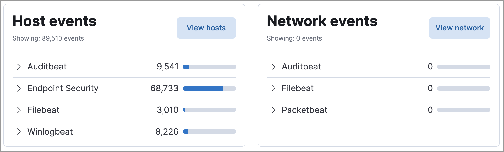

<DocBadge template="technical preview" />

The Overview dashboard provides a high-level snapshot of alerts and events. It helps you assess overall system health and find anomalies that may require further investigation.

## Live feed

The live feed on the Overview dashboard helps you quickly access recently created cases, favorited Timelines, and the latest ((elastic-sec)) news.

<DocCallOut title="Tip">
The **Security news** section provides the latest ((elastic-sec)) news to help you stay informed of new developments, learn about ((elastic-sec)) features, and more.
</DocCallOut>

## Histograms

Time-based histograms show the number of detections, alerts, and events that have occurred within the selected time range. To focus on a particular time, click and drag to select a time range, or choose a preset value. The **Stack by** menu lets you select which field is used to organize the data. For example, in the Alert trend histogram, stack by `kibana.alert.rule.name` to display alert counts by rule name within the specified time frame.

Hover over histograms, graphs, and tables to display an **Inspect** button (<DocIcon type="inspect" title="Inspect" />) or options menu (<DocIcon type="boxesHorizontal" title="More actions" />). Click to inspect the visualization's ((es)) queries, add it to a new or existing case, or open it in Lens for customization.

## Host and network events

View event and host counts grouped by data source, such as **Auditbeat** or **((elastic-defend))**. Expand a category to view specific counts of host or network events from the selected source.

## Threat Intelligence

The Threat Intelligence view on the Overview dashboard provides streamlined threat intelligence data for threat detection and matching.

The view shows the total number of ingested threat indicators, enabled threat intelligence sources, and ingested threat indicators per source. To learn more about the ingested indicator data, click **View indicators**.

<DocCallOut title="Note">
For more information about connecting to threat intelligence sources, visit <DocLink id="serverlessSecurityThreatIntelligence">Enable threat intelligence integrations</DocLink>.
</DocCallOut>

<DocImage size="l" url="../images/overview-dashboard/-getting-started-threat-intelligence-view.png" alt="Threat Intelligence view on the Overview dashboard" />
