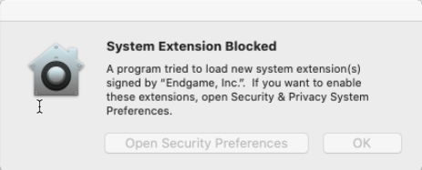
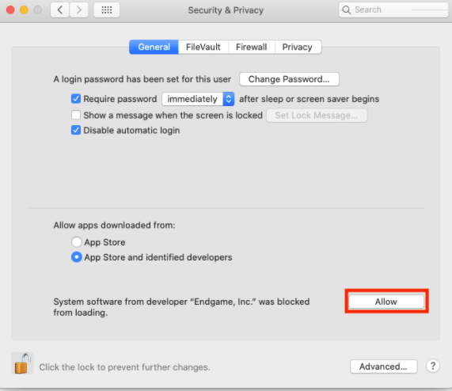
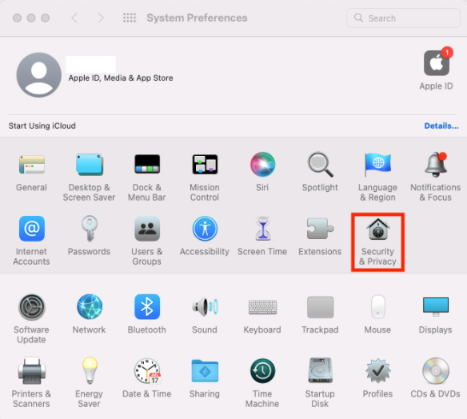
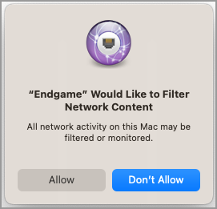
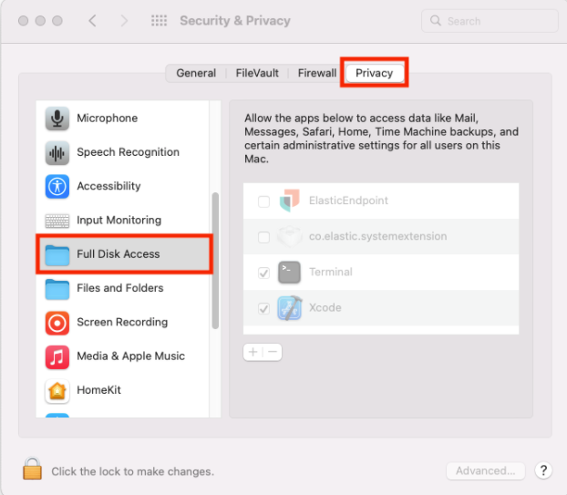

<DocBadge template="technical preview" />

On macOS, Elastic Endgame requires Full Disk Access to protect you from malware and other cybersecurity threats. Full Disk Access permission is a privacy feature that controls which applications can access your data. This means you need to manually enable Full Disk Access permission for the Elastic Endgame sensor to access these protected areas of your Mac.

## macOS permissions

The behavior of the Elastic Endgame sensor differs based on your macOS version. MDM/Jamf users can pre-approve all Full Disk Access without granting permission to the sensor. However, depending on the macOS version and sensor type, non-MDM/Jamf users may be prompted to enable Full Disk Access for required security files.

Here are the following Full Disk Access requirements for specific versions of macOS:

- `10.15`: You cannot install the sensor without allowing it to load a <DocLink id="serverlessSecurityEndgameSensorFullDiskAccess" section="approve-the-kernel-extension-for-the-elastic-endgame-sensor">kernel extension</DocLink>. During installation, you'll be prompted to go to System Preferences and approve it. Upon approval, installation proceeds.

- `11.0`, `12.0`: You cannot install the sensor without allowing it to load a <DocLink id="serverlessSecurityEndgameSensorFullDiskAccess" section="approve-the-system-extension-for-the-elastic-endgame-sensor">system extension</DocLink>. During installation, you'll be prompted to go to System Preferences and approve it. Upon approval, a second prompt appears to enable Network Filtering. Approve this final prompt to proceed.

You must also grant Full Disk Access to `com.endgame.systemextension`.

- `10.15, 11.0, 12.0`: Grant the <DocLink id="serverlessSecurityEndgameSensorFullDiskAccess" section="enable-full-disk-access-for-the-elastic-endgame-sensor">esensor file</DocLink> Full Disk Access.

<DocCallOut title="Note">
The following instructions apply to the Elastic Endgame sensor only. To see requirements for the ((elastic-endpoint)), refer to <DocLink id="serverlessSecurityElasticEndpointDeployReqs">((elastic-endpoint)) requirements</DocLink>.
</DocCallOut>

## Approve the kernel extension for the Elastic Endgame sensor

For endpoints running macOS Catalina (10.15), the Elastic Endgame sensor will attempt to load a kernel extension (as opposed to a system extension) during installation. This kernel extension is required to provide insight into system events such as process events, file system events, and network events. The following prompt appears during installation:

To approve the extension:

1. Click **Open Security Preferences**.
1. In the lower-left corner of the pane, click the **Lock button**, then enter your credentials to authenticate.
1. Click **Allow** to load the kernel extension.

    

If the prompt does not appear, enable the extension by doing the following:

1. Open a Terminal application.
1. Enter `kextload /Library/Extension/kendpoint.kext`. Prepend the command with `sudo` if necessary. You will receive an output that's similar to the one below:

    `149    0 0xffffff7f82e7b000 0x21000    0x21000    co.elastic.kendpoint (7.11.0) BD152A57-ABD3-370A-BBE8-D15A0FCBD19A <6 5 2 1>`

    If you receive this output, the kernel extension is enabled.

## Approve the system extension for the Elastic Endgame sensor

To fully protect endpoints from malware and other cybersecurity threats when using Elastic Endgame with system extensions, you must enable the system extension during installation on macOS Big Sur (11.0) and later.

When you receive the prompt to approve loading the system extension:

1. Open the **System Preferences** application.
1. Select **Security and Privacy**.

    

1. Click **Allow** to allow the Elastic Endgame system extension to load.

    

1. Enter your username and password and click **Modify Settings** to save your changes. 

## Approve network content filtering for Elastic Endgame

<DocCallOut title="Note">
The following instructions apply only if you're on macOS BigSur (11.0) or later.
</DocCallOut>

After successfully loading the Elastic Endgame system extension, an additional message appears, asking to allow Elastic Endgame to filter network content.

Click **Allow** to enable content filtering for the Elastic Endgame system extension. Without this approval, Elastic Endgame cannot receive network events and, therefore, cannot enable network-related features such as <DocLink id="serverlessSecurityHostIsolationOv">host isolation</DocLink>.

## Enable Full Disk Access for the Elastic Endgame sensor

For the Elastic Endgame sensor to detect events from a macOS host, you must enable Full Disk Access for the `esensor` file, which appears once you've downloaded the sensor on your host.

1. Open the **System Preferences** application.
1. Click **Security and Privacy**.
1. On the **Security and Privacy** pane, select the **Privacy** tab.
1. From the left pane, select **Full Disk Access**.

    

1. In the lower-left corner of the pane, click the **Lock button**, then enter your credentials to authenticate. 
1. Click the *+* button to view **Finder**.
1. Navigate to `/Library/Endgame`, then select the `esensor` file.
1. Click **Open**.
1. In the **Privacy** tab, confirm that the `com.endgame.systemextension` or `esensor` file appears in the list of applications with Full Disk Access permission.

The Elastic Endgame sensor now has the access required to fully protect your system.
