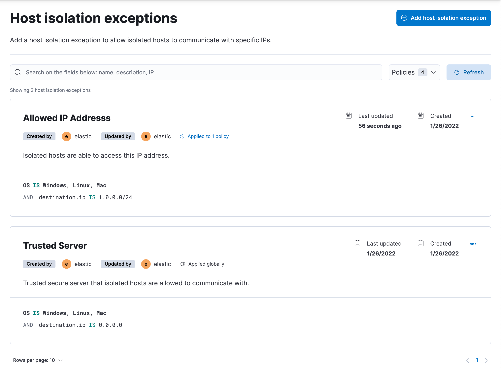

<DocBadge template="technical preview" />

You can configure host isolation exceptions (**Assets** → **Host isolation exceptions**) for specific IP addresses that <DocLink id="serverlessSecurityHostIsolationOv">isolated hosts</DocLink> are still allowed to communicate with, even when blocked from the rest of your network. Isolated hosts can still send data to ((elastic-sec)), so you don't need to set up host isolation exceptions for them.

Host isolation exceptions support IPv4 addresses, with optional classless inter-domain routing (CIDR) notation.

<DocCallOut title="Requirements">

You must have the appropriate user role to use this feature.
{/* Placeholder statement until we know which specific roles are required. Classic statement below for reference. */}
{/* You must have the **Host Isolation Exceptions** <DocLink id="serverlessSecurityEndpointManagementReq">privilege</DocLink> to access this feature. */}

</DocCallOut>

<DocCallOut title="Important" color="warning">
Each host isolation exception IP address should be a highly trusted and secure location since you're allowing it to communicate with hosts that have been isolated to prevent a potential threat from spreading.
</DocCallOut>

Host isolation requires the Endpoint Protection Complete <DocLink id="serverlessGeneralManageProject" text="project feature"/>. By default, a host isolation exception is recognized globally across all hosts running ((elastic-defend)). You can also assign a host isolation exception to a specific ((elastic-defend)) integration policy, affecting only the hosts assigned to that policy.

1. Go to **Assets** → **Host isolation exceptions**.
1. Click **Add Host isolation exception**.
1. Fill in these fields in the **Add Host isolation exception** flyout:
    1. `Name your host isolation exceptions`: Enter a name to identify the host isolation exception.
    1. `Description`: Enter a description to provide more information on the host isolation exception (optional).
    1. `Enter IP Address`: Enter the IP address for which you want to allow communication with an isolated host. This must be an IPv4 address, with optional CIDR notation (for example, `0.0.0.0` or `1.0.0.0/24`, respectively).
1. Select an option in the **Assignment** section to assign the host isolation exception to a specific integration policy:

    * `Global`: Assign the host isolation exception to all integration policies for ((elastic-defend)).
    * `Per Policy`: Assign the host isolation exception to one or more specific ((elastic-defend)) integration policies. Select each policy where you want the host isolation exception to apply.
    <DocCallOut title="Note">
    You can also select the `Per Policy` option without immediately assigning a policy to the host isolation exception. For example, you could do this to create and review your host isolation exception configurations before putting them into action with a policy.
    </DocCallOut>
1. Click **Add Host isolation exception**. The new exception is added to the **Host isolation exceptions** list.

## View and manage host isolation exceptions

The **Host isolation exceptions** page displays all the host isolation exceptions that have been configured for ((elastic-sec)). To refine the list, use the search bar to search by name, description, or IP address.

### Edit a host isolation exception
You can individually modify each host isolation exception and change the policies that a host isolation exception is assigned to.

To edit a host isolation exception:

1. Click the actions menu (<DocIcon type="boxesHorizontal" title="Actions menu icon" />) for the exception you want to edit, then select **Edit Exception**.
1. Modify details as needed.
1. Click **Save**. The newly modified exception appears at the top of the list.

### Delete a host isolation exception
You can delete a host isolation exception, which removes it entirely from all ((elastic-defend)) integration policies.

To delete a host isolation exception:

1. Click the actions menu (<DocIcon type="boxesHorizontal" title="Actions menu icon" />) on the exception you want to delete, then select **Delete Exception**.
1. On the dialog that opens, verify that you are removing the correct host isolation exception, then click **Delete**. A confirmation message is displayed.

