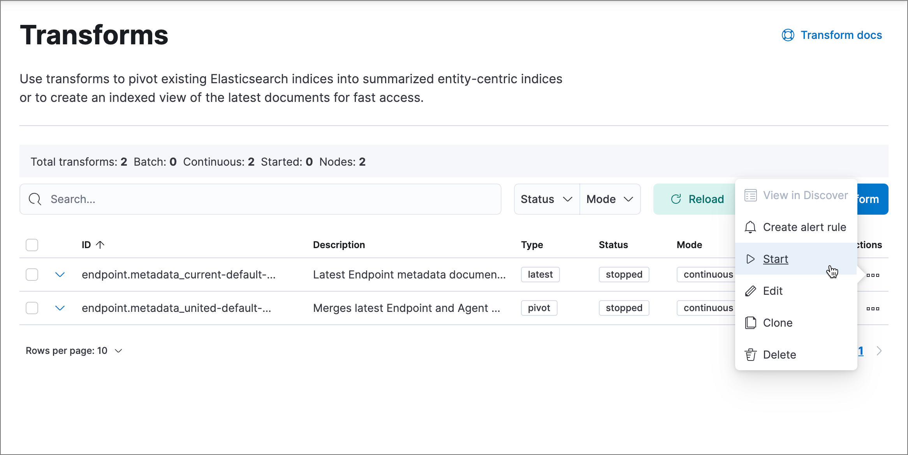

<DocBadge template="technical preview" />

This topic covers common troubleshooting issues when using ((elastic-sec)) <DocLink id="serverlessSecurityManageEndpointProtection">endpoint management tools</DocLink>.

## Endpoints

<DocAccordion id="ts-unhealthy-agent" buttonContent="Unhealthy ((agent)) status">

In some cases, an `Unhealthy` ((agent)) status may be caused by a failure in the ((elastic-defend)) integration policy. In this situation, the integration and any failing features are flagged on the agent details page in ((fleet)). Expand each section and subsection to display individual responses from the agent.

<DocCallOut title="Tip">
Integration policy response information is also available from the **Endpoints** page in the ((security-app)) (**Assets** → **Endpoints**, then click the link in the **Policy status** column).
</DocCallOut>

Common causes of failure in the ((elastic-defend)) integration policy include missing prerequisites or unexpected system configuration. Consult the following topics to resolve a specific error:

- <DocLink id="serverlessSecurityDeployElasticEndpoint" section="approve-the-system-extension-for-((elastic-endpoint))">Approve the system extension for ((elastic-endpoint))</DocLink> (macOS)
- <DocLink id="serverlessSecurityDeployElasticEndpoint" section="enable-full-disk-access-for-((elastic-endpoint))">Enable Full Disk Access for ((elastic-endpoint))</DocLink> (macOS)
- <DocLink id="serverlessSecurityTroubleshootEndpoints" section="linux-deadlock">Resolve a potential system deadlock</DocLink> (Linux)

<DocCallOut title="Tip">
If the ((elastic-defend)) integration policy is not the cause of the `Unhealthy` agent status, refer to [((fleet)) troubleshooting](((fleet-guide))/fleet-troubleshooting.html) for help with the ((agent)).
</DocCallOut>

</DocAccordion>

<DocAccordion id="linux-deadlock" buttonContent="Disabled to avoid potential system deadlock (Linux)">

If you have an `Unhealthy` ((agent)) status with the message `Disabled due to potential system deadlock`, that means malware protection was disabled on the ((elastic-defend)) integration policy due to errors while monitoring a Linux host.

You can resolve the issue by configuring the policy's <DocLink id="serverlessSecurityLinuxFileMonitoring">advanced settings</DocLink> related to **fanotify**, a Linux feature that monitors file system events. By default, ((elastic-defend)) works with fanotify to monitor specific file system types that Elastic has tested for compatibility, and ignores other unknown file system types.

If your network includes nonstandard, proprietary, or otherwise unrecognized Linux file systems that cause errors while being monitored, you can configure ((elastic-defend)) to ignore those file systems. This allows ((elastic-defend)) to resume monitoring and protecting the hosts on the integration policy.

<DocCallOut title="Caution" color="warning">
Ignoring file systems can create gaps in your security coverage. Use additional security layers for any file systems ignored by ((elastic-defend)).
</DocCallOut>

To resolve the potential system deadlock error:

1. Go to **Assets** → **Policies**, then click a policy's name.

1. Scroll to the bottom of the policy and click **Show advanced settings**.

1. In the setting `linux.advanced.fanotify.ignored_filesystems`, enter a comma-separated list of file system names to ignore, as they appear in `/proc/filesystems` (for example: `ext4,tmpfs`). Refer to <DocLink id="serverlessSecurityLinuxFileMonitoring" section="find-file-system-names">Find file system names</DocLink> for more on determining the file system names.

1. Click **Save**. 

    Once you save the policy, malware protection is re-enabled.

</DocAccordion>

<DocAccordion id="ts-transform-failed" buttonContent="Required transform failed">

If you encounter a `“Required transform failed”` notice on the Endpoints page, you can usually resolve the issue by restarting the transform. Refer to [Transforming data](((ref))/transforms.html) for more information about transforms.

To restart a transform that’s not running:

1. Go to **Project settings** → **Management** → **Transforms**.
1. Enter `endpoint.metadata` in the search box to find the transforms for ((elastic-defend)).
1. Click the **Actions** menu (<DocIcon type="boxesHorizontal" title="Actions menu icon" />) and do one of the following for each transform, depending on the value in the **Status** column:

    * `stopped`: Select **Start** to restart the transform. 
    * `failed`: Select **Stop** to first stop the transform, and then select **Start** to restart it.

    

1. On the confirmation message that displays, click **Start** to restart the transform.
1. The transform’s status changes to `started`. If it doesn't change, refresh the page.

</DocAccordion>

<DocAccordion id="ts-agent-connection" buttonContent="((agent)) and Endpoint connection issues">

After ((agent)) installs Endpoint, Endpoint connects to ((agent)) over a local relay connection to report its health status and receive policy updates and response action requests. If that connection cannot be established, the ((elastic-defend)) integration will cause ((agent)) to be in an `Unhealthy` status, and Endpoint won't operate properly.

### Identify if the issue is happening

You can identify if this issue is happening in the following ways:

* Run ((agent))'s status command:

  * `sudo /opt/Elastic/Agent/elastic-agent status` (Linux)
  * `sudo /Library/Elastic/Agent/elastic-agent status` (macOS)
  * `c:\Program Files\Elastic\Agent\elastic-agent.exe status` (Windows)

  If the status result for `endpoint-security` says that Endpoint has missed check-ins or `localhost:6788` cannot be bound to, it might indicate this problem is occurring.

* If the problem starts happening right after installing Endpoint, check the value of `fleet.agent.id` in the following file:

  * `/opt/Elastic/Endpoint/elastic-endpoint.yaml` (Linux)
  * `/Library/Elastic/Endpoint/elastic-endpoint.yaml` (macOS)
  * `c:\Program Files\Elastic\Endpoint\elastic-endpoint.yaml` (Windows)

  If the value of `fleet.agent.id` is `00000000-0000-0000-0000-000000000000`, this indicates this problem is occurring.

  <DocCallOut title="Note">
  If this problem starts happening after Endpoint has already been installed and working properly, then this value will have changed even though the problem is happening.
  </DocCallOut>

### Examine Endpoint logs

If you've confirmed that the issue is happening, you can look at Endpoint log messages to identify the cause:

* `Failed to find connection to validate. Is Agent listening on 127.0.0.1:6788?` or `Failed to validate connection. Is Agent running as root/admin?` means that Endpoint is not able to create an initial connection to ((agent)) over port `6788`.
* `Unable to make GRPC connection in deadline(60s). Fetching connection info again` means that Endpoint's original connection to ((agent)) over port `6788` worked, but the connection over port `6789` is failing.

### Resolve the issue

To debug and resolve the issue, follow these steps:

1. Examine the Endpoint diagnostics file named `analysis.txt`, which contains information about what may cause this issue. ((agent)) diagnostics automatically include Endpoint diagnostics. 

1. Make sure nothing else on your device is listening on ports `6788` or `6789` by running:

    * `sudo netstat -anp --tcp` (Linux)
    * `sudo netstat -an -f inet` (macOS)
    * `netstat -an` (Windows)

1. Make sure `localhost` can be resolved to `127.0.0.1` by running:

    * `ping -4 -c 1 localhost` (Linux)
    * `ping -c 1 localhost` (macOS)
    * `ping -4 localhost` (Windows)

</DocAccordion>
