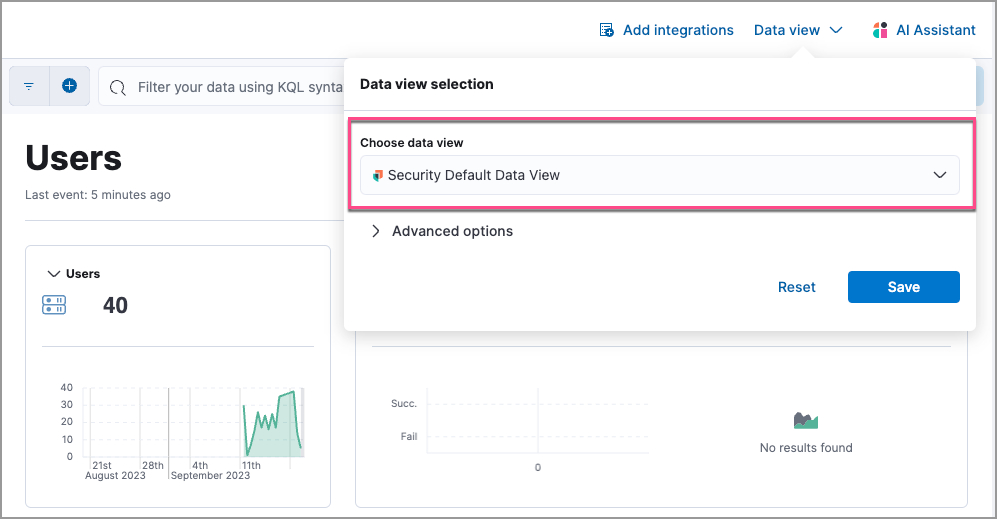
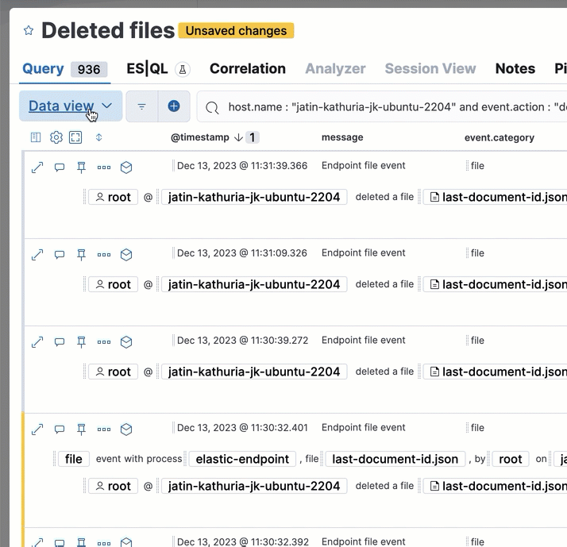

<DocBadge template="technical preview" />

((data-sources-cap)) determine what data displays on ((elastic-sec)) pages with event or alert data.
((data-sources-cap)) are defined by the index patterns they include.
Only data from ((es)) [indices](((ref))/documents-indices.html), [data streams](((ref))/data-streams.html), or [index aliases](((ref))/alias.html) specified in the active ((data-source)) will appear.

<DocCallOut title="Important" color="warning">
Custom indices are not included in the <DocLink id="serverlessSecurityDataViewsInSec" section="the-default-((data-source))">default ((data-source))</DocLink>. Modify it or create a custom ((data-source)) to include custom indices.
</DocCallOut>

## Switch to another ((data-source))

You can tell which ((data-source)) is active by clicking the **((data-source-cap))** menu at the upper right of ((elastic-sec)) pages that display event or alert data, such as Overview, Alerts, Timelines, or Hosts.
To switch to another ((data-source)), click **Choose ((data-source))**, select one of the options, and click **Save**.

## Create or modify a ((data-source))

You can temporarily modify the active ((data-source)) from the **((data-source-cap))** menu by clicking **Advanced options**, then adding or removing index patterns.

This only allows you to add index patterns that match indices that currently contain data (other index patterns are unavailable). Note that any changes made are saved in the current browser window and won't persist if you open a new tab.

To permanently modify a ((data-source)), delete an existing ((data-source)) or create a new one, you need the required permissions.
To learn more, refer to [((data-sources-cap))](((apm-app-ref))/data-views.html).

## The default ((data-source))

The default ((data-source)) is defined by the `securitySolution:defaultIndex` setting, which you can modify in your project's advanced settings{/* path to be updated: (**Stack Management** → **Advanced Settings** → **Security Solution**) */}. To learn more about this setting, including its default value, refer to <DocLink id="serverlessSecurityAdvancedSettings" />).

The first time a user visits ((elastic-sec)){/* within a given ((kib)) [space](((apm-app-ref))/xpack-spaces.html)*/}, the default ((data-source)) generates{/* in that space*/} and becomes active.

If you delete the active ((data-source)) when there are no other defined ((data-sources)), the default ((data-source)) will regenerate and become active upon refreshing any ((elastic-sec)) page{/* in the space*/}.
