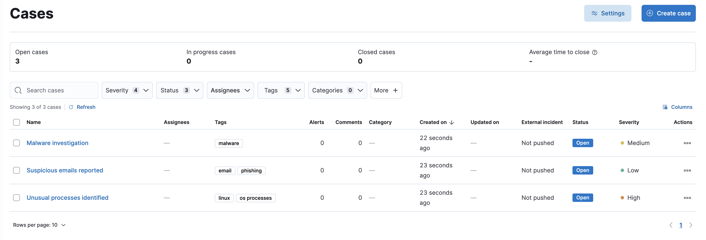

<DocBadge template="technical preview" />

Collect and share information about security issues by opening a case in ((elastic-sec)). Cases allow you to track key investigation details, collect alerts in a central location, and more. The ((elastic-sec)) UI provides several ways to create and manage cases. Alternatively, you can use the [Cases API](((security-guide))/cases-api-overview.html) to perform the same tasks.
{/* Link to classic docs until serverless API docs are available. */}

You can also send cases to these external systems by <DocLink id="serverlessSecurityCasesUiIntegrations">configuring external connectors</DocLink>:

* ((sn-itsm))
* ((sn-sir))
* ((jira)) (including Jira Service Desk)
* ((ibm-r))
* ((swimlane))
* ((webhook-cm))

{/* NOTE: This is an autogenerated screenshot. Do not edit it directly. */}

