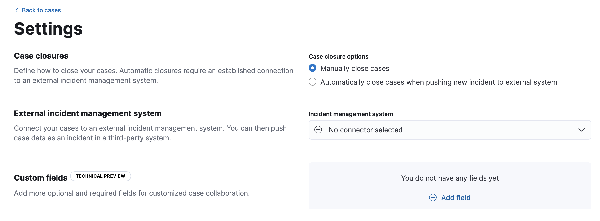
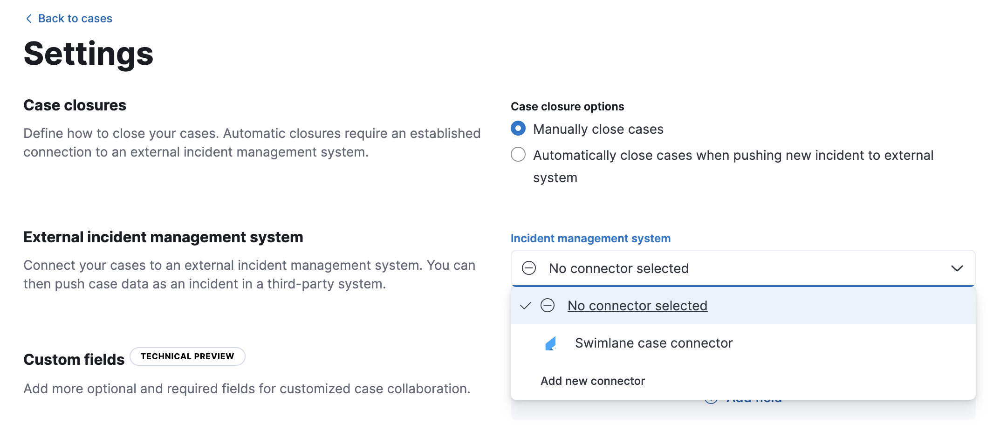
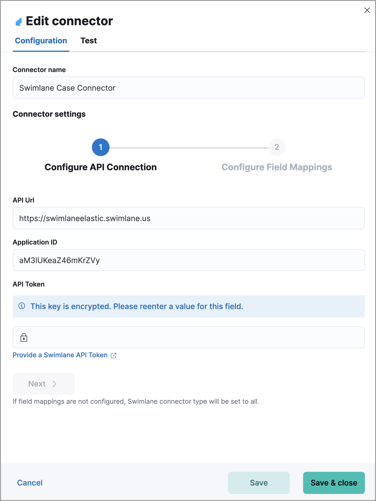

<DocBadge template="technical preview" />

You can push ((elastic-sec)) cases to these third-party systems:

* ((sn-itsm))
* ((sn-sir))
* ((jira)) (including Jira Service Desk)
* ((ibm-r))
* ((swimlane))
* ((webhook-cm))

To push cases, you need to create a connector, which stores the information required to interact with an external system. After you have created a connector, you can set ((elastic-sec)) cases to automatically close when they are sent to external systems.

<DocCallOut title="Requirements">
To create connectors and send cases to external systems, you need the Security Analytics Complete <DocLink id="serverlessGeneralManageProject" text="project feature"/> and the appropriate user role. For more information, refer to <DocLink id="serverlessSecurityCasePermissions">Cases prerequisites</DocLink>.
</DocCallOut>

## Create a new connector

1. Go to **Cases** → **Settings**.

    
    {/* NOTE: This is an autogenerated screenshot. Do not edit it directly. */}

1. From the **Incident management system** list, select **Add new connector**.
1. Select the system to send cases to: **((sn))**, **((jira))**, **((ibm-r))**, **((swimlane))**, or **((webhook-cm))**.
1. Enter your required settings. For connector configuration details, refer to:
    - [((sn-itsm)) connector](((kibana-ref))/servicenow-action-type.html)
    - [((sn-sir)) connector](((kibana-ref))/servicenow-sir-action-type.html)
    - [((jira)) connector](((kibana-ref))/jira-action-type.html)
    - [((ibm-r)) connector](((kibana-ref))/resilient-action-type.html)
    - [((swimlane)) connector](((kibana-ref))/swimlane-action-type.html)
    - [((webhook-cm)) connector](((kibana-ref))/cases-webhook-action-type.html)

## Mapped case fields

When you export an ((elastic-sec)) case to an external system, case fields are mapped to existing fields in ((sn)), ((jira)), ((ibm-r)), and ((swimlane)). For the ((webhook-cm)) connector, case fields can be mapped to custom or pre-existing fields in the external system you're connecting to.

Once fields are mapped, you can push updates to external systems, and mapped fields are overwritten or appended. Retrieving data from external systems is not supported.

<DocTable columns={[
  {
    "title": "Case field",
    "width": "20%"
  },
  {
    "title": "Mapped field",
    "width": "80%"
  }
]}>
  <DocRow>
    <DocCell>
      Title
      
      
    </DocCell>
    <DocCell>
      The case `Title` field is mapped to corresponding fields in external systems. Mapped field values are overwritten when you push updates.
      
      * **((sn))**: `Short description`
      * **((jira))**: `Summary`
      * **((ibm-r))**: `Name`
      * **((swimlane))**: `Description`

      
      
    </DocCell>
  </DocRow>
  <DocRow>
    <DocCell>
      Description
      
    </DocCell>
    <DocCell>
      The case `Description` field is mapped to the `Description` field in all systems. Mapped field values are overwritten when you push updates.
      
      
    </DocCell>
  </DocRow>
  <DocRow>
    <DocCell>
      Comments
      
      
    </DocCell>
    <DocCell>
      The case `Comments` field is mapped to corresponding fields in external systems.
      
      * **((sn))**: `Work Notes`
      * **((jira))**: `Comments`
      * **((ibm-r))**: `Comments`
      * **((swimlane))**: `Comments`

      
      New and edited comments are added to incident records when pushed to ((sn)), ((jira)), or ((ibm-r)). Comments pushed to ((swimlane)) are appended to the `Comment` field in ((swimlane)) and posted individually.
      
      
    </DocCell>
  </DocRow>
</DocTable>

## Close sent cases automatically

To close cases when they are sent to an external system, select
**Automatically close Security cases when pushing new incident to external system**.

## Change the default connector

To change the default connector used to send cases to external systems, go to **Cases** → **Settings** and select the required connector from the Incident management system list.

## Add connectors

After you <DocLink id="serverlessSecurityCasesOpenManage" section="open-a-new-case">create a case</DocLink>, you can add connectors to it. From the case details page, go to **External incident management system**, then select a connector. A case can have multiple connectors, but only one connector can be selected at a time.

<DocImage size="l" url="../images/cases-ui-integrations/-cases-add-connectors.png" alt="Shows how to add connectors" />

## Modify connector settings

To change the settings of an existing connector:

1. Go to **Cases** → **Settings**.
1. Select the required connector from the Incident management system list.
1. Click **Update \<connector name>**.
1. In the **Edit connector** flyout, modify the connector fields as required, then click **Save & close** to save your changes.

