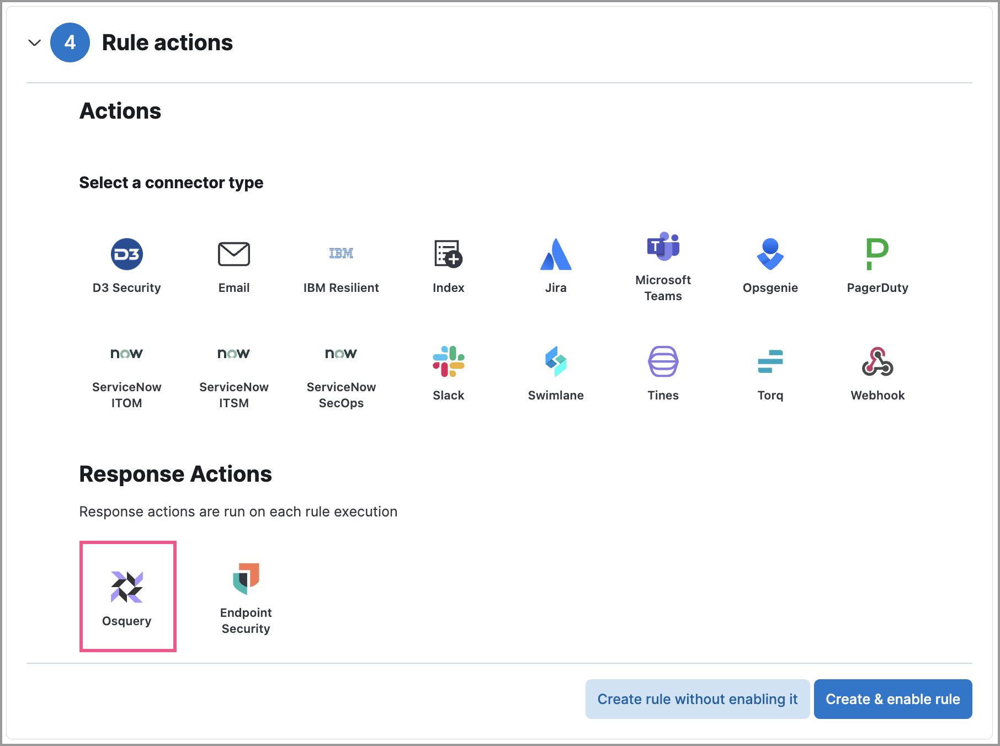
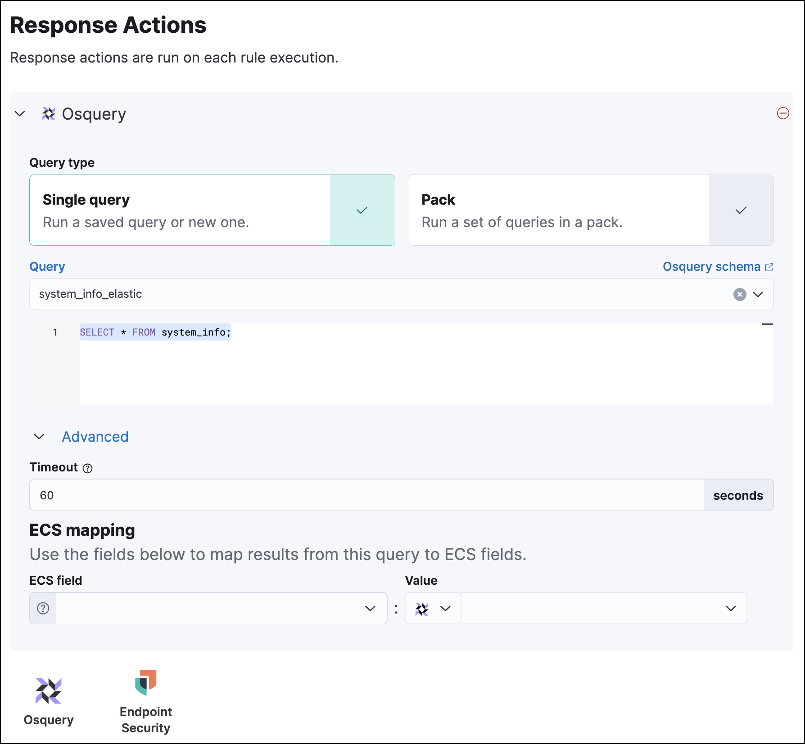

<DocBadge template="technical preview" />

<DocCallOut template="technical_preview" />

Osquery Response Actions allow you to add live queries to custom query rules so you can automatically collect data on systems the rule is monitoring. Use this data to support your alert triage and investigation efforts.

<DocCallOut title="Requirements">

* Osquery Response Actions require the Endpoint Protection Complete <DocLink id="serverlessGeneralManageProject" text="project feature"/>.
* The [Osquery manager integration](((kibana-ref))/manage-osquery-integration.html) must be installed.
* ((agent))'s [status](((fleet-guide))/monitor-elastic-agent.html) must be `Healthy`. Refer to [((fleet)) Troubleshooting](((fleet-guide))/fleet-troubleshooting.html) if it isn't.
* You must have the appropriate user role to use this feature.
* You can only add Osquery Response Actions to custom query rules.

</DocCallOut>

## Add Osquery Response Actions to rules

You can add Osquery Response Actions to new or existing custom query rules. Queries run every time the rule executes.

1. Choose one of the following:
    * **New rule**: When you are on the last step of <DocLink id="serverlessSecurityRulesUiCreate" section="create-a-custom-query-rule">custom query rule</DocLink> creation, go to the Response Actions section and click the **Osquery** icon.
    * **Existing rule**: Edit the rule's settings, then go to the **Actions** tab. In the tab, click the **Osquery** icon under the Response Actions section.

        <DocCallOut title="Note">
        If the rule's investigation guide is using an Osquery query, you'll be asked if you want to add the query as an Osquery Response Action. Click **Add** to add the investigation guide's query to the rule's Osquery Response Action. 
        </DocCallOut>

2. Specify whether you want to set up a single live query or a pack:
    * **Query**: Select a saved query or enter a new one. After you enter the query, you can expand the **Advanced** section to set a timeout period for the query, and view or set [mapped ECS fields](((kibana-ref))/osquery.html#osquery-map-fields) included in the results from the live query. Mapping ECS fields is optional.

        <DocCallOut title="Note">
        Overwriting the query's default timeout period allows you to support queries that take longer to run. The default and minimum supported value for the **Timeout** field is `60`. The maximum supported value is `900`. 
        </DocCallOut>

        <DocCallOut title="Tip">
        You can use <DocLink id="serverlessSecurityOsqueryPlaceholderFields">placeholder fields</DocLink> to dynamically add alert data to your query. 
        </DocCallOut>

    * **Pack**: Select from available query packs. After you select a pack, all of the queries in the pack are displayed.

        <DocCallOut title="Tip">
        Refer to [prebuilt packs](((kibana-ref))/osquery.html#osquery-prebuilt-packs-queries) to learn about using and managing Elastic prebuilt packs.
        </DocCallOut>

        

3. Click the **Osquery** icon to add more live queries (optional).
4. Click **Create & enable rule** (for a new rule) or **Save changes** (for existing rules) to finish adding the queries.

## Edit Osquery Response Actions

If you want to choose a different query or query pack for the Osquery Response Action to use, edit the rule to update the Response Action.

<DocCallOut title="Important" color="warning">
If you edited a saved query or query pack that an Osquery Response Action is using, you must reselect the saved query or query pack on the related Osquery Response Action. Query changes are not automatically applied to Osquery Response Actions.
</DocCallOut>

1. Edit the rule's settings, then go to the **Actions** tab.
1. Modify the settings for Osquery Response Actions you've added.
1. Click **Save changes**.

## Find query results

When a rule generates an alert, Osquery automatically collects data on the host. Query results are displayed within the **Response Results** tab in the Alert details flyout. The number next to the **Response Results** tab represents the number of queries attached to the rule, in addition to endpoint response actions run by the rule.

<DocCallOut title="Note">
Refer to <DocLink id="serverlessSecurityViewOsqueryResults">Examine Osquery results</DocLink> for more information about query results.
</DocCallOut>

<DocImage size="xl" url="../images/osquery-response-action/-osquery-osquery-results-tab.png" alt="Shows how to set up a single query" />
