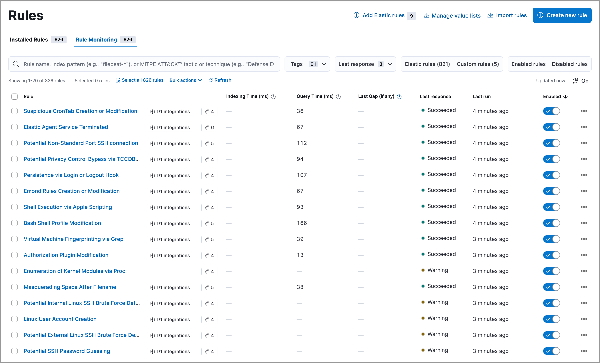
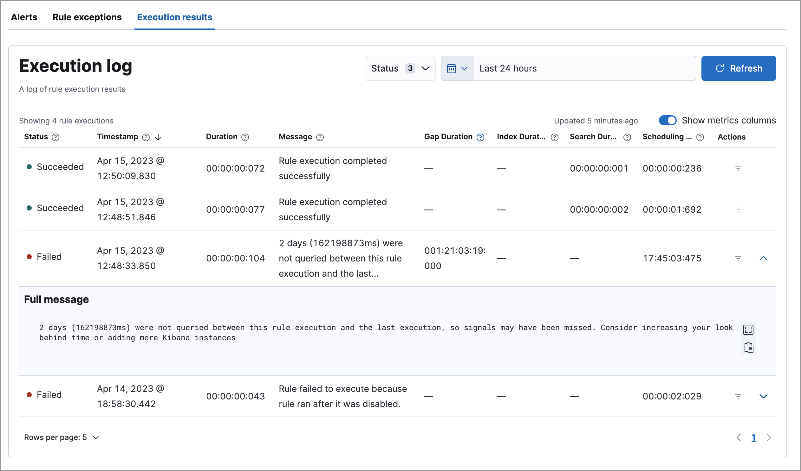
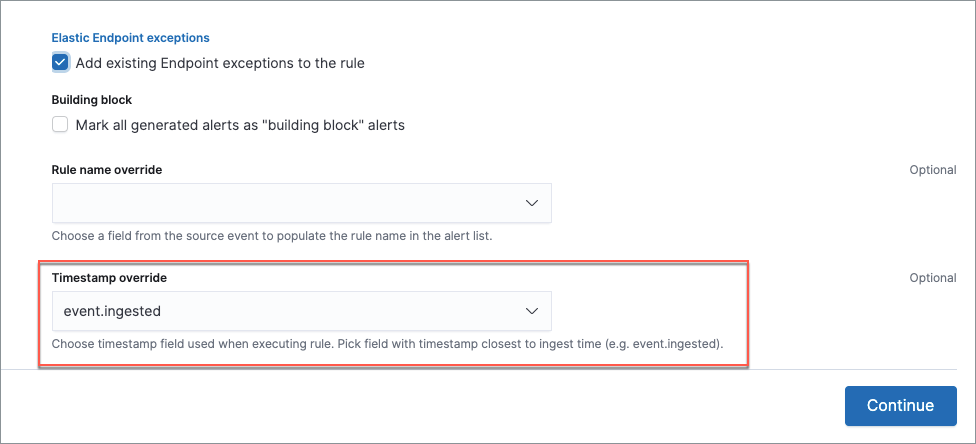

<DocBadge template="technical preview" />

Several tools can help you gain insight into the performance of your detection rules:

* <DocLink id="serverlessSecurityAlertsUiMonitor" section="rule-monitoring-tab">Rule Monitoring tab</DocLink> — The current state of all detection rules and their most recent executions. Go to the **Rule Monitoring** tab to get an overview of which rules are running, how long they're taking, and if they're having any trouble.

* <DocLink id="serverlessSecurityAlertsUiMonitor" section="execution-results">Execution results</DocLink> — Historical data for a single detection rule's executions over time. Consult the execution results to understand how a particular rule is running and whether it's creating the alerts you expect.

* <DocLink id="serverlessSecurityRuleMonitoringDashboard">Detection rule monitoring dashboard</DocLink> — Visualizations to help you monitor the overall health and performance of ((elastic-sec))'s detection rules. Consult this dashboard for a high-level view of whether your rules are running successfully and how long they're taking to run, search data, and create alerts.

Refer to the <DocLink id="serverlessSecurityAlertsUiMonitor" section="troubleshoot-missing-alerts">Troubleshoot missing alerts</DocLink> section below for strategies on adjusting rules if they aren't creating the expected alerts.

## Rule Monitoring tab

To view a summary of all rule executions, including the most recent failures and execution
times, select the **Rule Monitoring** tab on the **Rules** page (**Rules** →
**Detection rules (SIEM)** → **Rule Monitoring**).

On the **Rule Monitoring** tab, you can <DocLink id="serverlessSecurityRulesUiManagement" section="sort-and-filter-the-rules-list">sort and filter rules</DocLink> just like you can on the **Installed Rules** tab. 

<DocCallOut title="Tip">
To sort the rules list, click any column header. To sort in descending order, click the column header again.
</DocCallOut>

For detailed information on a rule, the alerts it generated, and associated errors, click on its name in the table. This also allows you to perform the same actions that are available on the <DocLink id="serverlessSecurityRulesUiManagement">**Installed Rules** tab</DocLink>, such as modifying or deleting rules, activating or deactivating rules, exporting or importing rules, and duplicating prebuilt rules.

## Execution results

Each detection rule execution is logged, including its success or failure, any warning or error messages, and how long it took to search for data, create alerts, and complete. This can help you troubleshoot a particular rule if it isn't behaving as expected (for example, if it isn't creating alerts or takes a long time to run).

To access a rule's execution log, go to **Rules** → **Detection rules (SIEM)**, click the rule's name to open its details, then scroll down and select the **Execution results** tab. You can expand a long warning or error message by clicking the arrow at the end of a row.

You can hover over each column heading to display a tooltip about that column's data. Click a column heading to sort the table by that column.

Use these controls to filter what's included in the logs table:

* The **Status** drop-down filters the table by rule execution status: 
    * **Succeeded**: The rule completed its defined search. This doesn't necessarily mean it generated an alert, just that it ran without error.
    * **Failed**: The rule encountered an error that prevented it from running. For example, a ((ml)) rule whose corresponding ((ml)) job wasn't running.
    * **Warning**: Nothing prevented the rule from running, but it might have returned unexpected results. For example, a custom query rule tried to search an index pattern that couldn't be found in ((es)).

* The date and time picker sets the time range of rule executions included in the table. This is separate from the global date and time picker at the top of the rule details page.

* The **Show metrics columns** toggle includes more or less data in the table, pertaining to the timing of each rule execution.

* The **Actions** column allows you to show alerts generated from a given rule execution. Click the filter icon (<DocIcon type="filterInCircle" title="Filter" size="s"/>) to create a global search filter based on the rule execution's ID value. This replaces any previously applied filters, changes the global date and time range to 24 hours before and after the rule execution, and displays a confirmation notification. You can revert this action by clicking **Restore previous filters** in the notification.

## Troubleshoot missing alerts

When a rule fails to run close to its scheduled time, some alerts may be
missing. There are a number of ways to try to resolve this issue:

* <DocLink id="serverlessSecurityAlertsUiMonitor" section="troubleshoot-gaps">Troubleshoot gaps</DocLink>
* <DocLink id="serverlessSecurityAlertsUiMonitor" section="troubleshoot-ingestion-pipeline-delay">Troubleshoot ingestion pipeline delay</DocLink>
* <DocLink id="serverlessSecurityAlertsUiMonitor" section="troubleshoot-missing-alerts-for-((ml))-jobs">Troubleshoot missing alerts for ((ml)) jobs</DocLink>

You can also use Task Manager in ((kib)) to troubleshoot background tasks and processes that may be related to missing alerts:

* [Task Manager health monitoring](((kibana-ref))/task-manager-health-monitoring.html)
* [Task Manager troubleshooting](((kibana-ref))/task-manager-troubleshooting.html)

{/* Will need to revisit this section since it references a Kibana feature that's not currently available in serverless Security */} 

### Troubleshoot maximum alerts warning

When a rule reaches the maximum number of alerts it can generate during a single rule execution, the following warning appears on the rule's details page and in the rule execution log: `This rule reached the maximum alert limit for the rule execution. Some alerts were not created.` 

If you receive this warning, go to the rule's **Alerts** tab and check for anything unexpected. Unexpected alerts might be created from data source issues or queries that are too broadly scoped. To further reduce alert volume, you can also add <DocLink id="serverlessSecurityAddExceptions">rule exceptions</DocLink> or <DocLink id="serverlessSecurityAlertSuppression">suppress alerts</DocLink>. 

### Troubleshoot gaps

If you see values in the Gaps column in the Rule Monitoring table or on the Rule details page
for a small number of rules, you can increase those rules'
Additional look-back time (**Rules** → **Detection rules (SIEM)** → the rule's **All actions** menu (*...*) → **Edit rule settings** → **Schedule** → **Additional look-back time**).

It's recommended to set the `Additional look-back time` to at
least 1 minute. This ensures there are no missing alerts when a rule doesn't
run exactly at its scheduled time.

((elastic-sec)) prevents duplication. Any duplicate alerts that are discovered during the
`Additional look-back time` are _not_ created.

<DocCallOut title="Note">
If the rule that experiences gaps is an indicator match rule, see <DocLink id="serverlessSecurityTuningDetectionSignals" section="tune-indicator-match-rules">how to tune indicator match rules</DocLink>. Also please note that ((elastic-sec)) provides <DocLink id="serverlessSecurityDetectionEngineOverview" section="limited-support-for-indicator-match-rules">limited support for indicator match rules</DocLink>.
</DocCallOut>

If you see gaps for numerous rules:

* If you restarted ((kib)) when many rules were activated, try deactivating them
    and then reactivating them in small batches at staggered intervals. This
    ensures ((kib)) does not attempt to run all the rules at the same time.

* Consider adding another ((kib)) instance to your environment.

{/* Will need to revisit this section since it references Kibana. */} 

### Troubleshoot ingestion pipeline delay

{/* Will need to revisit this section since it mentions versions of the stack, Beats, and Agent.  */} 

Even if your rule runs at its scheduled time, there might still be missing alerts if your ingestion pipeline delay is greater than your rule interval + additional look-back time. Prebuilt rules have a minimum interval + additional look-back time of 6 minutes. To avoid missed alerts for prebuilt rules, use caution to ensure that ingestion pipeline delays remain below 6 minutes.

In addition, use caution when creating custom rule schedules to ensure that the specified interval + additional look-back time is greater than your deployment's ingestion pipeline delay.

You can reduce the number of missed alerts due to ingestion pipeline delay by specifying the `Timestamp override` field value to `event.ingested` in <DocLink id="serverlessSecurityRulesUiCreate" section="configure-advanced-rule-settings-optional">advanced settings</DocLink> during rule creation or editing. The detection engine uses the value from the `event.ingested` field as the timestamp when executing the rule.

For example, say an event occurred at 10:00 but wasn't ingested into ((es)) until 10:10 due to an ingestion pipeline delay. If you created a rule to detect that event with an interval + additional look-back time of 6 minutes, and the rule executes at 10:12, it would still detect the event because the `event.ingested` timestamp was from 10:10, only 2 minutes before the rule executed and well within the rule's 6-minute interval + additional look-back time.

### Troubleshoot missing alerts for ((ml)) jobs

((ml-cap)) detection rules use ((ml)) jobs that have dependencies on data fields populated by the ((beats)) and ((agent)) integrations. In ((stack)) version 8.3, new ((ml)) jobs (prefixed with `v3`) were released to operate on the ECS fields available at that time. 

If you're using 8.2 or earlier versions of ((beats)) or ((agent)) with ((stack)) version 8.3 or later, you may need to duplicate prebuilt rules or create new custom rules _before_ you update the Elastic prebuilt rules. Once you update the prebuilt rules, they will only use `v3` ((ml)) jobs. Duplicating the relevant prebuilt rules before updating them ensures continued coverage by allowing you to keep using `v1` or `v2` jobs (in the duplicated rules) while also running the new `v3` jobs (in the updated prebuilt rules).

<DocCallOut title="Important" color="warning">

* Duplicated rules may result in duplicate anomaly detections and alerts.
* Ensure that the relevant `v3` ((ml)) jobs are running before you update the Elastic prebuilt rules.

</DocCallOut>

* If you only have **8.3 or later versions of ((beats)) and ((agent))**: You can download or update your prebuilt rules and use the latest `v3` ((ml)) jobs. No additional action is required.

* If you only have **8.2 or earlier versions of ((beats)) or ((agent))**, or **a mix of old and new versions**: To continue using the `v1` and `v2` ((ml)) jobs specified by pre-8.3 prebuilt detection rules, you must duplicate affected prebuilt rules _before_ updating them to the latest rule versions. The duplicated rules can continue using the same `v1` and `v2` ((ml)) jobs, and the updated prebuilt ((ml)) rules will use the new `v3` ((ml)) jobs.

* If you have **a non-Elastic data shipper that gathers ECS-compatible events**: You can use the latest `v3` ((ml)) jobs with no additional action required, as long as your data shipper uses the latest ECS specifications. However, if you're migrating from ((ml)) rules using `v1`/`v2` jobs, ensure that you start the relevant `v3` jobs before updating the Elastic prebuilt rules.

The following Elastic prebuilt rules use the new `v3` ((ml)) jobs to generate alerts. Duplicate their associated `v1`/`v2` prebuilt rules _before_ updating them if you need continued coverage from the `v1`/`v2` ((ml)) jobs:

{/* {/* Links to prebuilt rule pages temporarily removed for initial serverless docs. We can renable links once
we add prebuilt rule pages to the serverless docs.*/}
{/* 
* <DocLink id="serverlessSecurityUnusualLinuxNetworkPortActivity">Unusual Linux Network Port Activity</DocLink>: `v3_linux_anomalous_network_port_activity`

* <DocLink id="serverlessSecurityAnomalousProcessForALinuxPopulation">Anomalous Process For a Linux Population</DocLink>: `v3_linux_anomalous_process_all_hosts`

* <DocLink id="serverlessSecurityUnusualLinuxUsername">Unusual Linux Username</DocLink>: `v3_linux_anomalous_user_name`

* <DocLink id="serverlessSecurityUnusualLinuxProcessCallingTheMetadataService">Unusual Linux Process Calling the Metadata Service</DocLink>: `v3_linux_rare_metadata_process`

* <DocLink id="serverlessSecurityUnusualLinuxUserCallingTheMetadataService">Unusual Linux User Calling the Metadata Service</DocLink>: `v3_linux_rare_metadata_user`

* <DocLink id="serverlessSecurityUnusualProcessForALinuxHost">Unusual Process For a Linux Host</DocLink>: `v3_rare_process_by_host_linux`

* <DocLink id="serverlessSecurityUnusualProcessForAWindowsHost">Unusual Process For a Windows Host</DocLink>: `v3_rare_process_by_host_windows`

* <DocLink id="serverlessSecurityUnusualWindowsNetworkActivity">Unusual Windows Network Activity</DocLink>: `v3_windows_anomalous_network_activity`

* <DocLink id="serverlessSecurityUnusualWindowsPathActivity">Unusual Windows Path Activity</DocLink>: `v3_windows_anomalous_path_activity`

* <DocLink id="serverlessSecurityAnomalousWindowsProcessCreation">Anomalous Windows Process Creation</DocLink>: `v3_windows_anomalous_process_creation`

* <DocLink id="serverlessSecurityAnomalousProcessForAWindowsPopulation">Anomalous Process For a Windows Population</DocLink>: `v3_windows_anomalous_process_all_hosts` 

* <DocLink id="serverlessSecurityUnusualWindowsUsername">Unusual Windows Username</DocLink>: `v3_windows_anomalous_user_name`

* <DocLink id="serverlessSecurityUnusualWindowsProcessCallingTheMetadataService">Unusual Windows Process Calling the Metadata Service</DocLink>: `v3_windows_rare_metadata_process`

* <DocLink id="serverlessSecurityUnusualWindowsUserCallingTheMetadataService">Unusual Windows User Calling the Metadata Service</DocLink>: `v3_windows_rare_metadata_user`
 */}

* Unusual Linux Network Port Activity: `v3_linux_anomalous_network_port_activity`

* Anomalous Process For a Linux Population: `v3_linux_anomalous_process_all_hosts`

* Unusual Linux Username: `v3_linux_anomalous_user_name`

* Unusual Linux Process Calling the Metadata Service: `v3_linux_rare_metadata_process`

* Unusual Linux User Calling the Metadata Service: `v3_linux_rare_metadata_user`

* Unusual Process For a Linux Host: `v3_rare_process_by_host_linux`

* Unusual Process For a Windows Host: `v3_rare_process_by_host_windows`

* Unusual Windows Network Activity: `v3_windows_anomalous_network_activity`

* Unusual Windows Path Activity: `v3_windows_anomalous_path_activity`

* Anomalous Windows Process Creation: `v3_windows_anomalous_process_creation`

* Anomalous Process For a Windows Population: `v3_windows_anomalous_process_all_hosts` 

* Unusual Windows Username: `v3_windows_anomalous_user_name`

* Unusual Windows Process Calling the Metadata Service: `v3_windows_rare_metadata_process`

* Unusual Windows User Calling the Metadata Service: `v3_windows_rare_metadata_user`
